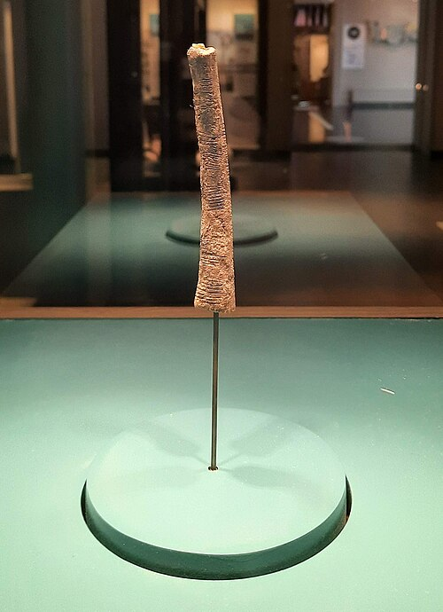

In 1950 the Belgian geologist **[Jean de Heinzelin](kloom:e/jean-de-heinzelin-de-braucourt)** was digging at
**Ishango**, a fishing settlement on the Semliki River where it leaves Lake
Edward, in what was then the Belgian Congo. Among stone tools and human
remains he found a dark, curved bone about ten centimetres long, with a
chip of quartz fixed into one end and rows of notches cut along its
length. It is now in the **[Museum of Natural Sciences](kloom:e/museum-of-natural-sciences)** in Brussels, and
the **[Ishango bone](kloom:e/ishango-bone)** is often called the oldest mathematical object we
have. Whether it is mathematics at all is still argued.

Its age is uncertain too. It was first put at 9,000 to 6,500 BC. The site
was later re-dated to about 20,000 years ago, and the bone's defenders now
give 22,000; volcanic activity nearby upset the carbon isotopes the dates
rest on. It is not the oldest notched bone. The **[Lebombo bone](kloom:e/lebombo-bone)**, a
baboon's fibula from Border Cave in southern Africa, is some 42,000 years
old. What sets Ishango apart is not its age but its arrangement.

## Three columns

The notches, 167 or 168 of them, run in three columns, each divided into
groups. De Heinzelin named the columns by the French for middle, left and
right: M, G and D.

| Column    | Groups of notches       | Sum |
| --------- | ----------------------- | --: |
| G, left   | 11, 13, 17, 19          |  60 |
| M, middle | 3, 6, 4, 8, 10, 5, 5, 7 |  48 |
| D, right  | 11, 21, 19, 9           |  60 |

The plate unrolls the three columns flat beneath the bone, one tick for
each notch, so that the groups can be counted as a reader of the bone
would count them.

Everything anyone has claimed for the bone starts from these numbers. The
left column holds the four [primes](kloom:e/prime-number) between 10 and 20, and de Heinzelin saw
in it an early knowledge of primes. The middle column begins 3 then 6, 4
then 8, which looks like doubling. The right column is 10 and 20, each
plus and minus one. The outer columns both sum to 60 and the middle one to
48: five twelves, and four. The mathematicians **Vladimir Pletser** and
**Dirk Huylebrouck** read this as counting in twelves, with threes and
fours inside them. The archaeologist **[Alexander Marshack](kloom:e/alexander-marshack)**, after
examining the notches under a microscope, read them instead as a lunar
calendar of six months.

## Too much weight on one bone

The objections are as old as the claims. A prime number needs the idea of
division, which the historian Peter Rudman doubted anyone had 20,000 years
ago. Several notches are worn, and the counts are partly a reader's
choice: the middle column's 10 may be a 9, and one of its 5s is hard to
read. **Olivier Keller**, in a 2010 essay he called "The fables of
Ishango", made the case against at length. In Pletser and Huylebrouck's
reply, which quotes him point by point, he says they had to "forcibly make
up" the additions they found, and calls the "Ishango calculator" a fiction
that wastes what the archaeology could teach. They answered that they had
never said "calculator", and that they had given up the primes
themselves. What they claim, in their own word, is "unspectacular": a tool
for counting events or things, kept by someone who mixed tens and twelves.

De Heinzelin found a second notched bone at Ishango in 1959, and the two
sides read it differently. For Wikipedia's editors its marks are not
mathematically suggestive, and so a reason for caution about the first.
For Pletser and Huylebrouck it is confirmation: de Heinzelin, late in
life, read both bones as arithmetic in several bases, and asked that his
reading be published only after his death. The historian of mathematics
**[George Gheverghese Joseph](kloom:e/george-gheverghese-joseph)** put the problem best, and Huylebrouck
himself quotes him: "A single bone may well collapse under the heavy
weight of conjectures piled onto it."

The argument goes on. In a paper first posted in 2025, Jenny Baur tested
the pattern statistically, shuffling the same sixteen numbers across the
three columns a million times and finding no arrangement that scored as
well as the bone's. But her best score comes after moving some groups,
adjustments she found by exploring the data, and she offers the result as
support for a hypothesis, not as a proof of it.

## Before numbers had names

What is not in dispute is the act. Someone cut these marks deliberately,
in groups, and kept the tool. A notch for each thing matches marks to
things one to one, and it needs no word for "eleven" to work. When numbers
were first written down, in the cities of [Mesopotamia](kloom:e/mesopotamia) some fifteen
thousand years later, they began the same way, as marks beside the things
counted. A thousand years after that, the scribes of Babylon had a
notation that could hold the square root of two.
