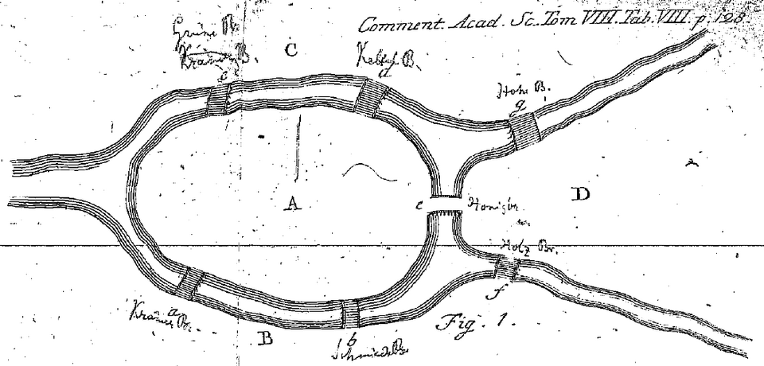

**[Königsberg](kloom:e/konigsberg)**, in Prussia, stood on the river Pregel, which ran in two
branches round an island, the Kneiphof. Seven bridges tied the island, the
two banks and the land between the branches east of it together, and the townspeople had a question about
them: could anyone walk through the city crossing every bridge once and
never twice? Some said no, some doubted, and nobody said yes. On 26 August
1735 **[Leonhard Euler](kloom:e/leonhard-euler)**, then twenty-eight and a member of the Academy of
Sciences at St Petersburg, presented the answer, and a way of answering
every question like it.

## The geometry of position

His paper, "The solution of a problem relating to the geometry of
position", opens by recalling that **[Gottfried Wilhelm Leibniz](kloom:e/gottfried-wilhelm-leibniz)** had
imagined a branch of geometry that deals with position alone, in our
translation "in which
neither quantities are to be considered nor calculation with quantities
used". The bridges, Euler decided, belonged to it: nothing in them needs
measuring. Earlier he had been less sure. In a letter to Carl Ehler, the
mayor of Danzig, he had called the problem one that "bears little
relationship to mathematics", since its solution rests on reason alone.

The paper was read in 1735 and printed in the Academy's volume for 1736,
which came out only in 1741. The date usually given is the volume's.

## Counting letters

Trying every route would be slow, Euler wrote, and would give more than
was asked. He wanted only to know whether a route exists. So he named the
four lands A, B, C and D, and wrote a walk as the lands it passes through:
a walk from A to B and on to D is ABD. A walk over seven bridges is a
string of eight letters.

Now count how often each letter must appear. If a land has one bridge, its
letter appears once, whether the walk starts there or ends there. If it has
three, its letter appears twice; if five, three times: for an odd number of
bridges, half of one more than that number. The island A has five bridges,
and B, C and D three each:

| Land | Bridges | Times its letter must appear |
| ---- | ------: | ---------------------------: |
| A    |       5 |                            3 |
| B    |       3 |                            2 |
| C    |       3 |                            2 |
| D    |       3 |                            2 |
|      |         |                        **9** |

Nine letters are needed and a walk over seven bridges has only eight. No
such walk exists.

Euler went on to the general rule. Adding up the bridges at every land
counts each bridge twice, so the total is even, and the lands with an odd
number of bridges come in pairs. If there are more than two of them, no
walk crosses every bridge once. If there are exactly two, one exists, and
it must start at one of them and end at the other. If there are none, it
can start anywhere and come back to where it began. Euler showed the first
part and gave the rest with only a hint at how to find the route; the
proof that the route always exists came from **[Carl Hierholzer](kloom:e/carl-hierholzer)**, in a
paper published in 1873.

## A graph nobody drew

In today's language each land is a _vertex_, each bridge an _edge_, and the
number of bridges at a land is its _degree_: Königsberg's are 5, 3, 3 and 3.
The plate draws the river and its bridges, and beside them the dots and
lines that stand for them. That second drawing is not Euler's. His figures
are all maps, and his argument ran on letters. Yet the historians Norman
Biggs, Keith Lloyd and Robin Wilson begin their history of **[graph
theory](kloom:e/graph-theory)** with this paper, and the idea that only the connections matter,
not the lengths or the shapes, is the germ of **[topology](kloom:e/topology)**. Whether this
paper or Euler's later one on the knight's tour was the first in topology
is still argued.

## The bridges now

The Kneiphof was devastated in the bombing of 1944; in 1945 the Soviet
Union took the city, and in 1946 it became Kaliningrad, in Russia. Of
the seven bridges, two did not survive the war, and two more were later
demolished and replaced by a highway. Three stand on their old sites,
only two of them from Euler's time, and with the highway's two there are
five. By Euler's rule, as of Wikipedia's article in 2026, the walk is now
possible: two of the lands have two bridges and two have three, so it must
begin on one island and end on the other.

The dated spine ends here. From here the history runs by branch, and
algebra comes first, with the equations the Italians could solve and the
one they never could.
