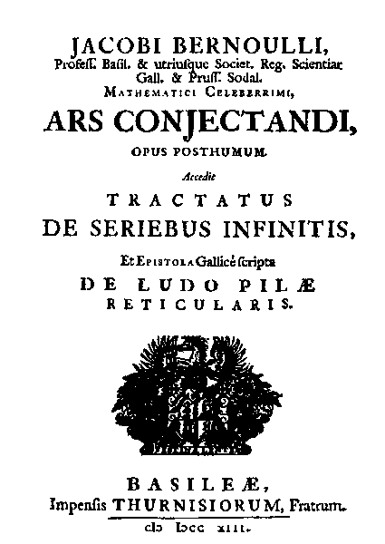
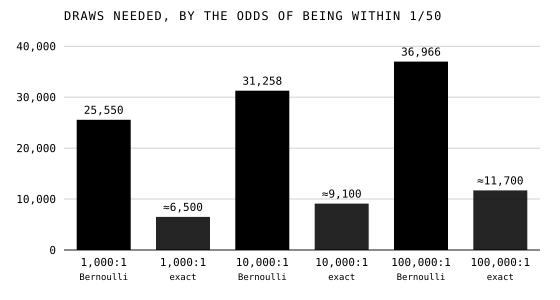

Pascal, Fermat and Huygens worked out chances that were known in advance:
a die has six faces, a fair game gives each player an even chance. Most
of the world is not like that. Nobody knows in advance the chance that a
man of forty will live to sixty, or that it will rain in May. **[Jacob
Bernoulli](kloom:e/jacob-bernoulli)**, professor of mathematics at **[Basel](kloom:e/basel)**, asked whether such a
chance could be learned the other way round, by counting what happens, and
how many observations it would take to be sure. His answer is what we
now call the **[law of large numbers](kloom:e/law-of-large-numbers)**.

## An urn of pebbles

Bernoulli worked on it in his notebooks from the mid-1680s and died in
1705 with the book unfinished. His nephew Nicolaus published it in 1713
as **[_Ars Conjectandi_](kloom:e/ars-conjectandi)**, "the art of conjecturing". Its first three parts
rework Huygens, the mathematics of combinations and games of chance; the fourth, on "civil,
moral and economic affairs", holds the theorem. Bernoulli, as Oscar
Sheynin's translation puts it, had "known its solution for twenty years".
He called it his golden theorem; since [Siméon Denis Poisson](kloom:e/simeon-denis-poisson) in 1837 it has
been the law of large numbers.

He set it out with an urn. Hidden in it, without your knowledge, are
3,000 white pebbles and 2,000 black. Draw one, note its color, put it
back, and draw again. Can you draw so often that it becomes "ten, a
hundred, a thousand, etc., times more probable" that the share of white
you have drawn lies close to three in five than that it does not? Close
means within limits he fixed, between 29/50 and 31/50. He proved that
you can, for any limits however narrow and any odds however long, and he
worked out how many draws were enough: 25,550 for odds of a thousand to
one, 31,258 for ten thousand to one, 36,966 for a hundred thousand, "and
so on until infinity, always adding 5708 other experiments".

## What it says, and what it does not

The theorem is about proportions. Toss a fair coin _n_ times and the
share of heads is, with a probability as close to certainty as you like,
as close to one half as you like, once _n_ is large enough. It does not
say that the number of heads catches up with the number of tails. The
table follows one run of a million tosses of a simulated fair coin,
generated by us with a seeded random-number generator: the numbers are
ours, not history's.

| Tosses    |   Heads | Share of heads | Heads minus half the tosses |
| --------- | ------: | -------------: | --------------------------: |
| 10        |       5 |         0.5000 |                           0 |
| 100       |      59 |         0.5900 |                          +9 |
| 1,000     |     502 |         0.5020 |                          +2 |
| 10,000    |   5,043 |         0.5043 |                         +43 |
| 100,000   |  50,337 |         0.5034 |                        +337 |
| 1,000,000 | 500,300 |         0.5003 |                        +300 |

The share settles towards one half while the surplus of heads grows into
the hundreds. Nothing pulls the coin back: the excess is simply swamped
by the growing total. Its typical size grows like the square root of the
number of tosses, which is why the plate's five runs are squeezed between
curves of ½ ± 1/√*n*. A gambler who has lost ten times running is owed
nothing by the next throw; to believe otherwise is the **[gambler's
fallacy](kloom:e/gamblers-fallacy)**, and the law of large numbers gives it no support.

## Moral certainty, at a price

Bernoulli wanted his theorem for the courts and the counting-house. A
judge, he wrote, should have a rule for when a thing is certain enough to
act on, 99 in 100 perhaps, or 999 in 1,000: _moral certainty_. His
correspondent **[Gottfried Wilhelm Leibniz](kloom:e/gottfried-wilhelm-leibniz)** doubted in letters of 1703 to 1705
that a finite number of observations could ever reach it, since nature
depends on innumerable circumstances. Bernoulli answered him in the book
without naming him.

His numbers were also far too large. His bound was proved with crude
inequalities, and Karl Pearson in 1925 called it crude enough to ruin
anyone who relied on it. For the urn and limits above, we worked out the
exact binomial probabilities: about 6,500 draws give odds of a thousand to
one, about 9,100 ten thousand, and about 11,700 a hundred thousand, a
quarter to a third of what Bernoulli asked.

| Odds of being within the limits | Bernoulli's bound | Exact, by our arithmetic |
| ------------------------------- | ----------------: | -----------------------: |
| 1,000 to 1                      |            25,550 |                   ≈6,500 |
| 10,000 to 1                     |            31,258 |                   ≈9,100 |
| 100,000 to 1                    |            36,966 |                  ≈11,700 |

Bernoulli proved the direct problem: given the urn, what will the draws
show? He believed he had solved the converse too, given the draws, what
is in the urn; Sheynin notes that de Moivre claimed the same, and that it
was Thomas Bayes who first saw that the two problems differ. The theorem
has been sharpened ever since, by Chebyshev, Markov, Borel, Kolmogorov
and others, into a _weak_ and a _strong_ form. A far better estimate of
the draws came twenty years after the book, from counting how they spread
out around the middle: the curve that de Moivre found in 1733.
