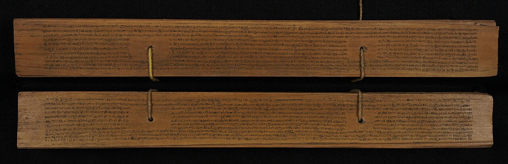

Around 1400, on the Malabar coast of south-west India, an astronomer
named **[Madhava](kloom:e/madhava-of-sangamagrama)** found how to write the circle's measure as a sum that
never ends. He lived at Sangamagrama, a village whose place is itself
argued over, from about 1340 to about 1425; one of his few surviving
works takes 1400 as its starting date. He founded what historians call
the **[Kerala school](kloom:e/kerala-school-of-astronomy-and-mathematics)**, a line of teachers and pupils who worked on
astronomy, and so on sines, arcs and the circle, for the next two
centuries.

Almost none of Madhava's own writing on series survives. We know his
results through his successors, who name him as their source. **[Nilakantha
Somayaji](kloom:e/nilakantha-somayaji)** gathered them in verse in the _Tantrasaṃgraha_ of about 1500;
a commentary on it sets them out in more verses; and **Jyeṣṭhadeva**'s
**[_Yuktibhāṣā_](kloom:e/yuktibhasa)** of about 1530, written in Malayalam rather than Sanskrit,
proves them. So which results are Madhava's, and which are his pupils',
is not always certain.

## A slow series, made fast

Among the results is one we can check with a pencil:

π/4 = 1 − 1/3 + 1/5 − 1/7 + 1/9 − …

The odd numbers, taken in turn, added and subtracted, sum to a quarter of
the circle's circumference when its diameter is one. It is true, and it
is almost useless as it stands. Its sums swing above and below π, as the
plate draws, and close in very slowly: after ten terms the sum is still
wrong in the first decimal place.

The Kerala texts do not stop there. They tell the reader to stop
wherever they like and add one more piece, a _correction_. A commentary
on Nilakantha's book gives the rule in verse: at the odd number where you
stop, take the next even number, and add or subtract four times the
diameter, times half that even number, divided by one more than its
square. For a diameter of one, stopping after _n_ terms, the correction
is 4_n_ ÷ (4_n_² + 1), added if the last term was subtracted and
subtracted if it was added. The table is our own arithmetic, and it shows
what the rule is worth:

| Terms | The plain sum | With the correction | π is       |
| ----: | ------------: | ------------------: | ---------- |
|     1 |         4.000 |              3.2000 | 3.14159265 |
|     2 |         2.667 |              3.1373 |            |
|     3 |         3.467 |              3.1423 |            |
|     5 |         3.340 |           3.1416627 |            |
|    10 |         3.042 |           3.1415902 |            |
|    20 |         3.092 |          3.14159258 |            |

Ten terms of the plain series give one correct figure; ten terms and the
correction give six. The texts give finer corrections still, and the
_Yuktibhāṣā_ gives π as 3.14159265359, correct to eleven places.

The series is the arc-tangent's, taken at 45 degrees, and the Kerala
authors had the whole of it, and series for the sine and cosine too. To
derive them, the _Yuktibhāṣā_ divides an arc into many small pieces and
adds them up, using the sums of the powers of the whole numbers, 1² + 2²

- 3² and so on. **[Ibn al-Haytham](kloom:e/ibn-al-haytham)** had worked out such sums in Egypt four
  centuries before; the Kerala texts name no predecessor, and the historian
  Victor Katz thought the idea might have travelled from the Islamic world
  to India.

## Two centuries early

In Europe the same series were found again between 1669 and 1673: the
arc-tangent's by the Scottish mathematician **[James Gregory](kloom:e/james-gregory-mathematician)** in 1671,
the series for π by **[Gottfried Wilhelm Leibniz](kloom:e/gottfried-wilhelm-leibniz)** in 1673, and the sine
and cosine by Newton. Europe first heard of Kerala's in 1832, when a
British official in Madras, Charles Whish, read a paper to the Royal
Asiatic Society in London on "the Hindú quadrature of the circle",
claiming that its authors had used "a system of fluxions", Newton's word
for his calculus, "peculiar to their authors alone among Hindus". It was
little read for a century.

Whether the Kerala work reached Europe before Gregory is argued. The
historian **[George Gheverghese Joseph](kloom:e/george-gheverghese-joseph)** said in 2007 that there was
strong circumstantial evidence that it had, through Jesuit
missionaries who visited India and wanted its astronomy for the reform
of the calendar. Most historians of Indian mathematics are not persuaded:
as the mathematician David Bressoud put it, there is no evidence that the
work was known beyond India, "or even outside Kerala, until the
nineteenth century". Kim Plofker and others warn against calling it
calculus at all. The Kerala series are exact and brilliant, but they
belong to the sine and the arc; Katz's view is that Newton and Leibniz
were the ones who joined many such ideas into one method, with the
derivative and the integral at its centre. That joining is the story of
the invention of the calculus.
