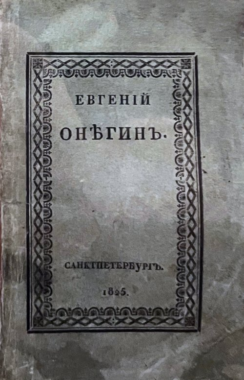

On 23 January 1913 **[Andrey Markov](kloom:e/andrey-markov)** gave a lecture to the physical-mathematical department of the
Academy of Sciences in St Petersburg about the first 20,000 letters of Pushkin's [_Eugene Onegin_](kloom:e/eugene-onegin): the whole
first chapter and sixteen stanzas of the second. He had copied them out
without spaces or punctuation, a hundred to a square, and marked each
letter as a vowel or a consonant. It was an odd subject for a man who had
written to a colleague, "I am concerned only with questions of pure
analysis", and it was the first time the mathematics now called a **[Markov chain](kloom:e/markov-chain)** was
tried on real data.

## A quarrel about free will

The chain came out of an argument. Since Jacob Bernoulli the **[law of
large numbers](kloom:e/law-of-large-numbers)** had been proved for independent trials: toss a fair coin
often enough and the share of heads settles near a half. In 1902 the
Moscow mathematician **[Pavel Nekrasov](kloom:e/pavel-nekrasov)** turned this into theology. The
law, he argued, holds only for independent events; social statistics,
such as crime figures, obey it; so the acts behind them must be
independent, and therefore free. Markov, a secular republican in St
Petersburg, called Nekrasov's work "an abuse of mathematics", and went
after the premise rather than the politics.

In 1906 he showed that independence is not needed. Take a system with two
states that moves from one to the other with fixed probabilities, each
between 0 and 1, so that what happens next depends on where it is now and
on nothing earlier. The share of time it spends in each state still
settles to a fixed value. That was a law of large numbers for dependent
events, and Nekrasov's argument lost its footing. In 1913, when the Tsar
called for celebrations of three hundred years of Romanov rule, Markov
organised a meeting to mark another anniversary: two hundred years of
Bernoulli's _Ars Conjectandi_. The science writer Brian Hayes, whose
account this follows, relied on the historians Eugene Seneta, Oscar
Sheynin and David Link for the Russian sources.

## Pushkin by hand

The lecture put the theory to a text. Markov's counts, from the English
translation of 2006:

| In 20,000 letters of _Onegin_ |  Count |              Share |
| ----------------------------- | -----: | -----------------: |
| vowels                        |  8,638 |               .432 |
| consonants                    | 11,362 |               .568 |
| a vowel after a vowel         |  1,104 |     .128 of vowels |
| a vowel after a consonant     |  7,534 | .663 of consonants |

He counted the vowel pairs and found the rest by subtraction. If letters
were independent, a vowel would follow a vowel 43 times in a hundred, and
there would be about 3,730 such pairs, by our arithmetic; there are 1,104.
Russian, like any language, likes to alternate.

Now treat the text as a chain with two states. Suppose a share _π_ of
letters are vowels. The vowels among the next letters come from two
places: vowels that follow vowels, _π_ × .128, and vowels that follow
consonants, (1 − _π_) × .663. For the share to stay the same from letter
to letter,

_π_ = .128 _π_ + .663 (1 − _π_), so _π_ = .663 ⁄ 1.535 = .432.

That is the share Markov counted, 8,638 in 20,000. The two numbers of
the chain carry the whole text's proportion of vowels. The plate draws
the chain, and below it what the chain says about a letter _k_ places
after a vowel or after a consonant: the chance of a vowel swings to one
side of .432 and back, the gap shrinking by a factor of .535 each letter
(by our arithmetic, from .128 − .663), until after eight letters the
start is forgotten.

Markov's own test was subtler. He split the text into 200 runs of a
hundred letters and measured how much their vowel counts varied. For
independent letters his measure of spread would be 1; the text gave .208.
A simple chain predicted .3, and a chain that remembered two letters .195,
which, he wrote, "agrees very well".

## From letters to the web

Markov's paper was little read outside Russia; the first widely
available English translation appeared in 2006. The idea travelled anyway. In 1948
**[Claude Shannon](kloom:e/claude-shannon)**, measuring information at Bell Labs, built a series of
"approximations to English". The first chose letters with English
frequencies; the next chose each letter by the one before it, then by the
two before it, then words by the word before. He did it with a book:
open it at random, find the last letter chosen, write down the letter
after it, and turn to another page. The second-order word approximation
begins "THE HEAD AND IN FRONTAL ATTACK ON AN ENGLISH WRITER". Such
processes, Shannon wrote, "are known mathematically as discrete Markoff
processes". A language model that picks each next token from
probabilities computed on a fixed window of preceding text is, formally,
the same kind of object: a Markov chain whose state is the whole window,
as a 2024 paper by Oussama Zekri and colleagues set out.

In 1998 Sergey Brin and Lawrence Page described **[PageRank](kloom:e/pagerank)**, the ranking
at the heart of their search engine, Google, by a "random surfer" who
follows links at random and now and then jumps to a random page. A page's
rank is the share of time the surfer spends there in the long run: the
same settled share as Markov's .432, computed for 26 million pages in "a
few hours on a medium size workstation".

Markov's chain moves in steps. Make the steps smaller and more frequent
without end and a random walk becomes a path in continuous time, the
subject of the next frame.
