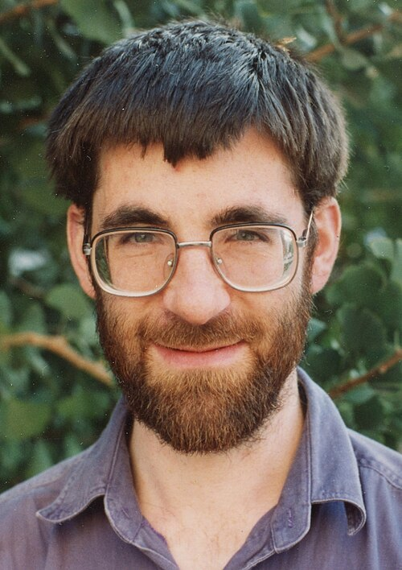

The **[Monster](kloom:e/monster-group)** is a group: the symmetries of an object too large to draw,
808,017,424,794,512,875,886,459,904,961,710,757,005,754,368,000,000,000 of
them. It is the largest of twenty-six exceptions in one of the longest
proofs ever written, the **[classification of finite simple groups](kloom:e/classification-of-finite-simple-groups)**, which
says that every finite group is built from atoms of a few known kinds, and
lists the atoms.

## Atoms of symmetry

A group that has a _normal_ subgroup, one that looks the same from every
angle within the group, can be broken into two smaller groups; a group that
cannot is _simple_. Every finite group is built from simple ones, as every
whole number is a product of primes, though, as **[Michael Aschbacher](kloom:e/michael-aschbacher)**
warns, without quite the same unique factorization. The groups of prime
order are simple and dull. The smallest simple group of any other kind has
60 elements: the rotations of an icosahedron, which the plate draws with an
axis of each of its three kinds.

Why it cannot be broken takes one paragraph. Its 60 rotations fall into
families of rotations that look the same from different angles: the
identity; twelve turns of 72° and twelve of 144° about axes through
opposite corners; twenty turns of 120° about axes through opposite faces;
fifteen half-turns about axes through opposite edges. A normal subgroup
must take whole families, including the identity, and its size must divide 60. But 1 plus any selection of 12, 12, 20 and 15 makes 13, 16, 21, 25,
28, 33, 36, 40, 45, 48 or 60, and of those only 60 divides 60. So the only
normal subgroups are the identity and the whole group.

## Twenty-six exceptions

The list reads: the groups of prime order; the alternating groups, of
which the icosahedron's is the first; sixteen families of _groups of Lie
type_, most of them groups of matrices over finite fields; and twenty-six _sporadic_
groups that fit no family. Émile Mathieu found five, in 1861 and 1873.
The other twenty-one were found between 1965 and 1975, and the largest was predicted by **Bernd Fischer** and **[Robert Griess](kloom:e/robert-griess)** in 1973.
Griess constructed it without a computer, announcing it in January 1980, as
the symmetries of an algebra of 196,884 dimensions. The Monster's smallest
faithful representation is in 196,883: every element is a matrix that
size. **[Richard Borcherds](kloom:e/richard-borcherds)** noted in 2002 that the number of elements is
about the number of elementary particles in the planet Jupiter.

Its order factors into fifteen primes:

|                              Prime |  Power |             Factor |
| ---------------------------------: | -----: | -----------------: |
|                                  2 |     46 | 70,368,744,177,664 |
|                                  3 |     20 |      3,486,784,401 |
|                                  5 |      9 |          1,953,125 |
|                                  7 |      6 |            117,649 |
|                                 11 |      2 |                121 |
|                                 13 |      3 |              2,197 |
| 17, 19, 23, 29, 31, 41, 47, 59, 71 | 1 each | 53,911,588,082,213 |

By our arithmetic the product is 8.08 × 10⁵³, and the three largest primes
give the dimension: 47 × 59 × 71 = 196,883. Andrew Ogg noticed that these
fifteen are exactly the primes for which a certain surface has genus zero,
and offered a bottle of Jack Daniel's to anyone who could explain it; as of
2026 it is unclaimed.

## Moonshine

In 1978 **[John McKay](kloom:e/john-mckay-mathematician)**, reading the expansion of the _j_-function of
number theory, _j_ = *q*⁻¹ + 744 + 196884_q_ + 21493760_q_² + …, saw that
196,884 = 196,883 + 1. He was told, Borcherds recalls, that it was about as
useful as reading tea leaves. John Thompson found the next coefficient
behaving the same way, 21,493,760 = 21,296,876 + 196,883 + 1, and in 1979
**[John Horton Conway](kloom:e/john-horton-conway)** and Simon Norton set out a whole web of such
coincidences under a name that said what they thought of it:
**[monstrous moonshine](kloom:e/monstrous-moonshine)**. Igor Frenkel, James Lepowsky and Arne Meurman
built the object moonshine predicted, and Borcherds proved the conjecture
in 1992, with a theorem borrowed from string theory. He received a Fields
Medal for it in 1998.

## A proof no one has read whole

The classification's proof runs to tens of thousands of pages, in several
hundred articles by about a hundred authors, published mostly between 1955
and 2004. When it was finished is itself disputed. Daniel Gorenstein, who
organised the effort, wrote in a draft preface that it was complete in
August 1980, and in print said February 1981; many accounts give 1983. But
a manuscript of some 800 pages on the _quasithin_ groups, never published,
proved to be incomplete, and Aschbacher and Stephen Smith spent seven years
on roughly 1,200 pages to close the gap, in 2004. Ten years earlier,
Aschbacher wrote, he still called the classification a theorem, but "knew
formally that that was not the case."

A second-generation proof, begun by Gorenstein, Richard Lyons and Ronald
Solomon, is meant to put the whole argument in one place; ten volumes had
appeared by 2023, with more to come. Machines are checking pieces of it. The
odd order theorem of Feit and Thompson, 255 pages in 1963, was verified in
the Coq proof assistant in 2012, and a preprint of August 2026 reports an
AI-assisted formalisation in Lean that reaches further into the
classification, though not yet to the end.

The Monster is algebra at its most finite. The spine turns next to
analysis, and begins with numbers once called imaginary.
