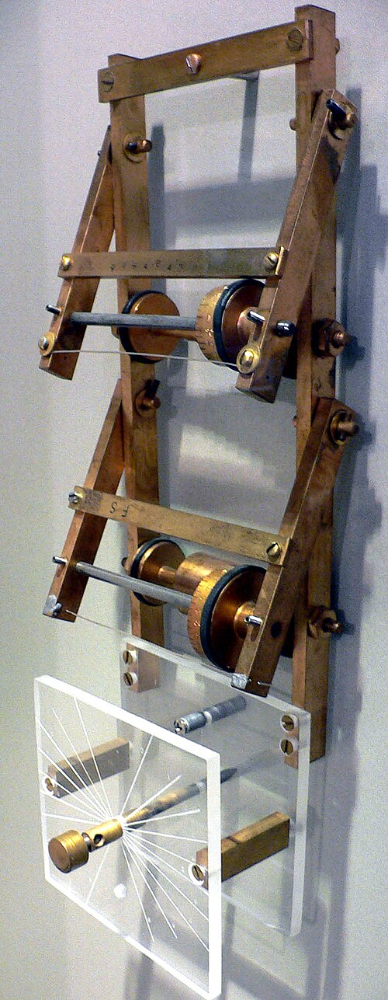

In 1946 **[Stanisław Ulam](kloom:e/stanislaw-ulam)**, a Polish mathematician who had worked at
Los Alamos in the war, was recovering from an illness and playing solitaire. As he told it in
remarks of 1983, quoted by Roger Eckhardt, he wondered "what are the
chances that a Canfield solitaire laid out with 52 cards will come out
successfully?" Combinatorics defeated him, and he wondered whether it
would be more practical to "lay it out say one hundred times and simply
observe and count". The new electronic computers could deal the cards.
And the same trick, he saw at once, might answer the question the
laboratory most needed answered: how neutrons multiply in a core of
fissile metal. That is the **[Monte Carlo method](kloom:e/monte-carlo-method)**: when a quantity is too
hard to calculate, imitate the chance process that produces it, many
times, and count.

## Needles and a trolley

The idea was old. In 1733 Georges-Louis Leclerc, Comte de Buffon, asked
the chance that a needle dropped on a floor of parallel boards lands
across a crack, and in 1777 he published the answer: for a needle no
longer than the boards are wide, 2_l_ ⁄ (π_t_), with _l_ the needle's
length and _t_ the width. Drop enough needles and π can be estimated. In
1901 the Italian Mario Lazzarini reported 3,408 tosses giving 355/113, π
to six decimal places. That was too good. His count of tosses is just the one that makes that
fraction possible, and his intermediate results sit too close to
expectation to be believed.

**[Enrico Fermi](kloom:e/enrico-fermi)** had done it quietly. His student Emilio Segrè wrote that
in Rome in the early 1930s Fermi "had invented, but of course not named,
the present Monte Carlo method", working out neutron problems on a
small mechanical adding machine. At Los Alamos in 1947, while [ENIAC](kloom:e/eniac) was
being moved, he had Percy King build the FERMIAC, a brass trolley: its
drums were set by random digits for a neutron's speed, direction and
distance to the next collision, and it was rolled across a drawing of a
reactor, tracing the neutron's path.

## The first runs

**[John von Neumann](kloom:e/john-von-neumann)** took up Ulam's idea at once. On 11 March 1947 he
wrote to Robert Richtmyer, head of the laboratory's theoretical
division, with a plan: each neutron on a punched card, its fate at each
step settled by random numbers, 100 neutrons followed through 100
collisions each, which would "take about 5 hours" on **ENIAC**. Random
numbers would come from the machine itself, by squaring a number and
keeping its middle digits. **[Nicholas Metropolis](kloom:e/nicholas-metropolis)** suggested the code
name, after an uncle of Ulam's who borrowed money because he "just had
to go to Monte Carlo".

The archives suggest that the program was diagrammed and coded chiefly
by **[Klara von Neumann](kloom:e/klara-dan-von-neumann)**, who called herself her husband's "experimental
rabbit" and found programming "just like a very amusing and rather
intricate jigsaw puzzle". With Metropolis she ran it
at Aberdeen: a first production run on 17 April 1948, work in earnest
from 28 April, seven problems finished by 10 May, and more than 20,000
cards of output. "The method is clearly a 100% success," von Neumann
wrote to Ulam. The historians Thomas Haigh, Mark Priestley and Crispin
Rope argue that it was also the first program in the modern
stored-program style ever run. Who converted ENIAC to run it is told two
ways: Metropolis recalled in 1987 that he and Klara designed the new
controls in about two months; Haigh and his colleagues describe a wider
effort by the Goldstines, Richard Clippinger and the Aberdeen staff, and
contractors led by Jean Bartik, with Metropolis finishing the work.

In 1949 Metropolis and Ulam published the method, as "a statistical
approach to the study of differential equations". In 1953 Metropolis, Arianna and Marshall Rosenbluth and Augusta and Edward Teller
published a rule for sampling states by their Boltzmann weights, now the
Metropolis algorithm; Marshall Rosenbluth said in 2003 that Teller posed
the problem, he solved it and Arianna programmed it; Teller's memoirs
describe all five at work together.

## π by chance

The simplest Monte Carlo calculation throws points at a unit square. The
quarter circle of radius 1 covers π/4 of it, so four times the share of
points inside it estimates π. The plate draws 300 such points and the
running estimate. The table is our own run, with Python's random-number
generator seeded with 2026; each row continues the one above.

|     Points | Inside the arc | Estimate of π |  Error | Typical error, 1.64 ⁄ √*N* |
| ---------: | -------------: | ------------: | -----: | -------------------------: |
|         10 |              8 |           3.2 |  0.058 |                       0.52 |
|        100 |             77 |          3.08 |  0.062 |                       0.16 |
|      1,000 |            784 |         3.136 | 0.0056 |                      0.052 |
|     10,000 |          7,867 |        3.1468 | 0.0052 |                      0.016 |
|    100,000 |         78,867 |       3.15468 |  0.013 |                     0.0052 |
|  1,000,000 |        786,651 |      3.146604 | 0.0050 |                     0.0016 |
| 10,000,000 |      7,855,783 |     3.1423132 | 0.0007 |                    0.00052 |

The error falls like one over the square root of the number of points:
a hundred times the work buys one more decimal place. That is slow, and
chance is chance: at 100,000 points our run was two and a half typical
errors off. But the rate does not depend on how many
dimensions the problem has, which is why, as Metropolis put it, random
sampling is "an efficient way to evaluate complicated and
many-dimensional integrals": a neutron's history, or a field in the
lattice calculations of the feynman frame on path integrals today.

Games came later. **[Monte Carlo tree search](kloom:e/monte-carlo-tree-search)** judges a position by
playing it out to the end many times with random moves. AlphaGo, in
2016, judged each position its search reached half by its value network and half by the
result of such a random game: the mixed evaluation beat either alone. The
next segment turns from chance to certainty, and to Boole's algebra of
thought.
