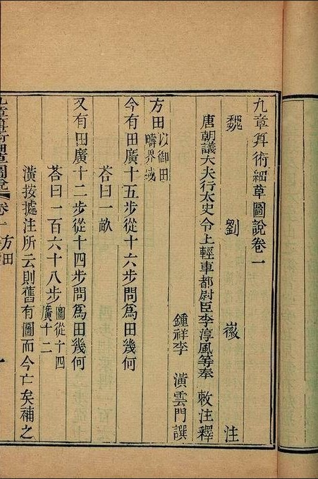
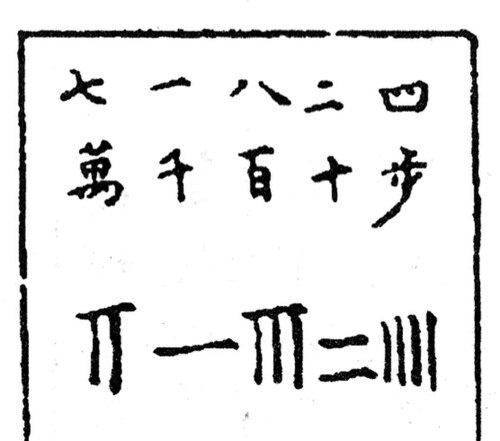

The **[Nine Chapters on the Mathematical Art](kloom:e/the-nine-chapters-on-the-mathematical-art)** has no author. It grew in
**[Han](kloom:e/han-dynasty)** China over generations, and reached its final form around the first
century AD: the historian Ma Xu is recorded studying it before AD 93, and
its full title is cast on two bronze measures dated 179. **[Liu Hui](kloom:e/liu-hui)**, who
wrote the commentary through which we read it, told a longer story in his
preface of 263: that the old texts were damaged when the Qin emperor
burned the books in 213 BC, and that two officials of the early Han,
Zhang Cang and Geng Shouchang, restored them. Most historians, MacTutor
notes, doubt that the text is as old as Liu Hui believed.

It is a book of problems, a few hundred of them, each followed by its
answer and a general procedure. The first asks the area of a field 15
paces wide and 16 long, and answers "one _mu_", which is 240 square paces.
Its chapters run from fields and grain to taxes, walls and canals, and
end with right triangles. Where the Greeks deduced theorems from axioms,
the _Nine Chapters_ gives methods that work for every problem of a kind.

## Rods on a board

The arithmetic was done with **[counting rods](kloom:e/counting-rods)**, small sticks of bamboo or
bone laid out on a flat surface. A digit was a group of rods, and its
column gave it its place: units stood upright, tens lay flat, hundreds
stood upright again, so that neighbouring digits could not run together.
Six to nine used one crossing rod for five. An empty column was zero,
long before there was a sign for it, though sources differ on whether a
blank counts as a zero: Wikipedia's article on the rods says so, and its
article on the abacus says they lacked one. The board did what the counting
boards of Greece and Rome did, holding place value in its layout, and the
rods lasted until the bead abacus spread; then they were abandoned
everywhere but Japan.

The board could hold what writing then could not. The eighth chapter's
methods produce negative quantities, and the chapter gives rules for
them: subtract numbers of the same sign and add numbers of different
signs. Liu Hui explained how the board showed the difference: "Red
counting rods are positive, black counting rods are negative." It is the
reverse of a modern ledger, where red is a loss.

## A rectangular array

That eighth chapter, _fangcheng_, "rectangular arrays", holds eighteen
problems that come down to simultaneous linear equations. The first
reads: three bundles of top-grade grain, two of middle and one of low
yield 39 _dou_; two, three and one yield 34; one, two and three yield 26.
How much does one bundle of each yield?

The procedure sets each statement out as a column of rods, the first on
the right. It multiplies the middle column by the top number of the
right-hand one, 3, and takes the right-hand column away from it until
its top place is empty, and does the same to the left-hand column. Then
it clears the left column's middle place with the middle column. In
numbers, working from the text's instructions:

| Column                           | Top | Middle | Low | Yield |
| -------------------------------- | --: | -----: | --: | ----: |
| Right, as set out                |   3 |      2 |   1 |    39 |
| Middle × 3, less right twice     |   0 |      5 |   1 |    24 |
| Left × 3, less right             |   0 |      4 |   8 |    39 |
| That × 5, less middle four times |   0 |      0 |  36 |    99 |

So 36 bundles of low grain yield 99 _dou_, and one yields 2¾. Working
back up the columns gives the middle grade 4¼ and the top 9¼, the
answers the book prints. The plate shows the board before and after.

This is the method now taught as **[Gaussian elimination](kloom:e/gaussian-elimination)**, named after
**[Carl Friedrich Gauss](kloom:e/carl-friedrich-gauss)** (1777–1855); the only difference, MacTutor observes, is that the Chinese board works on
columns where we work on rows. Whether the method travelled west is
argued. [Leibniz](kloom:e/gottfried-wilhelm-leibniz), who studied elimination from 1678, admired China and
read what Chinese texts he could; the historian Joseph Grcar concluded
that elimination was found independently in several cultures, and
Wikipedia's article on _fangcheng_ gives both views.

## Liu Hui's circle

Before Liu Hui, Chinese reckoners usually took a circle's circumference
as three times its diameter, and the astronomer Zhang Heng had offered
values of about 3.16 and 3.17. Liu Hui thought neither good enough. A regular hexagon inside a circle has a perimeter of three
diameters, and by doubling its sides over and over with the right
triangle's rule he reached a polygon of 96 sides, which put π between
3.141024 and 3.142708. He suggested 157/50, 3.14, for practical use.
Accounts of how far he went differ: Wikipedia's article on his
algorithm says he reached 3.1416 from the 96-gon by a shortcut, while its
article on Liu Hui, and MacTutor, have him go on to a polygon of 3,072
sides and 3.14159. His method is Archimedes' in outline, but most historians think
Chinese and Greek mathematics had grown up apart, and the values Liu Hui
argued with were Chinese ones.

Liu Hui also knew where he had failed. He could not find the volume of a
sphere, gave a formula he showed to be wrong, and wrote, in MacTutor's
translation: "Let us leave the problem to whoever can tell the truth."
Two centuries later [Zu Chongzhi](kloom:e/zu-chongzhi) and his son Zu Gengzhi finished the
work he had begun. In India, meanwhile,
negative numbers would come to be written down as debts, and zero as a
number.
