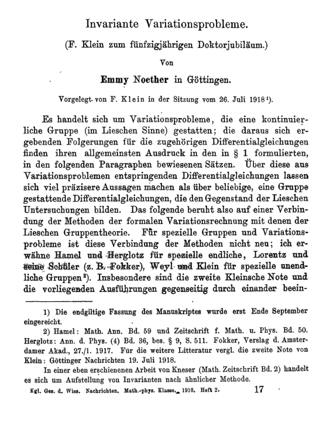

**[Emmy Noether](kloom:e/emmy-noether)** was born in 1882 in Erlangen, the town where **[Felix Klein](kloom:e/felix-klein)**
had printed his program ten years before, into a Jewish family; her
father Max was a professor of mathematics at its university. Women could
at first only audit lectures there, but by 1907 she had a doctorate. For
seven years after it she taught at Erlangen without pay, sometimes in her
father's place. Then she was invited to Göttingen, and in the next two
decades she did two things that would each have made her name: a theorem
that physicists still use daily, and a new way of doing algebra.

## Göttingen

In 1915 **[David Hilbert](kloom:e/david-hilbert)** and Felix Klein asked her to the
**[University of Göttingen](kloom:e/university-of-gottingen)**, the center of German mathematics. The
historians and philologists of the faculty refused to let a woman
qualify to teach; one asked what the soldiers would think, coming back
from the war to learn "at the feet of a woman". Hilbert's answer is often
quoted, that the university was "not a bathhouse", but his exact words
were not recorded. For four years she lectured under his name, as his
"assistant". She qualified in 1919, after the revolution changed the
rules, and was first paid in 1923.

Hilbert wanted her for a reason. That year he was working, beside Einstein,
towards the equations of **[general relativity](kloom:e/general-relativity)**, and in the new theory the **[conservation of energy](kloom:e/conservation-of-energy)**, the most trusted law in physics, behaved
strangely. Noether's answer was a paper of 1918, _Invariante
Variationsprobleme_, which Klein presented to the Göttingen academy on 26
July, since she was not a member.

## Symmetry and what it keeps

Its first theorem, **[Noether's theorem](kloom:e/noethers-theorem)**, says that wherever the laws of
a system are unchanged by a continuous family of transformations, some
quantity is conserved: it stays the same however the system moves. Each
symmetry of the laws brings a conservation law with it, and each
conservation law comes from a symmetry.

| The laws are unchanged by …   | So this is conserved |
| ----------------------------- | -------------------- |
| a shift in time               | energy               |
| a shift in place              | momentum             |
| a rotation, through any angle | angular momentum     |

The conservation of energy, found in the nineteenth century from
steam engines and paddle wheels, turns out to say that the laws of physics
are the same today as tomorrow. The plate shows the third line at work. A
planet's orbit is not symmetrical, but the pull of the sun is the same in
every direction, so angular momentum is conserved, and that is Kepler's
second law: the line from the sun sweeps out equal areas in equal times.
The plate marks the orbit at twelve equal intervals of time (computed for
an ellipse of eccentricity 0.6), close together where the planet is far
out and slow, far apart where it swings in fast.

Noether wrote that her first theorem "comprises all theorems on first
integrals known to mechanics", the conservation laws in one statement.
Her second theorem, for symmetries as sweeping as those of general
relativity, proved what Hilbert had asserted: that there, energy is not
conserved in the ordinary sense.

## Abstract algebra

Among mathematicians she is remembered for something else. Her paper of
1921, _Idealtheorie in Ringbereichen_, recast algebra around structures
rather than calculations. She proved her results from a few axioms, of
which the most famous is a chain condition. In the whole numbers the
multiples of 12 lie inside the multiples of 6, those inside the multiples
of 3, and those inside all the numbers, and every such climbing chain in
the whole numbers stops after finitely many steps. Rings in which every
chain stops are called _Noetherian_. Her students, the "Noether boys",
and the Dutch mathematician B. L. van der Waerden, whose _Moderne Algebra_
of 1930–31 drew on her lectures, carried the method everywhere. In 1932
she gave a plenary address at the International Congress of Mathematicians
in Zürich.

In April 1933 the new Nazi government withdrew her right to teach. She
went on teaching students in her flat, and in the autumn left for
**[Bryn Mawr College](kloom:e/bryn-mawr-college)** in Pennsylvania, lecturing also at the Institute for
Advanced Study in Princeton. She died there on 14 April 1935, after an operation, aged 53. Einstein wrote to _The New York Times_ that
she had been "the most significant creative mathematical genius thus far
produced since the higher education of women began".

Abstract algebra's largest undertaking was still to come: the
classification of the finite simple groups.
