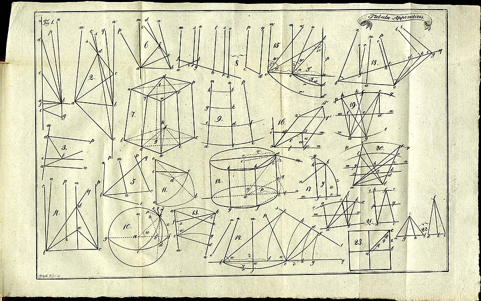

Of the five postulates at the head of Euclid's _Elements_, four are
short and obvious. The fifth, the **[parallel postulate](kloom:e/parallel-postulate)**, is long, and it
says in effect that through a point off a line there is exactly one line
that never meets it. Euclid proved his first twenty-eight propositions
without it. For two thousand years geometers took that as a hint: the
fifth must be a theorem in disguise, provable from the other four. Every
proof failed, and in the 1820s the failure turned out to be the discovery.

## Two thousand years of proofs

The commentator Proclus, in the fifth century AD, reported that Ptolemy
had offered a proof, showed that it was wrong, and gave one of his own,
which was wrong too. **[Ibn al-Haytham](kloom:e/ibn-al-haytham)**, better known in Europe
for his optics, tried an argument by contradiction built on a
quadrilateral with three right angles. Omar Khayyam, the Persian
astronomer and poet, studied a quadrilateral with two equal sides standing
at right angles on a base, and asked whether its two top angles were
right, blunt or sharp. He ruled out the blunt and the sharp by assuming a
principle he took from Aristotle, which turned out to be the fifth
postulate again in other words. So did nearly everyone.

The Jesuit **[Giovanni Girolamo Saccheri](kloom:e/giovanni-girolamo-saccheri)** took up the same quadrilateral in
_Euclides ab omni naevo vindicatus_, "Euclid cleared of every flaw"
(Milan, 1733). He disposed of the blunt angles properly. For the sharp ones
he derived theorem after theorem of what is now a consistent geometry,
then declared the hypothesis "absolutely false, because repugnant to the
nature of the straight line", an appeal to intuition rather than a
contradiction. In 1767 d'Alembert called the parallels the scandal of
elementary geometry.

## Out of nothing

**[Carl Friedrich Gauss](kloom:e/carl-friedrich-gauss)** had worked on the problem since his teens. In 1813
he called it a shameful part of mathematics; by about 1817 he was sure the
postulate could not be proved, and he began to work out a geometry
without it. He published none of it. He feared, he wrote to Bessel in
1829, "the clamour of the Boeotians".

In 1823 **[János Bolyai](kloom:e/janos-bolyai)**, a young Hungarian officer of engineers and the
son of Gauss's friend Farkas Bolyai, wrote to his father from Temesvár
that he had "created a new universe from nothing", in Bonola's English, or
"a strange new world", as other translations have it. His 24-page
appendix to his father's textbook, the _Tentamen_, was printed in 1831,
before the book itself (1832). Gauss's reply of 6 March 1832 is famous: "To
praise it would be to praise myself", for the work "coincides almost
entirely with my meditations" of thirty or thirty-five years. János came to
suspect that Gauss meant to claim the discovery, and resented him for
the rest of his life.

Neither knew that **[Nikolai Lobachevsky](kloom:e/nikolai-lobachevsky)** in Kazan had lectured on the
same geometry in February 1826 and printed it in 1829–30, in Russian, in
the university's own journal, where almost no one outside Russia saw it.

## Triangles that come up short

In the new geometry, through a point off a line there are infinitely
many lines that never meet it, and the angles of every triangle add up
to less than 180°. The shortfall is not a fixed amount: it grows with the
triangle, and in fact it is the triangle's area.

The plate draws the geometry in the disc model named after **[Henri
Poincaré](kloom:e/henri-poincare)**. The whole
plane is the inside of a disc, its "straight lines" are arcs that meet
the rim at right angles, and it shrinks lengths more and more towards the
rim, which is infinitely far away. Through the point _P_, two lines run to
the ends of the line below it and never meet it. The two triangles are
equilateral, and their angles can be computed from the arcs. We did so
for triangles of several sizes, taking a unit of length in which the area
of a triangle is exactly its shortfall in radians:

| Side of the triangle | Each angle | Angle sum | Area |
| -------------------: | ---------: | --------: | ---: |
|                 0.17 |     59.75° |   179.26° | 0.01 |
|                 0.71 |     56.11° |   168.33° | 0.20 |
|                 1.50 |     45.38° |   136.13° | 0.77 |
|                 2.52 |     30.40° |    91.20° | 1.55 |
|                 7.04 |      3.39° |    10.17° | 2.96 |

Small triangles are almost Euclidean, which is why no one had noticed.
Large ones have angles that shrink towards zero, and no triangle's area
can exceed π, about 3.14.

## As consistent as Euclid

Nobody had yet shown that the new geometry could not one day contradict
itself. In 1868 **[Eugenio Beltrami](kloom:e/eugenio-beltrami)** did the next best thing. He realised
it on a surface in ordinary space, the trumpet-shaped _pseudosphere_,
whose shortest paths obey it, and then in models inside a disc, among them
the one in the plate. Any contradiction in the new geometry would be a
contradiction in Euclid's. Poincaré used the disc again in 1882, and it
now carries his name. The fifth postulate was independent of the
other four: it could be kept or denied, and either choice made a geometry.

Which one is true of space was now a question of fact, not of logic.
Bolyai said so in his appendix. It was Riemann, in 1854, who showed how to
ask it.
