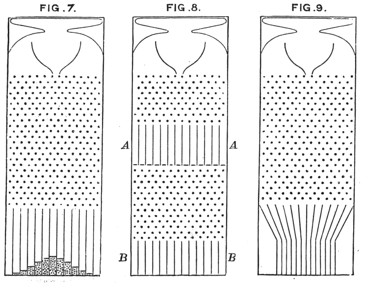

Toss a coin thousands of times, count the heads, and do it again. The counts pile up around the middle in a shape that is the same
whatever the coin, whatever the number of tosses: high in the centre, falling away steeply, never quite reaching zero. It turned out to
be the shape of errors in astronomers' measurements, of the heights of
conscripts, of the speeds of molecules. The **[normal distribution](kloom:e/normal-distribution)** was
found three times over, by three men looking for three different things.

## De Moivre's approximation

**[Abraham de Moivre](kloom:e/abraham-de-moivre)**, a Huguenot who had fled France for London and made his living tutoring mathematics in its coffee houses, wanted the sums Bernoulli
had bounded so crudely. The chance of exactly _k_ heads in _n_ tosses is
a binomial coefficient over 2ⁿ, and for large _n_ such coefficients were
beyond computing by hand. On 12 November 1733 he had a seven-page Latin
paper printed for friends, the _Approximatio_, showing that the terms near
the middle fall away from the largest by a rule we would write as the
exponential of −2ℓ²/_n_, ℓ being the distance from the middle. He
printed it in English in the second edition of _The Doctrine of Chances_,
in 1738.

His own example is the piece of mathematics to check. In 3,600 tosses of
a fair coin the middle is 1,800 heads, and half the square root of 3,600
is 30. De Moivre found that the chance of between 1,770 and 1,830 heads is
0.682688, odds "28 to 13 very near"; that doubling the limits makes the
odds 21 to 1, and tripling them 369 to 1. We summed the exact binomial
terms for comparison:

| Heads in 3,600 tosses | De Moivre's odds | Exact, by our arithmetic |
| --------------------- | ---------------: | -----------------------: |
| 1,770 to 1,830        |   28 to 13 (2.2) |                 2.2 to 1 |
| 1,740 to 1,860        |          21 to 1 |                21.9 to 1 |
| 1,710 to 1,890        |         369 to 1 |                 391 to 1 |

The approximation is good, and improves as _n_ grows. What de
Moivre did not do, as the historian Stephen Stigler points out, was treat
it as a law of anything: to him it was a way to add binomial coefficients. The plate shows the same thing mechanically, on the board Galton would build: ten rows of pins, the shot's columns in the
proportions 1, 10, 45, 120, 210, 252, … of the triangle's tenth row, and
the curve laid over them.

## The law of error

The second finding came from the sky. On 1 January 1801 Giuseppe Piazzi
at Palermo found a moving point of light, **Ceres**, and followed it for
forty-one days, through an arc of about three degrees, before it was lost
in the Sun's glare. To find it again someone had to fit an orbit to a
handful of imperfect observations. **[Carl Friedrich Gauss](kloom:e/carl-friedrich-gauss)**, twenty-four,
worked out an orbit in October 1801, and the planet was recovered close to
his position that December.

Fitting a curve to observations that do not quite agree needs a rule for
the best compromise. **[Adrien-Marie Legendre](kloom:e/adrien-marie-legendre)** published one in 1805:
choose the values that make the sum of the squares of the errors as small
as possible, the method of **[least squares](kloom:e/least-squares)**. His appendix tried it on the arc of the meridian from Dunkirk to Barcelona, measured by Delambre and Méchain to fix the metre. In 1809 Gauss wrote that "our principle, which we have
made use of since the year 1795, has lately been published by Legendre", and a priority dispute followed. The sources weigh it differently: Gauss
very likely used the method on Ceres, but published nothing on it first, and said the method he had used in 1801 had changed so
much that "scarcely any trace of resemblance remains". What Gauss added
was a reason. If the average of several measurements is the best
estimate, he showed, the errors must follow one particular law, the curve
de Moivre had found, and least squares then gives the most probable
values. Within ten years it was a standard tool of astronomy and surveying. Widrow and Hoff's ADALINE learned in 1960 by least mean squares, the same squared error, one example at a time.

The third finding explained the first two. In 1810 **[Pierre-Simon
Laplace](kloom:e/pierre-simon-laplace)** proved that the sum of many small independent effects, whatever
the law of each, is spread in this same way: the **[central limit
theorem](kloom:e/central-limit-theorem)**, though that name came only in 1920. Errors made up of many
small causes are normal, and so the curve belonged to measurement itself.

## The average man, and the bell

Adolphe Quetelet, the Belgian astronomer, carried the law of error from
the sky to people. In _Sur l'homme_ (1835) he measured human traits and
found them spread around a mean in the normal curve, and made that mean
an ideal, _l'homme moyen_, the average man. In 1860 James Clerk Maxwell
found the same law in a gas: each component of a molecule's velocity is
spread according to it. **[Francis Galton](kloom:e/francis-galton)** built his quincunx, the Galton
board, to show why: "a number of small and independent accidents befall
each shot in its career". He called the law "the supreme law of Unreason"
and saw in it "the reason why mediocrity is so common", and he put it to the service of eugenics. The name "normal" stuck in the
late nineteenth century; Karl Pearson, who spread it, regretted that it
made every other distribution sound abnormal.

The normal law describes the spread of what we observe given the cause.
The harder question runs the other way: given what we observed, how
probable is each cause? A minister in Tunbridge Wells had already
answered it, and his answer was published after his death.
