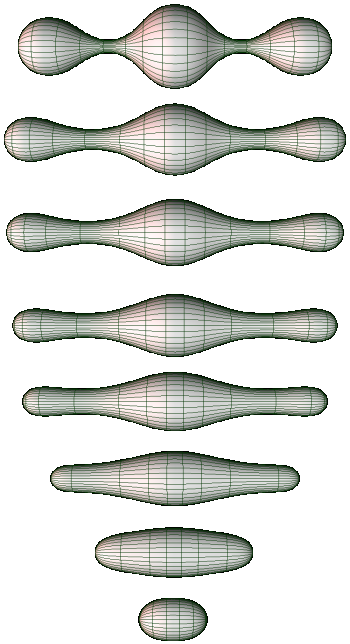
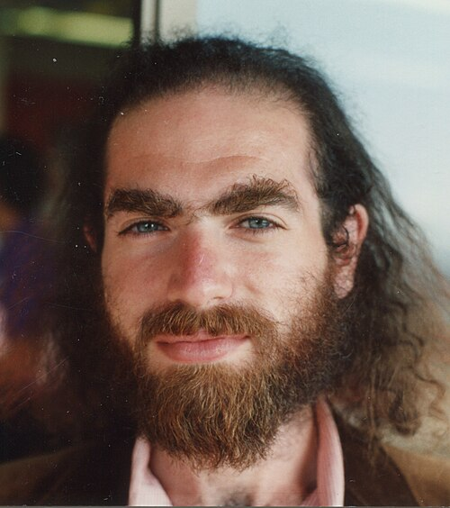

In 1904 **[Henri Poincaré](kloom:e/henri-poincare)** closed the fifth supplement to his _Analysis Situs_ with a question, and then walked away from it: "this question would carry us too far away." What he asked became the **[Poincaré conjecture](kloom:e/poincare-conjecture)**, the most famous open problem in topology for the rest of the century. It was answered by a Russian mathematician who posted his proof on the internet, and then declined the two largest honours mathematics could give him for it.

## Loops that shrink

The question is about loops. Stretch a rubber band around an apple, as the **[Clay Mathematics Institute](kloom:e/clay-mathematics-institute)** puts it, and you can slide it over the skin and shrink it to a point without tearing it and without lifting it off the surface. Stretch it around a doughnut the right way, through the hole or around the tube, and you cannot. A surface on which every loop can be shrunk to a point is called _simply connected_. The plate draws both cases: a loop on a sphere sliding up and closing at the pole, and two loops on a torus that are stuck.

For surfaces the answer was already known. As John Milnor puts it in his description of the problem for the Clay Institute, they were well understood in the nineteenth century: every closed, two-sided surface is a sphere with some number of handles, and the sphere is the only one on which every loop shrinks. Poincaré asked whether the same was true one dimension up. The _three-sphere_ is the set of points at distance 1 from the centre in four-dimensional space, _x_² + _y_² + _z_² + _w_² = 1, as the ordinary sphere is _x_² + _y_² + _z_² = 1 in three. It is a three-dimensional space that closes back on itself, and every loop in it shrinks. If a closed three-dimensional space has that property, must it be the three-sphere, however disguised?

He had got it wrong once already. In 1900 he claimed that counting holes with homology was enough to recognise a sphere. By 1904 he had found a counterexample. Milnor describes it as the space of all the positions of a regular icosahedron inside a sphere, which homology cannot tell from the three-sphere but which carries a loop that will not shrink: turn the icosahedron through a fifth of a revolution about one vertex. The loop, not the count, was what mattered.

## Every dimension but three

Other questions of the same kind fell first, and the higher the dimension, the sooner:

| Dimension | Answered by                    | When      |
| --------- | ------------------------------ | --------- |
| 2         | the classification of surfaces | 1800s     |
| 5 and up  | Stephen Smale                  | 1960–61   |
| 4         | Michael Freedman               | 1982      |
| 3         | Grigori Perelman               | 2002–2003 |

In high dimensions there is room to move a tangle out of its own way; in three and four there is not. Milnor noted that many false proofs of the three-dimensional case had been offered, some with errors "rather subtle and difficult to detect."

The way through came from geometry rather than topology. In 1982 **William Thurston** proposed that every closed three-dimensional space can be cut into pieces each with one of eight standard geometries, a conjecture that contains Poincaré's. The same year **[Richard Hamilton](kloom:e/richard-s-hamilton)** introduced the _Ricci flow_, an equation that changes the way distances are measured in a space much as heat spreads through a metal bar, smoothing out its bumps. Run it long enough, the hope went, and any simply connected space would round itself into a sphere. On a surface the flow does just that, as the computed pictures show. But in three dimensions it can pinch a space into thin necks and blow up, and Hamilton could not control where.

## Three preprints

On 11 November 2002 **[Grigori Perelman](kloom:e/grigori-perelman)**, of the Steklov Institute's branch in St Petersburg, posted the first of three papers on **[arXiv](kloom:e/arxiv)**, the open archive of preprints. The second followed on 10 March 2003 and the third on 17 July. They controlled the necks, cut them out ("surgery") and showed that the flow, with surgery, finishes in finite time. By our reading, none of the three names Poincaré. The first says it gives "a sketch of an eclectic proof" of Thurston's conjecture, and a footnote thanks the "personal savings" from his visits to American universities that paid for the work.

Checking took three years. By 2006 three teams, Bruce Kleiner and John Lott, John Morgan and Gang Tian, and Huai-Dong Cao and Xi-Ping Zhu, had filled in the details and found the gaps minor. Cao and Zhu's paper, which called itself "the first written account of a complete proof", was read by some as claiming credit, and was revised.

In August 2006 the International Mathematical Union offered Perelman the **[Fields Medal](kloom:e/fields-medal)**. He declined it and stayed away from the ceremony in Madrid. On 18 March 2010 the Clay Institute awarded him the first of its **[Millennium Prizes](kloom:e/millennium-prize-problems)**, one million dollars. That July, according to the Interfax news agency, he refused it too, saying the decision was unfair because his contribution was no greater than Hamilton's.

The conjecture is now a theorem in every dimension, for spaces up to continuous deformation. A smooth version in dimension four, which Freedman's proof does not reach, was still open as of September 2026. The next frame's shapes are rough at every scale, and no flow would smooth them.
