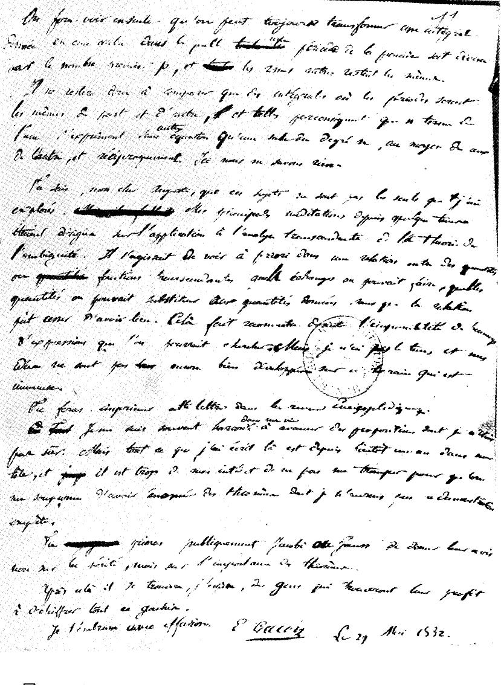

Since the 1540s there had been formulas for equations of the second, third
and fourth degree: recipes that turn the coefficients, by arithmetic and
the taking of roots, into the answers. The equation of the fifth degree,
the _quintic_, had none, and for two centuries algebraists looked for one.
There is none, and the proof turned algebra from a hunt for formulas into
the study of symmetry.

The first to ask why the old formulas worked was **[Joseph-Louis Lagrange](kloom:e/joseph-louis-lagrange)**,
in his _Réflexions sur la résolution algébrique des équations_ of 1770–71.
He watched what happens to expressions in the roots when the roots are
shuffled, and found that each known method rests on an auxiliary equation
of lower degree. For the quintic it came out of degree six, higher than
the one it was meant to solve.

## Ruffini and Abel

In 1799 the Modena physician and mathematician **[Paolo Ruffini](kloom:e/paolo-ruffini)** published
a _General theory of equations_ in which, its title said, the solution of
the general equation above the fourth degree "is proved impossible". Almost
nobody accepted it. Lagrange did not reply to him; Augustin-Louis Cauchy,
nearly alone, wrote that it proved its claim. The proof had a gap: Ruffini
assumed that every radical in a solution could be written in terms of the
roots themselves, which needs a proof of its own.

The Norwegian **[Niels Henrik Abel](kloom:e/niels-henrik-abel)** closed it. As a student in Christiania
he believed in 1821 that he had found a formula; working an example, he
found his mistake, and turned it into a proof that none exists. He printed it in 1824 at his own expense, as a pamphlet of
six pages compressed to save paper. "The geometers have much occupied
themselves with the general solution of algebraic equations," it begins,
in our translation, "and several have sought to prove it impossible; but
if I am not mistaken, none has succeeded until now." Abel died of
tuberculosis on 6 April 1829, aged 26, two days before a letter came to say
that a professorship in Berlin had been secured for him. Their result is
the **[Abel–Ruffini theorem](kloom:e/abel-ruffini-theorem)**.

## The group of an equation

Abel showed that the general quintic has no formula. But which quintics
can be solved? The answer came from a Paris student, **[Évariste
Galois](kloom:e/evariste-galois)**, born in 1811. Of his memoirs to the Academy of Sciences, one, entered for the Grand Prize of 1830, was lost when the secretary
who held it, Joseph Fourier, died that spring; another, dated 16 January
1831, came back from **[Siméon Denis Poisson](kloom:e/simeon-denis-poisson)**, who found its argument
"neither sufficiently clear nor sufficiently developed" to judge.

Galois's idea, in modern terms, is to take the shuffles of the roots that
keep every true relation among them with rational coefficients. They form
what he called the _group_ of the equation. The roots √2 and −√2 of _x_² −
2 satisfy _a_ + _b_ = 0 and _ab_ = −2; swapping them keeps both true, so
the group has two members, and the swap is the ± of the quadratic formula.

Take _x_⁴ − 2. Its roots are _a_ = ⁴√2 ≈ 1.189, _ia_, −*a* and −*ia*,
the corners of a square in the complex plane, as the plate draws them.
Four things can be shuffled 24 ways, but _a_ + (−*a*) = 0 and _ia_ +
(−*ia*) = 0 must stay true, so a permitted shuffle keeps each opposite pair
together. Send _a_ to any of the four roots, and −*a* must go to its
opposite; send _ia_ to either of the two left, and −*ia* follows. That
leaves at most 4 × 2 = 8 (a fuller argument, which we skip, shows all eight
are allowed), and they are the four turns and four reflections of the
square.

| Shuffle           | _a_ goes to | _ia_ goes to |
| ----------------- | ----------- | ------------ |
| leave all         | _a_         | _ia_         |
| quarter turn      | _ia_        | −*a*         |
| half turn         | −*a*        | −*ia*        |
| three-quarter     | −*ia*       | _a_          |
| mirror, real axis | _a_         | −*ia*        |
| mirror, imaginary | −*a*        | _ia_         |
| mirror, diagonal  | _ia_        | _a_          |
| other diagonal    | −*ia*       | −*a*         |

"To solve an equation," Galois wrote, in our translation, "one must
successively lower its group until it contains only a single permutation",
and each root taken can cut the group down only in a particular way. An
equation has a formula exactly when its group breaks down so. The group of
the general quintic, all 120 shuffles of five roots, does not; nor does
that of _x_⁵ − _x_ − 1, whose one real root, 1.1673 to four places, can be
computed to any accuracy but not written in radicals.

## The last night

Galois, a republican twice arrested in 1831, was shot in a duel on 30 May
1832 and died the next day, aged 20. Its cause is obscure; letters he
copied point to a quarrel over a physician's daughter at his lodging.

The legend, spread by E. T. Bell's _Men of Mathematics_ (1937), has him
writing his whole theory in the night before, scribbling "I have not time"
in the margins. The papers tell another story, as Tony Rothman showed in
1982: the theory was in the memoir he had sent the Academy sixteen months
before. That night Galois wrote a long letter to his friend Auguste
Chevalier summing up his work, and corrected his manuscripts, adding in one
margin: "There is something to complete in this demonstration. I have not
the time." The letter says it too, of new work on "ground which is
immense".

Chevalier and Galois's brother copied the papers. **[Joseph Liouville](kloom:e/joseph-liouville)** took them up in 1842, told the Academy in 1843 that
Galois had been right, and published them in his _Journal de mathématiques
pures et appliquées_ in 1846. Galois's groups were shuffles of roots; what
a group is, apart from anything it acts on, was the next question.
