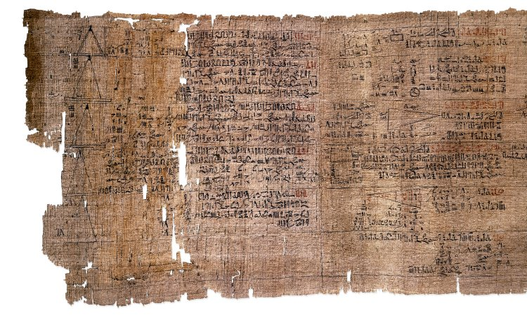

Around 1550 BC, in the thirty-third year of the Hyksos king Apophis, a
scribe named **[Ahmes](kloom:e/ahmes)** copied out a scroll of mathematics about five
meters long. He says he copied it from an older book made in the reign of
**[Amenemhat III](kloom:e/amenemhat-iii)**, who ruled some three centuries before, and the
Egyptologist T. Eric Peet saw no reason to doubt him. The **[Rhind
Mathematical Papyrus](kloom:e/rhind-mathematical-papyrus)** is named for **[Alexander Henry Rhind](kloom:e/alexander-henry-rhind)**, the
Scottish antiquarian who bought it at Luxor in 1858. Most of it has been
in the **[British Museum](kloom:e/british-museum)** since 1865, and a few fragments reached the
Brooklyn Museum by another route.

It opens by promising "accurate reckoning for inquiring into things, and
the knowledge of all things". What follows is a teacher's book: tables,
then ninety-one worked problems, numbered 1 to 87 by modern editors, about loaves, grain, granaries,
fields and pyramids, each set out as an instruction ("you are to take half
of 360") and checked.

## Doubling and halving

Egyptian arithmetic had one kind of multiplication. As Peet put it, the
Egyptian "never multiplied directly" by anything but 2 and 10. To
multiply 13 by 7, to take an example of our own, a scribe doubled 13
until the multipliers reached past half of 7, ticked the lines whose
multipliers add up to 7, and added what stood beside them:

| Multiplier | 13 times it | Ticked |
| ---------: | ----------: | :----: |
|          1 |          13 |   ✓    |
|          2 |          26 |   ✓    |
|          4 |          52 |   ✓    |
|      **7** |      **91** |        |

This is binary arithmetic in all but name, since every whole number is a
sum of doublings of one. Division used the same table, doubling the
divisor until the doublings made up the number to be divided.

Fractions were stranger. Apart from a few with signs of their own, such as
a half and two-thirds, the Egyptians wrote only
**[unit fractions](kloom:e/egyptian-fraction)**, one over a whole number, and a quantity like 2/15 had
to be written as a sum of different ones: 1/10 + 1/30. The papyrus begins
with a table of 2/n for every odd n from 3 to 101, none needing more than
four terms (2/101 is 1/101 + 1/202 + 1/303 + 1/606). Its first problems
share out loaves among ten men, the answers all in unit fractions. How Ahmes chose each sum is still argued:
some historians find two or three methods in the table, others one, and
none can be sure that the algebra we use to describe his choices is the
way he made them.

## A circle made square

Problem 50 finds the area of a round field nine _khet_ across: "You are to
subtract one-ninth of it, namely 1; remainder 8. You are to multiply 8
eight times; it becomes 64." The circle is replaced by a square on eight
ninths of its diameter, as the plate draws it. In our terms that makes π
equal to 256/81, about 3.16, less than one per cent too large. It is a
rule, stated and applied, never proved.

The last problems of the geometry section ask for a pyramid's _seked_,
the slope of its face as the palms it runs in for each cubit it rises,
with the royal cubit of seven palms. In problem 56 a pyramid 360 cubits on
a side and 250 high has a seked of 5 1/25 palms. By the same rule the
[Great Pyramid](kloom:e/great-pyramid-of-giza), 440 royal cubits on a side and 280 high, has a seked of 5½
palms, by our arithmetic.

## Seven houses

Problem 79 is a list with no question: 7 houses, 49 cats, 343 mice, 2,401
ears of spelt, 16,807 _hekat_ of grain, and their total, 19,607. It was
first explained in 1881, by the scholar Rodet, as a riddle: in
each house seven cats, each cat kills seven mice, each mouse would have
eaten seven ears of spelt. Rodet found the same riddle, with seven old
women on the road to Rome, in **[Fibonacci](kloom:e/fibonacci)**'s [_Liber Abaci_](kloom:e/liber-abaci) of 1202, and
Peet thought the English rhyme "[As I was going to St Ives](kloom:e/as-i-was-going-to-st-ives)" might descend
from it. Ahmes summed the powers of seven twice: once term by term, and
once by multiplying 2,801 by 7, a shortcut he does not explain.

Egypt's mathematics, like Babylon's, was a craft of rules that worked.
The Greeks would take the same kinds of question and ask for a proof, and
the first thing their proofs found was a length that no fraction could
measure.
