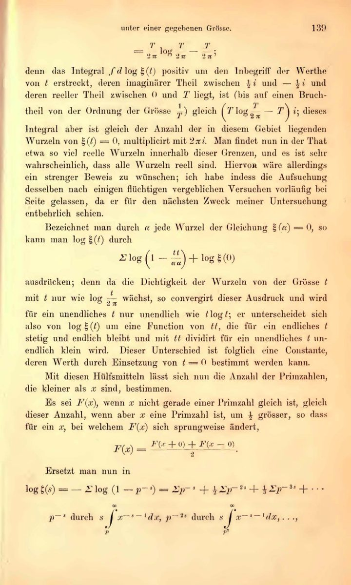

In 1859 the **[Prussian Academy of Sciences](kloom:e/prussian-academy-of-sciences)** in Berlin elected
**[Bernhard Riemann](kloom:e/bernhard-riemann)**, thirty-three, who that year had succeeded
Dirichlet, Gauss's successor, at Göttingen, a corresponding member. He thanked it,
he wrote, in the best way he knew: with a paper, "On the number of primes
less than a given magnitude", printed in the academy's monthly reports
for November. It is the only paper on the theory of numbers he ever published, and
it is short: six pages in his manuscript, as the Clay Mathematics
Institute counts them, nine in print. In passing, it made the most
famous conjecture in mathematics.

## Euler's product

Riemann's starting point, he says in its second paragraph, was an
observation of **[Leonhard Euler](kloom:e/leonhard-euler)**'s. In a paper written in 1737, Euler
had shown that a sum over all the whole numbers equals a product over
the primes alone:

1 + 1/2ˢ + 1/3ˢ + 1/4ˢ + … = 1/(1 − 2⁻ˢ) × 1/(1 − 3⁻ˢ) × 1/(1 − 5⁻ˢ) × …

The proof is a sieve. Multiply the sum by (1 − 1/2ˢ) and every term
whose number is even drops out. Multiply what is left by (1 − 1/3ˢ) and
the multiples of 3 go. Strike out every prime's multiples in turn and
only the 1 is left, because every whole number is a product of primes in
exactly one way. With _s_ = 2 the sum is π²/6, the value Euler had found
in 1735, and the product closes in on it prime by prime:

| Primes used        | Product, by our arithmetic |
| ------------------ | -------------------------: |
| 2                  |                      1.333 |
| 2, 3               |                      1.500 |
| 2, 3, 5, 7         |                      1.595 |
| 2, 3, 5, 7, 11, 13 |                      1.618 |
| all of them (π²/6) |                      1.645 |

Euler let _s_ be a real number. Riemann let it be a complex number,
_s_ = _σ_ + _it_, named the function ζ(_s_), and showed that it has a
meaning everywhere but at _s_ = 1, even where the sum makes no sense.
That is the **[Riemann zeta function](kloom:e/riemann-zeta-function)**.

## The zeros

ζ(_s_) is zero at −2, −4, −6 and so on, and those zeros are easy. All
the others lie in the strip where _σ_ is between 0 and 1, placed
symmetrically about the line _σ_ = ½. Riemann estimated how many there
are up to a height _t_, and then wrote the sentence the subject has
circled ever since, about the roots of his version of the function:
"it is very probable that all the roots are real. One would of course
wish for a rigorous proof of this; I have, however, after some fleeting,
vain attempts, put the search for one aside for the time being, since it
seemed unnecessary for the immediate purpose of my investigation." (The
translation is ours.) Real roots of his function are zeros of ζ on the
line _σ_ = ½. That is the **[Riemann hypothesis](kloom:e/riemann-hypothesis)**.

The plate computes |ζ(½ + _it_)| up the line and marks where it touches
zero: at _t_ = 14.13, 21.02, 25.01 and seven more below 50. The zeros
matter because Riemann's paper turns them into a formula for the number
of primes below any _x_: a smooth estimate, plus one wave for each zero.
Where the zeros lie decides how far the primes can stray from the
estimate.

## Checking the line

Riemann computed the first few zeros himself: Carl Ludwig Siegel found in
his notes, and published in 1932, the formula for it now named for both
of them. In 1939 **[Alan
Turing](kloom:e/alan-turing)** won £40 from the Royal Society to build a machine of gears to
compute the function, and cut some of the gears before the war stopped
it. In June 1950 he ran the search instead on the **[Manchester Mark 1](kloom:e/manchester-mark-1)**,
hoping, it seems, to find a zero off the line. The method he devised to
be sure no zero had been missed is still used.

In 2021 David Platt and Tim Trudgian published a check, in rigorous
interval arithmetic, that the first 12,363,153,437,138 zeros all lie on
the line. The published figures disagree: Xavier Gourdon announced ten
trillion in 2004 without a peer-reviewed account, and the Clay Institute's
own pages give 1.5 billion on one page and ten trillion on another.

## Where it stands

David Hilbert put the hypothesis on his list of problems in 1900, and
in 2000 the Clay Institute made it one of its seven **[Millennium Prize
Problems](kloom:e/millennium-prize-problems)**, with a million dollars for a proof. As of 30 September 2026
it is unproved. What is proved is a share of the zeros: a third on the
line (Norman Levinson, 1974), two-fifths (Brian Conrey, 1989), five
twelfths (2020). In August 2026 Anthropic reported that an unreleased
research version of its model Claude had raised the share above 67
per cent, checked by two of the company's mathematicians; in September
the mathematician Youness Lamzouri posted a shorter proof of more than
67.25 per cent. Two-thirds of the zeros is not all of them, and what all
of them on the line would say about the count of primes belongs to the
next frame, on the prime number theorem.
