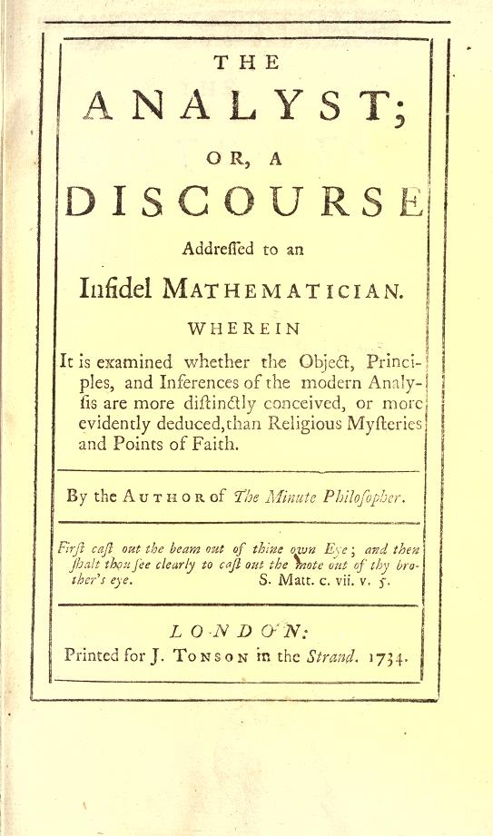

By the 1730s the calculus worked. It found tangents, areas and orbits, and nobody could say exactly why. The sharpest
statement of the trouble came from outside mathematics. In 1734 **[George
Berkeley](kloom:e/george-berkeley)**, the Irish philosopher, published
**[_The Analyst_](kloom:e/the-analyst)**, "a discourse addressed to an infidel mathematician",
thought to be Edmond Halley, a free-thinker who had mocked Berkeley's
defense of faith. If
mathematicians took their own foundations on trust, Berkeley asked, what
right had they to scorn believers for taking mysteries on faith?

His objection is easy to follow. To find the slope of *x*², give _x_ a small
increment _o_. The square grows from *x*² to (_x_ + _o_)², and the growth
divided by _o_ is 2*x* + _o_. Now let _o_ vanish, and the slope is 2*x*. But
the division was allowed only because _o_ was not zero, and the answer
came by making it zero. Newton's fluxions and Leibniz's infinitesimals, he
wrote, "are neither finite Quantities nor Quantities infinitely small, nor
yet nothing. May we not call them the Ghosts of departed Quantities?"

Berkeley did not doubt the answers; he thought two errors canceled to
give them. The historian Judith Grabiner judged his criticisms "witty,
unkind, and … essentially correct". Answers came, from Thomas Bayes in 1736 and
Colin Maclaurin in 1742, but the calculus went on for another century
without a foundation anyone could state.

## A limit, said exactly

The repair began in the 1810s and 1820s. **[Bernard Bolzano](kloom:e/bernard-bolzano)**, a priest in
Prague, set out the basics of the modern definition of continuity in 1817,
and was hardly read. **[Augustin-Louis Cauchy](kloom:e/augustin-louis-cauchy)** wrote his _Cours d'analyse_
of 1821 for the students of the École Polytechnique, promising them all
"the rigor which one demands from geometry". A limit, for Cauchy, is a
fixed value that a variable approaches until it differs from it "by as
little as we wish". Historians disagree about how far he went beyond that:
his definitions are still written in infinitely small quantities, but
Grabiner finds the modern inequalities at work in his proofs. One of his
theorems, that a convergent sum of continuous functions is continuous, was
met in 1826 by counterexamples built from Fourier series, which add
smooth waves into a jump.

The form now taught is **[Karl Weierstrass](kloom:e/karl-weierstrass)**'s, from his lectures in
Berlin in 1861. A sequence has the limit _L_ if, for every error _ε_ you
name, however small, there is a place _N_ in the sequence beyond which
every term is within _ε_ of _L_.

Apply it to Berkeley's slope at _x_ = 3, with the increment _o_ = 1/_n_
for _n_ = 1, 2, 3, …. The slopes are 7, 6.5, 6.33…, and in general
6 + 1/_n_. Each is 1/_n_ away from 6, so to come within _ε_ of 6 it is
enough that _n_ is larger than 1/_ε_:

| The error allowed, _ε_ | Every slope from term _N_ on is closer |
| ---------------------: | -------------------------------------: |
|                    0.1 |                               _N_ = 11 |
|                  0.001 |                            _N_ = 1,001 |
|               0.000001 |                        _N_ = 1,000,001 |

So the limit is 6, and the slope of *x*² at 3 is 6. No term is ever 6,
and no increment is ever zero. Every statement is about finite numbers,
and nothing departs.

## Continuous, and rough everywhere

Once continuity had a definition, it could be tested, and it failed a shared intuition. On 18 July 1872 Weierstrass showed the
Berlin Academy a function, a sum of cosine waves each faster and smaller
than the last, that is continuous everywhere and has a slope nowhere. It
needs 0 < _a_ < 1, _b_ an odd whole number, and _ab_ > 1 + 3π/2. The
plate draws it with _a_ = ½ and _b_ = 13, and below it a thirteenth of the
curve enlarged thirteen times, as rough as the whole.

Earlier mathematicians, Weierstrass said, Gauss among them, had taken it
for granted that a continuous function has a slope everywhere but at
isolated points.
**[Henri Poincaré](kloom:e/henri-poincare)** was not grateful. "Logic sometimes breeds monsters,"
he wrote in _Science and Method_ (1908): once, a new function was invented
for some practical end, and now they were "invented on purpose to show our
ancestors' reasonings at fault". The monsters turned out to be useful. A
grain in Brownian motion traces just such a path: [Jean Perrin](kloom:e/jean-perrin), tracing
grains under a microscope, saw that each straight step of his
drawings, looked at more often, would become as tangled as the whole.

## Filling the line

The last gap was the numbers themselves. In the autumn of 1858 **[Richard
Dedekind](kloom:e/richard-dedekind)**, teaching the calculus for the first time at the Polytechnic in
Zurich, found himself proving that an increasing, bounded quantity has a
limit by appeal to a picture. He resolved to find an arithmetic
foundation, and on 24 November 1858, he later wrote, he succeeded. He
published it in 1872.

His idea is the cut. Divide all the fractions into two classes, every
member of the first less than every member of the second. A fraction may
sit at the division; but put in the first class every fraction whose
square is less than 2, or which is negative, and the rest in the second,
and no fraction makes the division. There is a gap, and √2 is defined to
be the cut itself. With the real numbers built this way, Dedekind said, he
could give "real proofs" of theorems such as √2 · √3 = √6, "which to the
best of my knowledge have never been established before."

Cauchy, who gave the limit its first careful form, also gave the
derivative a job: in 1847 he used it to walk downhill, the method of the
next frame.
