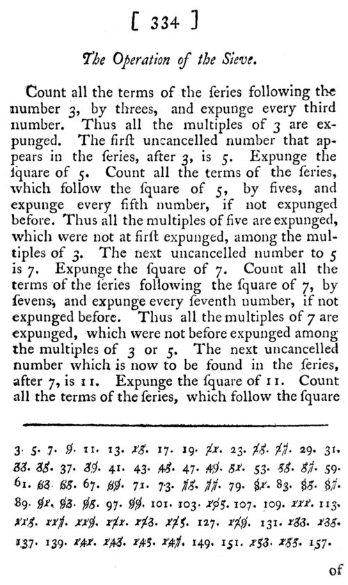

**[Euclid](kloom:e/euclid)** had proved that the [primes](kloom:e/prime-number) never run out. He gave no way to
find them. The oldest method we know for listing every prime up to a
limit is credited to **[Eratosthenes](kloom:e/eratosthenes)** of Cyrene, the librarian at
Alexandria in the third century BC, better known for measuring the Earth.
It needs no division and no cleverness, only counting, and it is still how
computers list primes today.

Nothing Eratosthenes wrote about it survives. Our source is
**[Nicomachus](kloom:e/nicomachus)** of Gerasa, a Pythagorean philosopher who wrote an
_Introduction to Arithmetic_ around AD 100, some three and a half
centuries later. "The production of these numbers," he says, "is called
by Eratosthenes the 'sieve'", the Greek _koskinon_, because it takes the
numbers "mingled together and indiscriminate" and separates the primes
from the rest. So the **[sieve of Eratosthenes](kloom:e/sieve-of-eratosthenes)** comes to us secondhand.

## What Nicomachus describes

Nicomachus sets out only the odd numbers, starting from 3. Then 3 takes up "the measuring
function" and strikes every third term after it: 9, 15, 21 and on. Then 5
strikes every fifth term, then 7 every seventh. The numbers never struck
are the primes, "sifted out as it were by a sieve".

His text is less tidy than that summary. As its translator, Martin Luther
D'Ooge, noted in 1926, it seems to let every odd number take its turn,
9 and 15 included, although their multiples are already struck;
historians, Heath among them, have assumed he meant the primes only.
Nicomachus also wanted each struck number marked with all its divisors,
which turns a sieve into a table of factors.

The rule taught now was set out in 1772 by **[Samuel Horsley](kloom:e/samuel-horsley)**, a
clergyman and mathematician, in a paper for the **[Royal Society](kloom:e/royal-society)**. He
had no patience with his source. Nicomachus was "a shallow writer", he
wrote, and he offered "the genuine Theory of Eratosthenes's method,
cleared from the adulterations of Nicomachus", which he admitted was
represented "according to my own ideas". Horsley also dated Nicomachus to
the third or fourth century, where modern scholars put him around AD 100.
The page shown gives his operation, which starts each prime's striking at
its square.

## Sifting to a hundred

The plate works the sieve from 1 to 100, with 2 back in. Each prime
strikes its multiples, from its square onward, with a stroke of its own:
2 from 4, 3 from 9, 5 from 25, 7 from 49. Starting at the square loses
nothing, because a smaller multiple of 7, such as 35, is 7 times something
smaller than 7, and that smaller factor has already struck it. And the
work stops at 7, because the next prime's square, 121, is past 100. Every
composite number up to 100 has a factor no larger than 10, its square
root. What is left, circled, is the 25 primes below 100.

Some numbers are struck more than once. 30 is struck by 2, by 3 and by 5.
By our count, sieving to 100 makes 104 strikes to remove 74 composite
numbers.

## What it costs

The work grows only a little faster than the list. Each prime _p_ strikes
about _n_/_p_ numbers, so the total is _n_ times the sum of 1/_p_ over
the primes used, and that sum grows like log log _n_, as **[Euler](kloom:e/leonhard-euler)**
showed in 1737. Our own count of strikes, with the refinement from the
square, bears it out:

| Numbers up to | Primes found | Strikes made | Strikes per number |
| ------------: | -----------: | -----------: | -----------------: |
|           100 |           25 |          104 |               1.04 |
|        10,000 |        1,229 |       16,981 |               1.70 |
|     1,000,000 |       78,498 |    2,122,048 |               2.12 |
|   100,000,000 |    5,761,455 |  242,570,204 |               2.43 |

The difficulty is memory, not arithmetic: a sieve to _n_ needs a mark for
every number. From the 1970s programmers have sieved in _segments_, a
window of numbers at a time, keeping only the primes up to √*n* from one
window to the next. The program primesieve lists primes up to 2⁶⁴ this
way.

Nobody lists the primes to count them at record scale. The count of
primes below 10²⁹, found by David Baugh and Kim Walisch in 2022, came from
formulas that go back to Legendre and Meissel and count without listing.
But Walisch describes their hardest part as "basically a modified version
of the well known segmented sieve of Eratosthenes". How those counts grow
with _n_ is a question the sieve cannot answer. In 1801 a young Gauss
published a book that made the arithmetic of whole numbers a science of
its own, and it began not with primes but with remainders.
