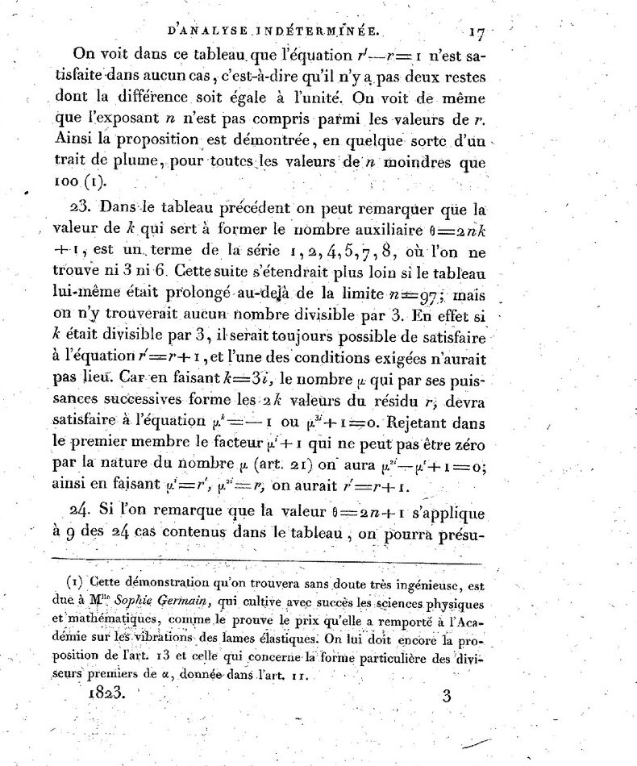

**[Sophie Germain](kloom:e/sophie-germain)** was thirteen when the Bastille fell, in 1789, and the
Revolution kept her indoors in Paris. By the account of her friend
Guglielmo Libri, written after her death, she read in her father's library how Archimedes was
killed because he would not look up from his geometry, and took up
mathematics herself. Her family took away her fire and candles at night to stop her; she worked on in the cold. In 1794 the new **[École
polytechnique](kloom:e/ecole-polytechnique)** opened and admitted no women. She got hold of its lecture
notes and sent written work to **[Joseph-Louis Lagrange](kloom:e/joseph-louis-lagrange)** under the name of
a former student, Antoine-Auguste Le Blanc. Lagrange asked to meet the
author, and found her.

She did the same with **[Carl Friedrich Gauss](kloom:e/carl-friedrich-gauss)**. After his
**[_Disquisitiones Arithmeticae_](kloom:e/disquisitiones-arithmeticae)** appeared in 1801 she wrote to him in 1804,
as Monsieur Le Blanc, with work on Fermat's claim. In 1807, with French
troops in Brunswick, she asked a general who was a family friend to see
that Gauss came to no harm, and her name came out. Gauss wrote that a
woman who overcame the obstacles her sex faced "doubtless has the most
noble courage, extraordinary talent, and superior genius".

## Here is what I have found

In 1816 she became the first woman to win a prize of the Paris Academy of
Sciences, for a theory of vibrating plates, and the Academy at once set a
new prize for a proof of Fermat's Last Theorem. It ran until 1820 and was
never awarded. She did not enter. But on 12 May 1819 she wrote to Gauss
again, "Voici ce que j'ai trouvé": here is what I have found.

Her plan was this. For a prime exponent _p_, take a helper prime θ of the
form 2_Np_ + 1. If no two of the nonzero _p_-th powers counted modulo θ
are neighbours, then θ must divide one of _x_, _y_, _z_. Find infinitely
many such θ, and no solution can exist, since a number has only finitely
many prime factors. She had pushed the helpers far, she told Gauss, and
could show that any solution would be of a size "that frightens the
imagination", but "it takes the infinite and not merely the very large".
Gauss, who found Fermat's theorem of little interest, seems not to have replied. The
plan cannot work: for each exponent only finitely many helpers exist.
Libri showed it for the smallest exponents in the 1820s, and Germain
herself proved it for _p_ = 3 in a letter to Legendre.

## The theorem, worked

What survived her plan was a smaller result. Take _p_ = 5 and θ = 11. By
Fermat's little theorem every _k_¹⁰ leaves 1 modulo 11, so every _k_⁵
leaves 1 or −1, which is 10. The plate draws each number sent to its
fifth power:

| _k_         |   1 |   2 |   3 |   4 |   5 |   6 |   7 |   8 |   9 |  10 |
| ----------- | --: | --: | --: | --: | --: | --: | --: | --: | --: | --: |
| _k_⁵ mod 11 |   1 |  10 |   1 |   1 |   1 |  10 |  10 |  10 |   1 |  10 |

Now suppose _x_⁵ + _y_⁵ = _z_⁵ and 11 divides none of them. The left side leaves 2, 0 or −2, and the right side 1 or −1. They cannot match, so 11 divides _x_, _y_ or _z_. With one
more condition, that 5 is not itself among the fifth powers, Germain's
theorem goes further: 25 must divide one of them. So in any solution one number is divisible by the exponent: the "first case" of Fermat's claim is ruled out.

**[Adrien-Marie Legendre](kloom:e/adrien-marie-legendre)** printed it in a memoir for the Academy's volume
of 1823, published in 1827, with a
footnote: the proof, "which will doubtless be found very ingenious", was
due to Mlle Sophie Germain. He applied it, "at a stroke of the pen", to
every prime below 100. He also noted that whenever _p_ and 2_p_ + 1 are
both prime, the only _p_-th powers modulo 2_p_ + 1 are 1 and −1, as with
11, and the theorem works. Such _p_ are now **[Sophie Germain primes](kloom:e/safe-and-sophie-germain-primes)**: 2, 3,
5, 11, 23, 29, 41, 53, 83, 89 and on. The memoir ends with a full proof for
fifth powers; Peter Gustav Lejeune Dirichlet reached one independently,
and both were done in 1825. Gabriel Lamé proved the case of sevenths in 1839.

For almost two centuries that footnote was all that was known of it. In 2010 the historians Reinhard Laubenbacher and David Pengelley
published their study of her manuscripts in Paris and Florence. The
theorem, they found, was "minor fallout" from the plan, worked out with methods of her own. She was, they
concluded, "a much more impressive number theorist than anyone has ever
known."

## Her primes now

Nobody knows whether there are infinitely many Sophie Germain primes,
though a heuristic formula of the kind G. H. Hardy and J. E. Littlewood
devised predicts how many there should be, and it fits closely. We counted to a hundred million ourselves; the
larger counts are the Prime Pages':

|              N | Sophie Germain primes below N |  Predicted |
| -------------: | ----------------------------: | ---------: |
|          1,000 |                            37 |         39 |
|        100,000 |                         1,171 |      1,166 |
|     10,000,000 |                        56,032 |     56,128 |
|    100,000,000 |                       423,140 |    423,295 |
| 10,000,000,000 |                    26,569,515 | 26,568,824 |

As of 30 September 2026 the largest known is 2,618,163,402,417 ×
2¹²⁹⁰⁰⁰⁰ − 1, of 388,342 digits, found in 2016. Their partners, the _safe primes_ 2_p_ + 1, guard secrets: the
groups that TLS standardised for the **[Diffie–Hellman key exchange](kloom:e/diffie-hellman-key-exchange)** in
2016 all use a safe prime, and the small worked example of the exchange
in the computing subject's frame on network security, modulo 23, uses one
without saying so: 23 is 2 × 11 + 1.

Germain died of breast cancer on 27 June 1831. Her death certificate called her a _rentière_, not a mathematician. Six years later Gauss said she had deserved an honorary
degree. The next step in the trail was Kummer's.
