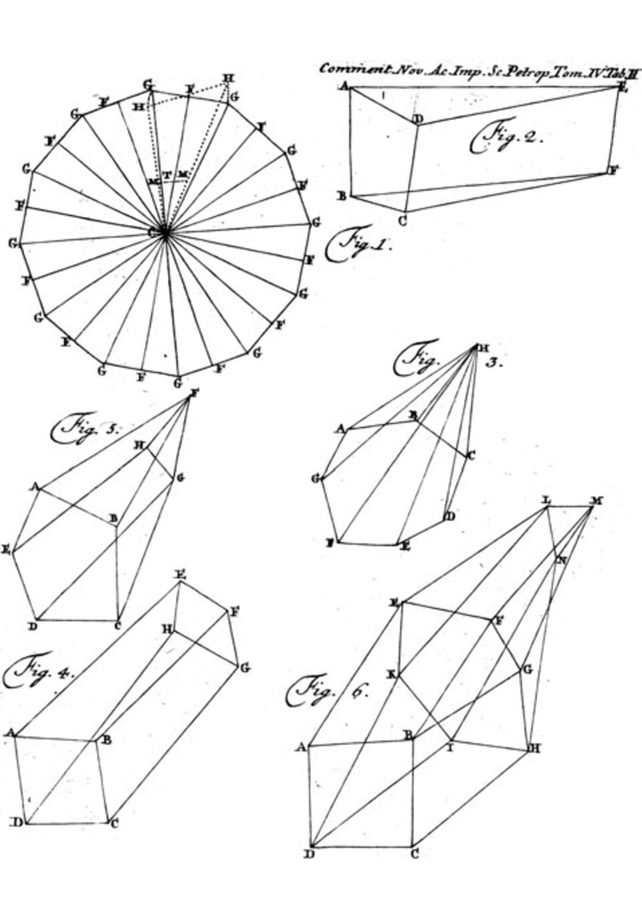

On 14 November 1750 **[Leonhard Euler](kloom:e/leonhard-euler)** wrote to his friend Christian Goldbach about a property of solids bounded by flat faces. Count the corners, which we now call vertices (_V_), the edges (_E_) and the faces (_F_), and for every such solid _V_ − _E_ + _F_ = 2. Nothing in the formula measures anything. It holds for a cube and for a cube squashed out of true, for a pyramid and for a prism, because it depends only on how the pieces are joined. It is one of the first results of the mathematics we now call **[topology](kloom:e/topology)**: the study of what stays the same when a shape is bent, stretched or squeezed, but not cut or glued.

Euler wrote the result up in two papers, written in 1750 and 1751 and printed together in 1758 in the journal of the St Petersburg Academy. In the first, by his own account, he could not prove it. In the second he did, by cutting corners off a solid one at a time and showing that each cut leaves _V_ − _E_ + _F_ unchanged. The historians at MacTutor point out that the proof assumes the solid is convex, with no dents or holes. That assumption was the whole of the trouble to come.

## Checking it

The five **[Platonic solids](kloom:e/platonic-solid)** are the natural place to try the formula, and a reader can check every row:

| Solid        |  _V_ |   _E_ |  _F_ | _V_ − _E_ + _F_ |
| ------------ | ---: | ----: | ---: | --------------: |
| Tetrahedron  |    4 |     6 |    4 |               2 |
| Cube         |    8 |    12 |    6 |               2 |
| Octahedron   |    6 |    12 |    8 |               2 |
| Dodecahedron |   20 |    30 |   12 |               2 |
| Icosahedron  |   12 |    30 |   20 |               2 |
| A torus      | _mn_ | 2_mn_ | _mn_ |               0 |

The last row is a solid with a hole through it, a ring or _torus_, and there the formula fails. The plate shows why. Take a square and cut it into a grid of _m_ columns and _n_ rows, as the plate does with 12 and 6. Roll it into a tube, gluing the top edge to the bottom, then bend the tube round and glue its two ends: the result is a torus covered in _mn_ four-sided faces. Every face has four edges and every edge is shared by two faces, so there are 2_mn_ edges. Every vertex is where four faces meet and every face has four vertices, so there are _mn_ vertices. Then _V_ − _E_ + _F_ = _mn_ − 2_mn_ + _mn_ = 0, whatever _m_ and _n_ are. By our arithmetic, the plate's grid has 72 vertices, 144 edges and 72 faces.

A little-known mathematician, Antoine-Jean Lhuilier, noticed this in 1813: for a solid with _g_ holes, the number is 2 − 2_g_. It no longer described a solid's faces at all. It described its holes, which no stretching can add or remove. It is now called the **[Euler characteristic](kloom:e/euler-characteristic)**, written _χ_, and MacTutor calls Lhuilier's the first known result on a topological invariant: a number that a shape keeps however it is deformed. Who had it first is not quite settled: MacTutor's historians say that Descartes, who wrote on polyhedra, missed it, while Wikipedia notes that Francesco Maurolico stated it for the Platonic solids in an unpublished manuscript of 1537. Euler was the first to see what it was for.

## A geometry of position

Euler had called his 1736 solution of the bridges of Königsberg a problem in the "geometry of position", and the subject long went under a Latin name of the same kind, _analysis situs_. The German word came from **[Johann Benedict Listing](kloom:e/johann-benedict-listing)**, whose ideas on the subject came largely from Gauss at Göttingen, and who used _Topologie_ in letters for ten years before he printed it in 1847. In 1858 Listing and August Ferdinand Möbius each found, separately, the surface that now carries only the second man's name. Give a strip of paper a half-twist before joining its ends, and it has one side and one edge. A beetle walking along its middle comes back to where it started on what seemed to be the other face. Listing described the **[Möbius strip](kloom:e/mobius-strip)** in print in 1861, four years before Möbius did.

**[Bernhard Riemann](kloom:e/bernhard-riemann)**, meanwhile, had found in the 1850s that questions about functions of complex numbers turned into questions about surfaces, and that what mattered about such a surface was how it was connected: its holes again. Then in 1895 **[Henri Poincaré](kloom:e/henri-poincare)** gathered these threads into one long paper, _Analysis Situs_, and its five supplements. He coined the word "homeomorphism" for the deformations topology ignores, and introduced two new tools: homology, which counts holes of every dimension, and the fundamental group, which records the loops a shape will carry.

## Rubber and coffee cups

In the twentieth century the subject grew in two directions. Maurice Fréchet in 1906 made distance abstract, and Felix Hausdorff in 1914 did without it, defining a _topological space_ by nothing more than which points are near which. The algebraic side, Poincaré's, grew into algebraic topology. The popular form of both is a joke: a topologist cannot tell a coffee cup from a doughnut, because a soft enough doughnut can be pushed into the shape of a cup, its hole becoming the handle. Both have _χ_ = 0.

Poincaré's supplements ended with a question about loops that took a century to answer, and it is the next frame's.
