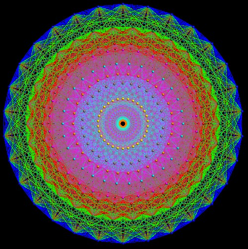

This spine began with notches on a bone. It ends on 30 September 2026, in
a month when a machine was said to have solved one of the hardest open
problems in mathematics, and the people who judge such claims had not yet
decided. What follows is a snapshot of where things stood on that date;
some of it will have changed by the time it is read.

## Seven problems

In Paris on 24 May 2000 the **[Clay Mathematics Institute](kloom:e/clay-mathematics-institute)** named seven
**[Millennium Prize Problems](kloom:e/millennium-prize-problems)**, a million dollars for each. Its rules pay
nothing until a solution has been published for two years and generally
accepted.

| Problem                              | State on 30 September 2026               |
| ------------------------------------ | ---------------------------------------- |
| Poincaré conjecture                  | Solved by Perelman, 2002–03; prize 2010  |
| Navier–Stokes existence, smoothness  | Claimed by OpenAI, 8 September; "active" |
| Riemann hypothesis                   | Open                                     |
| P versus NP                          | Open                                     |
| Birch and Swinnerton-Dyer conjecture | Open                                     |
| Hodge conjecture                     | Open                                     |
| Yang–Mills and the mass gap          | Open                                     |

Grigori Perelman declined the prize, as the Poincaré frame tells; the
Riemann hypothesis has its frame in the trail of the primes.

## A fluid that breaks

The **[Navier–Stokes equations](kloom:e/navier-stokes-equations)** describe how water and air move. The
Clay problem asks whether, in three dimensions, a smooth flow must stay
smooth, or can reach infinite speed at a point in a finite time. On
8 September **[OpenAI](kloom:e/openai)** announced that an internal model, run as about
10,000 agents working together for 88 hours, had shown that it can: a
fluid at rest, pushed by a smooth force, spirals into a vortex that
blows up. A second model, GPT-6 Astra, checked the proof in the proof
assistant Lean in 17 more hours. OpenAI said it would not claim the
prize.

The story around it is disputed. Twelve hours earlier Tristan Buckmaster
of New York University had released results with Levent Alpöge, who works
at the rival company Anthropic, including a blowup for the Euler
equations, the same fluid without friction, found with AI models of both
companies. OpenAI said its search began after it heard rumors of their
work. Buckmaster suggested that their private work might have reached
OpenAI's system; OpenAI, after an investigation, said his prompts to its
models could not have influenced it. Both groups built on a method found
without AI by Diego Córdoba and Luis Martínez-Zoroa. The force is argued
over too: the institute's statement allows a smooth one, but most experts
write the problem without it, and some may call its use a loophole. On 11 September the institute wrote that the problem had
"apparently been settled", and that its judging would be "deliberately
unhurried". Its website lists Navier–Stokes as "active", neither solved
nor open.

## Proved by people

Other recent results were human work. In May 2024 nine mathematicians led
by Dennis Gaitsgory and Sam Raskin announced a proof of the geometric
Langlands conjecture, in more than 800 pages by _Quanta_'s count, more
than 1,000 by Wikipedia's. In 2016 **[Maryna Viazovska](kloom:e/maryna-viazovska)** proved which way
of packing equal spheres is densest in eight dimensions, and with four
colleagues in twenty-four, with no long computation: a "stunningly
simple" proof, where Hales's in three dimensions had needed a computer.

What "densest" means can be worked in the plane, as the plate does. Pack
circles of radius _r_ in squares, and each square cell of side 2_r_ holds
four quarter-circles, one whole circle: a density of π_r_² / 4_r_² = π/4,
about 0.785. Pack them in triangles, and each triangular cell of side
2_r_, of area √3 _r_², holds three sixth-circles, half a circle: a
density of (π_r_²/2) / (√3 _r_²) = π/√12, about 0.907, the best possible.
The other cases known, by our arithmetic from their formulas:

| Dimension | Densest packing  | Density | Proved                |
| --------: | ---------------- | ------: | --------------------- |
|         2 | Triangles        |  0.9069 | Thue, 1890            |
|         3 | Oranges' pyramid |  0.7405 | Hales, 1998           |
|         8 | E₈ lattice       |  0.2537 | Viazovska, 2016       |
|        24 | Leech lattice    |  0.0019 | Cohn and others, 2016 |

In the E₈ packing each sphere touches 240 others. Drawn flat, the
centers of those 240 make the pattern in the picture.

In February 2026 Viazovska's proof for
eight dimensions was checked in Lean, its last stages written by an AI
model, Gauss, from the company Math Inc.

## Machines at the olympiad

| Year | Best AI score of 42 at the IMO | How it was done                          |
| ---- | -----------------------------: | ---------------------------------------- |
| 2024 |                             28 | Translated into Lean; up to three days   |
| 2025 |                             35 | Natural language, within 4.5 hours       |
| 2026 |                             42 | Several models, graded by the organizers |

At the **[International Mathematical Olympiad](kloom:e/international-mathematical-olympiad)** of 2024, **[Google
DeepMind](kloom:e/google-deepmind)**'s AlphaProof and AlphaGeometry 2 scored at silver-medal level.
In 2025 a Gemini model reached gold, graded by the olympiad's own
coordinators. In Shanghai in July 2026 several models scored full marks,
as seven of the 666 students did.

Mathematicians disagree about what it means. Charles Fefferman, who wrote
the Clay problem's official statement, said he was "thrilled that the
problem was solved". Buckmaster called it "a Deep Blue–Kasparov moment".
**[Terence Tao](kloom:e/terence-tao)** told IBM's _Think_ that Navier–Stokes was "the latest in a
string of problems that have been 'strip-mined' for solutions by AI",
his worry being that answers now arrive before mathematicians can draw
out the methods and insight that finding them used to teach.

Whether proofs found by machines will leave us understanding more is
where the spine stops. The notches at Ishango could be checked by anyone
who could count them again; since then we have written numbers in clay,
proved what we wrote, and built machines to check the proofs, wanting
each time what the scribe with the root of two wanted: to know that the
answer is right.
