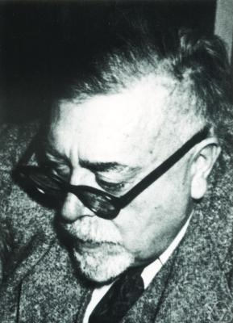

On 29 March 1900 a thirty-year-old student named **[Louis Bachelier](kloom:e/louis-bachelier)**
defended a thesis at the Sorbonne on the prices of the French government's
_rentes_, bonds traded on the Paris Bourse. _Théorie de la spéculation_ began by admitting
that the market could never be predicted, then set out to describe it
anyway: not where prices would go, but how likely each move was. Its
first principle was that a fair market offers no edge. "L'espérance
mathématique du spéculateur est nulle": the speculator's expected gain is
zero. From that, Bachelier derived how far a price should be expected to move.
The expected move, he found, "is proportional to the square root of the
time", and the probability spreads out as heat does, obeying what he
called "une équation de Fourier", the equation of heat.

His examiner **[Henri Poincaré](kloom:e/henri-poincare)** called part of it "very original" and
regretted that Bachelier had not developed it further. The thesis
received the grade _honorable_, and its author, who had come to
mathematics late after running the family business, waited years for a
post. The thesis ends with a sentence in his own words: the market,
"without knowing it, obeys a law that dominates it: the law of
probability." Five years later **[Albert Einstein](kloom:e/albert-einstein)**, apparently unaware of
it, derived the same square-root law for grains suspended in water, and
Jean Perrin's measurements of **[Brownian motion](kloom:e/brownian-motion)** confirmed it, as the
physics frame on real atoms tells.

## Steps that shrink

The square root is the mathematics of the whole story, and it can be seen
in a walk. In one unit of time take _n_ steps, each up or down by a size
_h_, at random. The steps are independent, so their variances add: after
_n_ steps the typical distance from the start is _h_ √*n*. For the walk to
settle into something definite as the steps get finer, the spread after
one unit of time must stay put, and that forces _h_ = 1 ⁄ √*n*. Bachelier
saw this. But then each step climbs _h_ in a time of 1 ⁄ _n_, a slope of
√*n*, and the slopes grow without limit:

| Steps in one unit of time | Size of each step | Spread after one unit | Slope of each step |
| ------------------------: | ----------------: | --------------------: | -----------------: |
|                        16 |               1/4 |                     1 |                  4 |
|                       256 |              1/16 |                     1 |                 16 |
|                     4,096 |              1/64 |                     1 |                 64 |
|                 1,048,576 |           1/1,024 |                     1 |              1,024 |

In the limit the path is continuous, yet no piece of it has a slope. The
plate draws one walk of 4,096 steps, computed by us, first seen every 256
steps and then in full, between curves at √*t* and 2√*t*. Beside it a
small window of the same path, a sixteenth of the time, is stretched
sixteen times in time and four in height. It looks as rough as the whole.

In 1926 that roughness may have cost Bachelier a chair at Dijon: **Paul
Lévy**, reading a later paper of his on these walks, judged it mistaken
and reported against him. Lévy later saw his error and the two were
reconciled.

## Wiener's measure

Perrin had seen the roughness under the microscope. In the preface to
_Les Atomes_ (1913) he wrote that for mathematicians "curves that have no
tangents are the rule, and regular curves, such as the circle, are
interesting though quite special cases", and that a grain's path was one
of the irregular ones. **[Norbert Wiener](kloom:e/norbert-wiener)**, a young instructor at MIT who
had read Perrin, took him at his word.

In "Differential Space", published in 1923, Wiener built a probability
on a set of paths rather than of numbers. Every continuous path starting
from zero is a possible outcome, and the chance that a path passes
through given windows at given times is fixed by Bachelier's and
Einstein's law: movements over separate stretches of time independent,
each spread according to the bell curve with a variance equal to the
time. He quoted Perrin in it. The paper gave a first argument that such
paths have no slopes; the proof that almost every one of them is
differentiable nowhere came ten years later, in 1933, with Raymond Paley
and Antoni Zygmund. The historian Arthur Genthon points out that Wiener
knew his paths were an idealisation: a real grain between collisions does
have a velocity, as the physicists Ornstein and Uhlenbeck insisted. The
mathematical object took Wiener's name, the Wiener process, and its
measure is the Wiener measure. The probabilist William Feller had called
it the Bachelier–Wiener process.

## Kac at Cornell

**[Mark Kac](kloom:e/mark-kac)**, trained at Lwów, had taught at Cornell since 1939. In a
paper presented to the American Mathematical Society on 25 October 1947
and printed in 1949, he averaged over Wiener's paths a weight that
decays with the time a path spends where a potential is high, and showed
that the average solves a diffusion equation with that potential. The
equation, he noted, is "quite similar to the equation of Schrödinger",
and his results were "strongly influenced by the derivation of
Schrödinger's equation which we found in a hitherto unpublished Princeton
Thesis of R. P. Feynman". Feynman's sum over paths weighted each path by
a turning phase and was not a genuine measure; Kac's version, with real
weights on Brownian paths, was a theorem. It is now the **[Feynman–Kac
formula](kloom:e/feynman-kac-formula)**, and the feynman frame on path integrals today follows where it
went.

Bachelier's thesis had meanwhile been forgotten. Kolmogorov pointed it
out to Lévy, and Leonard Savage brought it to Paul Samuelson in the
1950s, and its random walk returned to finance. Wiener had built his
measure before anyone had said what a probability is in general. That
came in 1933, and it is the next frame's.
