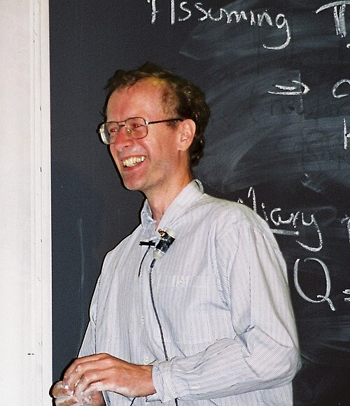

**[Andrew Wiles](kloom:e/andrew-wiles)** met the problem at ten. In his telling, he found a book
in his local public library in Cambridge that told the story of an
equation a ten-year-old could understand and that no mathematician in
three hundred years had been able to settle, and he decided to solve it. He grew up to work on elliptic curves, under John Coates at
Cambridge, and by 1986 he was a professor at **[Princeton](kloom:e/princeton-university)**. When he heard
that Ken Ribet had tied Fermat's equation to the modularity conjecture,
he set everything else aside. He needed only part of it: that every _semistable_ elliptic curve, the kind Frey's construction produces, is modular.

## Seven years in the study

He worked alone and told almost no one but his wife: for seven years in his account, six in others, much of it in his study at home. His paper of
1995 dates the turning points itself: an idea from commutative algebra in
the spring of 1991, a new construction of Matthias Flach's that he met in
August 1991, and a morning in May 1993 when a paper of Barry Mazur's
showed him how to switch from the prime 3 to the prime 5 for the curves
his method could not reach. In January 1993 he took his Princeton
colleague **[Nick Katz](kloom:e/nick-katz)** into his confidence to check the argument.

He chose to announce it in Cambridge, at a conference at the **[Isaac
Newton Institute](kloom:e/isaac-newton-institute)** organised by Coates. He gave three lectures, from 21 to
23 June 1993, under a title that did not mention Fermat. At the end of
the last one he wrote the theorem on the board, said he had proved it, and
added, "I think I'll stop there."

## The gap

Katz was one of the referees. Through July and August, in his telling, he
did nothing but go through the manuscript line by line, emailing Wiles
questions almost daily. One of them would not go away. It led to a flaw in
the bound Wiles had built by extending Flach's method, a step the proof could not do without. Accounts differ on when it was clear: Katz raised
it in August, and Wiles says he knew at the end of September. Late in
1993 he announced by email that there was a problem. Early in 1994 his
former student **[Richard Taylor](kloom:e/richard-taylor-mathematician)** came to Princeton, and they spent three
months on repairs that failed.

On Monday 19 September 1994, as he tells it, Wiles went back to see
exactly why the method did not work, and saw that what blocked it was
exactly what would complete the approach he had abandoned three years
before. "It was the most important moment of my working life." (In the
same film he places the morning at "the beginning of September".) The two
papers, his own and one with Taylor that proved the step the repair
needed, went to the _Annals of Mathematics_ on 24 October 1994 and filled its May 1995 issue.

## The last step

Suppose _a_ᵖ + _b_ᵖ = _c_ᵖ. Frey's curve for that
solution is semistable, so by Wiles it is modular. By Ribet its form can
be moved down to level 2. But at level 2 there are no forms, and the
reason can be drawn.

A form of level _N_ lives on a surface made by folding the upper half of
the complex plane with the matrices of whole numbers, rows (_a_, _b_) and (_c_, _d_), with _ad_ − _bc_ = 1 and _c_ divisible by _N_. For
_N_ = 2 the plate draws a region holding one copy of every point: the
strip −½ ≤ _x_ ≤ ½ above the two half-circles through 0. Glue its edges,
the straight sides by _z_ ↦ _z_ + 1 and the two arcs by
_z_ ↦ _z_/(2_z_ + 1), which carries −½ + ½_i_ to ½ + ½_i_ and holds 0 fixed.
The region closes up into a sphere. The forms that matter here are counted
by a surface's holes, and a sphere has none: as Ribet put it, the space of
forms at level 2 has dimension 0. At level 11 the surface is a torus with
one hole, and there is exactly one form: the one the modularity frame
checks prime by prime. So no solution exists.

## Checked by machine

In 2001 Christophe Breuil, Brian Conrad, Fred Diamond and Taylor proved
that every elliptic curve over the rationals is modular, the whole of
Taniyama's conjecture. **[Kevin Buzzard](kloom:e/kevin-buzzard)** of Imperial College began in 2024
to formalise the proof in the proof assistant **[Lean](kloom:e/lean-proof-assistant)**, with a
five-year grant to reduce it to results known by the 1980s. On 4
September 2026 **[Anthropic](kloom:e/anthropic)** announced that its model Claude, as dozens of
agents in a harness built on Claude Code, had written a complete Lean
proof in eleven days that August: 13 million lines, following the 1995
exposition by Henri Darmon, Diamond and Taylor. Buzzard compiled it and
checked it: "it checks out". It closed the last of Freek Wiedijk's list of
100 theorems to be formalised. Mathematically, he wrote, it "tells us
essentially nothing", since number theorists were already sure of the
proof; what it shows is what machines can now check. As of 30 September
2026 his own project goes on, towards a document in which people can explore the modern proof.

Fermat wrote his claim beside a problem of Diophantus. The trail that
began in that margin ends 358 years later, with a proof no margin could
hold.
