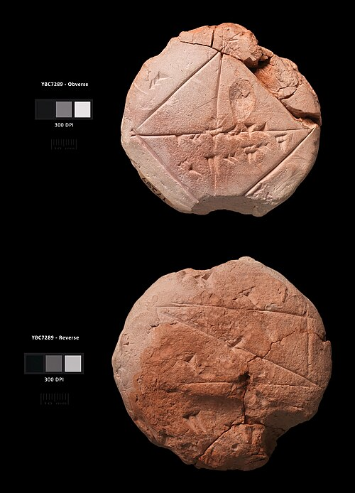

**[YBC 7289](kloom:e/ybc-7289)** is a lump of clay about the size of a palm, round, and
covered in a student's large handwriting. Someone in southern
**[Mesopotamia](kloom:e/mesopotamia)**, some time between 1800 and 1600 BC, drew a square on it
with its two diagonals and wrote three numbers. One of them is the square
root of two, correct to about six decimal places. It is the most accurate
calculation known from anywhere in the ancient world, and it is now in the
**[Yale Babylonian Collection](kloom:e/yale-babylonian-collection)** in New Haven.

## Counting in sixties

The scribes of Babylon wrote numbers in **[cuneiform](kloom:e/cuneiform)** wedges, and in base 60. Where we write a digit from 0 to 9 in each place, they wrote one up
to 59, built from narrow wedges for the units, up to nine, and wide wedges
for the tens, up to five. Where we
multiply by ten from place to place, they multiplied by sixty. Base 60 is
still with us: in the sixty minutes of an hour, the sixty seconds of a
minute, and the 360 degrees of a circle.

The number across the diagonal is 1 24 51 10. Modern scholars write it
1;24,51,10, with a semicolon where the whole number ends. Read place by
place, it is:

| Place          | Value      |   In decimals |
| -------------- | ---------- | ------------: |
| ones           | 1          |             1 |
| sixtieths      | 24/60      |           0.4 |
| 3,600ths       | 51/3,600   |     0.0141667 |
| 216,000ths     | 10/216,000 |     0.0000463 |
| **the number** |            | **1.4142130** |

The square root of two is 1.4142136. The tablet is short by less than one
part in two million; by our arithmetic, one part in about 2.4 million.
**[Ptolemy](kloom:e/ptolemy)**, when he needed the same root in his [_Almagest_](kloom:e/almagest) around AD 150, used the
same four sixty-places, without saying where they came from.

## What the student was doing

The side of the square is labeled 30, and under the diagonal is a second
number, 42;25,35, which is 30 times the root: the length of the diagonal
of a square of side 30. The plate draws the square as the scribes would
have drawn it, sides level, with the diagonal swung down by a compass to
show how much longer than the side it is.

But the scribes' notation had a flaw that is also a freedom. It wrote no
zero and no semicolon, so nothing said which place a digit was in. The 30
may be 30, or it may be 30/60, a half. Read that way, the diagonal is
0;42,25,35, which is 1/√2, and the two numbers on the tablet are a pair
whose product is one. Tables of reciprocals were among the scribes' basic
tools, and the historians
**[Eleanor Robson](kloom:e/eleanor-robson)** and David Fowler found this reading attractive, while
giving reasons to be wary of it.

The tablet's shape tells us who held it. A small, round "hand tablet" with
large writing was used for rough work by a student, and the student
probably copied the root from a table of constants. One such table, YBC
7243, gives the same value on its tenth line, labeled "the diagonal of a
square". Another tablet shows a step-by-step procedure for working such a
root out. The mathematical meaning of YBC 7289 was first recognized by
**[Otto Neugebauer](kloom:e/otto-e-neugebauer)** and Abraham Sachs, in 1945.

## Plimpton 322

A second tablet from the same world, **[Plimpton 322](kloom:e/plimpton-322)** in Columbia
University's library, is more famous and more argued over. It holds a
table of fifteen rows, and its second and third columns are the short side
and the diagonal of right triangles whose sides are all whole numbers:
Pythagorean triples, some of them far too large to find by trial. Row 4 is
the triple 12,709, 13,500 and 18,541, a thousand years before
Pythagoras.

What it was for is disputed. Some have read it as number theory, or as a
table of trigonometry. Robson, in 2002, argued against both: the
Babylonians had no idea of a measured angle, and the tablet's layout is that of the
administrative documents of Larsa around 1800 BC. She reads it as a
teacher's list, fifteen versions of one problem with tidy answers, so that
a teacher could set exercises and check them. In 2017 Daniel Mansfield
and Norman Wildberger at UNSW Sydney argued again for trigonometry, of a
kind built on ratios rather than angles, and called it the oldest and most
accurate trigonometric table. The two readings are still both in print.

These tablets were school exercises and working tables, the mathematics of
scribes who surveyed fields and counted rations. Egypt, at the same time,
was writing its own mathematics on papyrus, and doing it in fractions.
