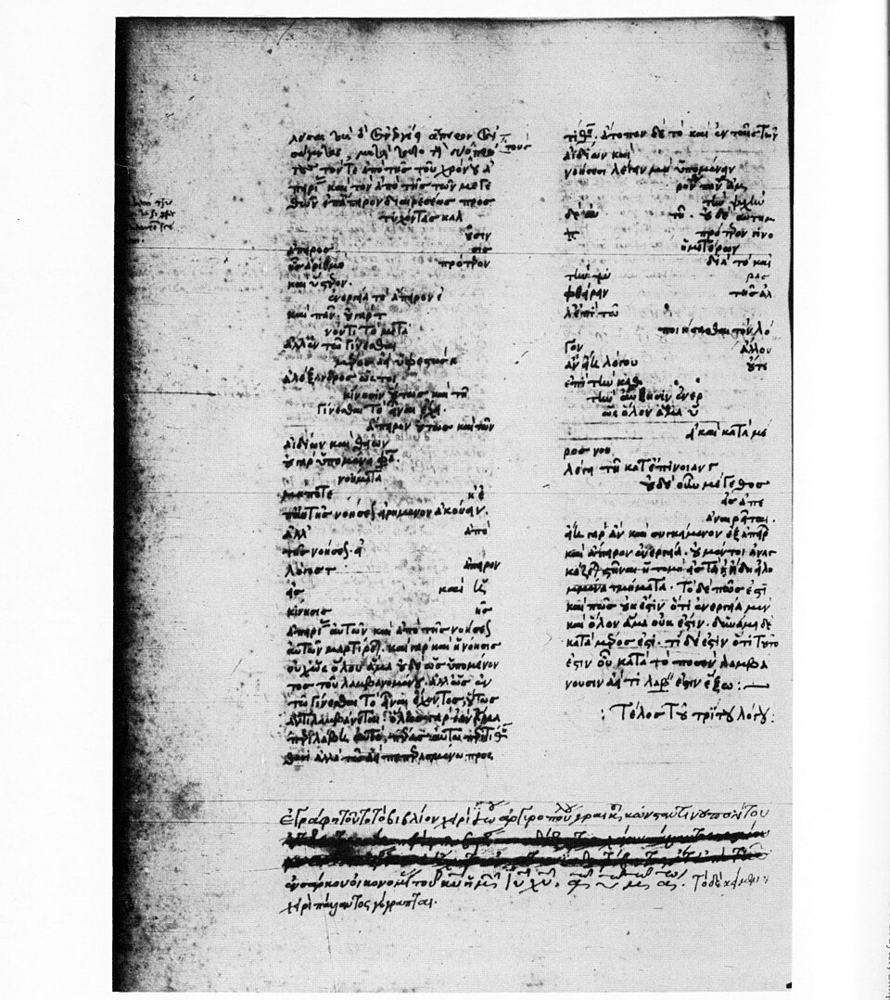

Some time around 450 BC, if a story told a lifetime later is to be trusted, two philosophers from Elea, a Greek city on the coast south of Naples, came to Athens for the Great Panathenaea. **[Parmenides](kloom:e/parmenides)** was about sixty-five and white with age. His pupil **[Zeno of Elea](kloom:e/zeno-of-elea)** was nearly forty. In the house where they lodged, Zeno read aloud from a book of arguments to a crowd that included a very young Socrates. **[Plato](kloom:e/plato)** tells the scene at the opening of his dialogue _Parmenides_, and it is nearly all we know of Zeno's life. Whether the meeting happened is doubted; the book existed, and is lost.

## A book against the many

Parmenides taught that reality is one and unchanging, and that the senses, which show us many things moving about, deceive us. People made fun of him. In Plato's dialogue Zeno explains that he wrote his book in youthful "pugnacity", to turn the attack back on the partisans of the many: "their hypothesis of the being of many, if carried out, appears to be still more ridiculous than the hypothesis of the being of one", in Benjamin Jowett's translation. Someone, he says, stole a copy, so he never chose whether to publish it. By the count of the philosopher Proclus, some nine centuries later, the book held forty arguments against plurality.

Each argument takes the opponent's assumption and follows it until it breaks: the method later called _reductio ad absurdum_, proof by contradiction. What survives is second-hand. **[Aristotle](kloom:e/aristotle)** states four arguments against motion in the sixth book of his [_Physics_](kloom:e/physics-aristotle), in order to refute them. **[Simplicius](kloom:e/simplicius-of-cilicia)**, commenting on Aristotle in the sixth century AD, a thousand years after Zeno, seems still to have had part of the book, and quotes a few sentences in what may be Zeno's own words.

The page is the end of Simplicius's commentary on the third book of the _Physics_, Aristotle's book on motion and the infinite, in a copy made in 1441 by the Byzantine scholar John Argyropoulos and the Florentine Palla Strozzi.

## Four arguments

In Aristotle's words, as translated by R. P. Hardie and R. K. Gaye, the first "asserts the non-existence of motion on the ground that that which is in locomotion must arrive at the half-way stage before it arrives at the goal." Before the half-way stage it must reach the quarter, before that the eighth, and so without end: the _dichotomy_. The second, "the so-called 'Achilles'", says "that in a race the quickest runner can never overtake the slowest, since the pursuer must first reach the point whence the pursued started, so that the slower must always hold a lead." The third says that a flying arrow, which at each moment occupies a space equal to itself, is at rest at every moment, and so never moves. The fourth, the _stadium_, sets rows of bodies passing one another and concludes that "half a given time is equal to double that time."

Together **[Zeno's paradoxes](kloom:e/zenos-paradoxes)** attack both ways of thinking about space and time: as divisible without end, where a journey needs infinitely many steps, and as made of indivisible moments, where the arrow never gets anywhere.

## The sum

The dichotomy asks us to add up infinitely many pieces: ½ + ¼ + ⅛ + …. The plate halves a segment in the same way, arcing over each run. After _n_ runs the distance covered is 1 − 1/2ⁿ, and what is left is exactly the last piece run:

| Runs | Distance covered | Still to go |
| ---: | ---------------: | ----------: |
|    1 |              1/2 |         1/2 |
|    2 |              3/4 |         1/4 |
|    3 |              7/8 |         1/8 |
|   10 |        1023/1024 |      1/1024 |
|   20 |  1048575/1048576 |   1/1048576 |

No finite number of runs finishes the course, but whatever gap is named, a millionth or a billionth, some number of runs leaves less than it. That is what it means, since **[Augustin-Louis Cauchy](kloom:e/augustin-louis-cauchy)** made it precise in the nineteenth century, to say that the infinite sum _is_ 1. The time sums the same way: if the whole course takes a minute, the runs take ½, ¼, ⅛ of a minute, and they are all done when the minute is. Achilles is the same sum in other numbers. Give the tortoise, by our own invention, a 90-meter start, Achilles ten times its speed, and he runs 90 + 9 + 0.9 + … meters, which is 100, where he passes it.

## Is that an answer?

Aristotle's answer was already half of this. Length and time, he wrote, are infinite "in respect of divisibility", not in extent, so "while a thing in a finite time cannot come in contact with things quantitatively infinite, it can come in contact with things infinite in respect of divisibility: for in this sense the time itself is also infinite." Of the arrow he said that "time is not composed of indivisible moments". But the philosopher Nick Huggett points out that Aristotle, later in the _Physics_, saw that this could not be the end, and fell back on a distinction between a _potential_ infinity of halves, which a continuous run contains, and an _actual_ one, which it does not.

Mathematicians since the nineteenth century have usually taken the sum as the answer. Philosophers often have not. The sum says where and when Achilles passes the tortoise; it does not say how anyone completes infinitely many acts, one after another, when none of them is the last. Simplicius tells of Diogenes the Cynic answering Zeno by standing up and walking.

Two thousand years later the infinite came back in a different shape. Galileo met it not in a distance cut ever smaller, but in the whole numbers, which could be counted in two ways at once.
