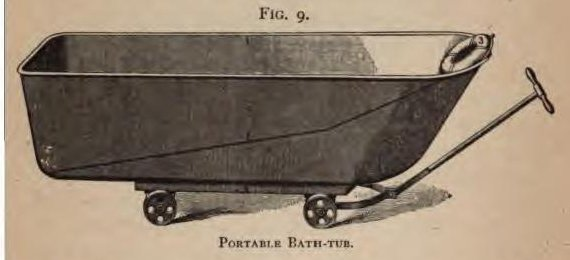

In the spring of 1898 the **[United States Army](kloom:e/united-states-army)** had 25,000 men, and to nurse them 520 privates of its Hospital Corps, with about 200 stewards and acting stewards. Within weeks of the declaration of the **[Spanish–American War](kloom:e/spanish-american-war)** in April it had ten times as many men in camps, and Congress, at the Surgeon General's request, let him hire nurses under contract. The law did not say they had to be men. Several hundred women, most of them untrained, had already applied, and the Surgeon General's office had no one to judge them.

## The Daughters' examining board

**[Anita Newcomb McGee](kloom:e/anita-newcomb-mcgee)**, a physician born and trained in Washington and a vice president general of the **[Daughters of the American Revolution](kloom:e/daughters-of-the-american-revolution)**, offered the society as an examining board, and in April the "D.A.R. Hospital Corps" was formed with her as director. Its standard was a diploma from a training school and the endorsement of the superintendent who had trained the applicant. The first nurses were appointed on 10 May and sent to the general hospital at Key West. In July yellow fever reached the troops at Santiago, and the Army hired "immunes", women who had survived it, many of them Black women from New Orleans without hospital training. The Sisters of Charity sent 200 sisters; in all about 250 Catholic sisters served. A contract nurse was paid $30 a month and a ration.

## Typhoid

Then came **[typhoid fever](kloom:e/typhoid-fever)**. The volunteers were packed into camps at Chickamauga Park in Georgia, Camp Alger in Virginia, Jacksonville and Camp Meade, with open sinks and flies swarming between the sinks and the mess tents. A board of three medical officers, **[Walter Reed](kloom:e/walter-reed)**, Victor Vaughan and Edward Shakespeare, went through the records of 92 regiments, 107,973 officers and men, and counted 20,738 cases, 19.26 percent of the men: about one soldier in five. Of these, 1,580 died, 7.61 percent. The surgeons had diagnosed only half the cases; most of the others went down as malaria. The Hospital Corps took 6,588 recruits, "entirely untrained", and once the camp hospitals had become, in McGee's words, "practically stationary", the objection to women in them disappeared.

| Date, 1898   | Women nurses in service |
| ------------ | ----------------------: |
| June 30      |                      23 |
| July 31      |                     162 |
| August 31    |                     924 |
| September 30 |                   1,065 |

## How typhoid was nursed

Typhoid ran about three weeks at a fever of 103 or 104 °F. Besides bringing the fever down, the treatment, the nursing textbook of Isabel Hampton, superintendent of nurses at Johns Hopkins, said in 1893, "consists chiefly of good nursing". The nurse charted the temperature, gave milk, three to four pints a day, four to six ounces every two hours, disinfected the stools, kept the mouth clean, and watched for the sudden fall of temperature that meant bleeding from the bowel or perforation. When the fever passed 102.5 °F, the doctor might order the cold bath named for Brand, who introduced it, given by the book like this:

| Step | The Brand bath, by Hampton (1893)                                                                         |
| ---- | --------------------------------------------------------------------------------------------------------- |
| 1    | Fill a portable tub two-thirds full of water at 70 °F; roll it to the bedside                             |
| 2    | Wrap the patient in a sheet; lift him in feet first and lower him until covered, hands free for the pulse |
| 3    | Rest the head on a rubber ring, under a cold wet compress                                                 |
| 4    | Keep the water at 68 to 70 °F with ice, for 15 to 20 minutes (10 the first time); rub against shivering   |
| 5    | Lift him out in a dry sheet; dry him after about ten minutes                                              |
| 6    | Take the temperature at once, and again half an hour later                                                |

A soft, intermittent pulse meant stopping at once. At Camp Meade a division surgeon, J. K. Weaver, put his worst typhoid cases in a separate hospital under women nurses and found "the air of cleanliness and order" in their wards the moment he walked in. The plate draws the tub and a fever chart with the line at which a bath was ordered.

## The corps made permanent

By mid-September about 1,200 women were in service, and before July 1899, 1,563 had served. McGee counted thirteen deaths: five trained nurses, five sisters and three immunes, all but two of typhoid. The Army Nurse Corps' own chronology gives twelve dead of typhoid, and adds Clara Maass, a former contract nurse who died in Havana in 1901 after volunteering as a subject in the Army's research on how the disease spread. At the Surgeon General's request McGee drafted the law, which became section 19 of the Army act of 2 February 1901. It made the Nurse Corps (female), the **[United States Army Nurse Corps](kloom:e/united-states-army-nurse-corps)**, a permanent part of the Medical Department: a superintendent at $1,800 a year, "as many chief nurses, nurses, and reserve nurses as may be needed", all graduates who had passed "a satisfactory professional, moral, mental, and physical examination", at $40 a month at home and $50 abroad, with quarters, subsistence, care when sick and thirty days' leave. It gave no rank. Nurses signed on for three years at a time, renewable on a good record. Dita H. Kinney, a former contract nurse, was its first superintendent. It began with about 200 nurses and was held at 100 from 1902; when the United States entered **[World War I](kloom:e/world-war-i)** on 6 April 1917 it had 403 on duty, and nineteen months later 21,480. The Navy's corps, its first superintendent wrote in 1909, was "the indirect outcome" of the Army corps' "proven worth"; it came in 1908.
