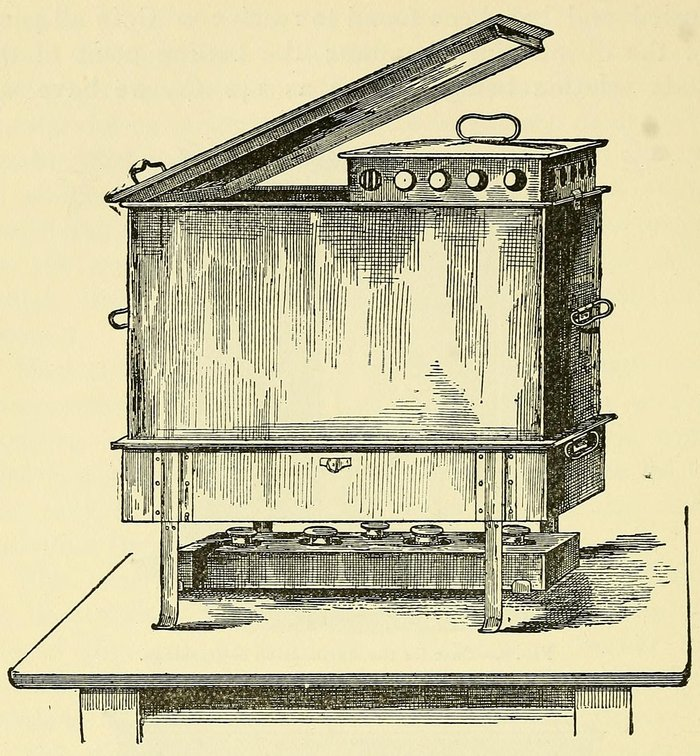

In 1890 the surgeons of the world met in Berlin for the tenth International Medical Congress, and **[Ernst von Bergmann](kloom:e/ernst-von-bergmann)**, professor of surgery at the university's clinic in the Ziegelstrasse, showed them his apparatus for sterilizing dressings. He claimed, as the historian Thomas Schlich reads the record, to have replaced antiseptic methods with aseptic ones in his hospital over the two years before. His assistant **[Curt Schimmelbusch](kloom:e/curt-schimmelbusch)**, hired in 1889 for his work in bacteriology, gathered the clinic's methods into a book, the _Anleitung zur aseptischen Wundbehandlung_ (1892), which Bergmann said was soon translated into almost every European language. Schimmelbusch wrote in 1891, in Schlich's translation, that "the streams of antiseptic solutions that used to flow in the operating rooms only a couple of years ago are running dry". Steam had taken their place. The change came gradually: the _Guide_'s second edition, of 1893, says that every dressing in Bergmann's clinic had then been sterilized in steam for eight years, while Wikipedia dates his first pressure sterilizer to 1891.

## Two words

The English translator of 1894, Alfred Rake, put the difference plainly. In antiseptic surgery, the method **[Joseph Lister](kloom:e/joseph-lister)** had built on carbolic acid, "the wound was kept in an antiseptic state by irrigation or spray, so that germs getting into the wound might be killed or rendered innocuous", and everything that touched it came wet from a chemical. In **[asepsis](kloom:e/asepsis)** "the great object aimed at is that everything which comes into contact with the wound shall be absolutely free from germs". Antisepsis fights the germs in the wound; asepsis keeps them from getting there, and the way to do that with dressings, towels and instruments was heat, which leaves nothing behind to injure tissue. The line was never clean. Bergmann's patients still had their skin washed with alcohol and sublimate, every hand was disinfected with chemicals, and during an operation the boiled instruments lay in a 1 percent solution of carbolic and soda.

## The apparatus and its numbers

Schimmelbusch tested each method with what was hardest to kill: anthrax spores, pus, and silk threads soaked in cultures. His figures, with those of the later sterilizers under pressure:

| What                     | How                                                         | Temperature and time                                                                                                  |
| ------------------------ | ----------------------------------------------------------- | --------------------------------------------------------------------------------------------------------------------- |
| Instruments              | Boiled in 1 percent washing soda, which stops steel rusting | Pus germs dead in 2–3 seconds, anthrax spores in 2 minutes; 5 minutes' boiling "would satisfy all claims in practice" |
| Dressings, towels, coats | Flowing steam in a closed chamber that drives out the air   | 100 °C; spores in pus-soaked dressings dead in 15 minutes; half an hour once the chamber is full of steam             |
| A large sterilizer       | Steam let in from above, a little over atmospheric pressure | One-fifth of an atmosphere over gives about 102 °C                                                                    |
| The autoclave            | Steam under pressure, 15 pounds a square inch (1916)        | Half an hour; 15 pounds is about 121 °C                                                                               |

Air was the enemy of steam: a pocket of it in a bundle never reached the temperature. Steam is lighter than air, so in a large sterilizer it went in at the top and pushed the air out of the bottom; one test cited in the _Guide_ heated folded blankets to 100 °C in 17 minutes that way, and in 22 minutes 20 seconds with the steam let in from below. Pressure raises the temperature at which steam forms, which is why the **[autoclave](kloom:e/autoclave)**, a steam vessel locked under pressure, kills spores faster. It came from **[Louis Pasteur](kloom:e/louis-pasteur)**'s laboratory, where **[Charles Chamberland](kloom:e/charles-chamberland)** is credited with it, in 1879, from his work on sterilizing culture media; **[Robert Koch](kloom:e/robert-koch)**'s simpler steamer, a tin cylinder with water below a perforated floor, was the model for many of the surgical sterilizers that followed.

The dressings went into tin boxes with a row of holes round the sides. A box went into the steam with its holes open, came out and stood to dry, and then its lid was pushed down to close the holes, so that it could be carried to the table and opened only when the operation began. The plate draws a sterilizer of this kind in section. The round drums that grew from these boxes, their holes closed by a sliding band, kept Schimmelbusch's name.

## The nurse's department

The new method moved work to the nurses. At Breslau, Rake noted, "the preparation of all dressings, towels, sponges, &c, which were required for the operations was entrusted to one sister, the 'Theatre sister'", and in four-hour operations supplies never ran short. In Bergmann's own breast amputation, as the _Guide_ describes it, one sister handed the instruments and a second the sponges and dressings. By 1916 Amy Armour Smith's primer for pupil nurses made the sterilizing room theirs: "Each nurse must learn how to run all of the sterilizers, since she has to do that work, not the orderly." A drum was packed with what was needed first on top, and the nurse who packed it dropped in a slip with her signature, so that any mistake came back to her. A small tube that opened only at the right heat went into the heart of the middle drum, and the load was held at 15 pounds for half an hour.

The rooms changed too. Bergmann's newer pavilions had walls and ceilings painted in oil colors, stone-flagged floors and furniture of wood or iron that could be washed. To disinfect one, everything was scrubbed with soap, soda and hot water, beds and curtains went into the steam, toys were destroyed, and the pavilion stood empty six or eight days with its windows open. The surgeons wore long coats of white linen fresh from the sterilizer.

Steam could make a dressing sterile, but not a hand. At the Johns Hopkins Hospital that problem was meeting a nurse's skin, in the next frame.
