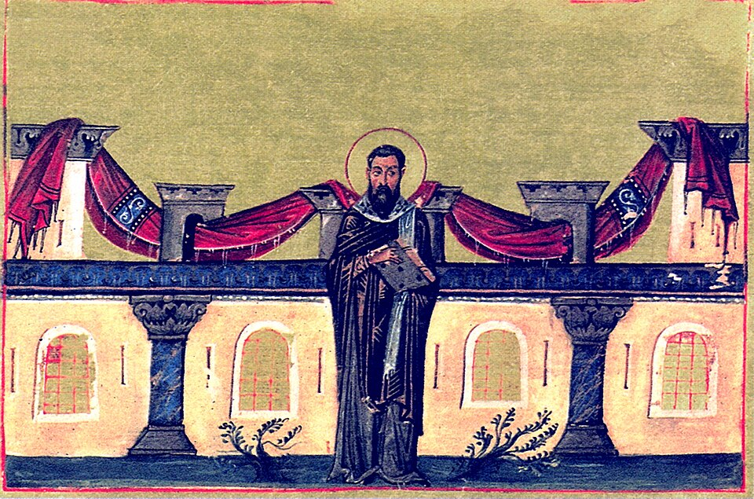

In January 372 the emperor **[Valens](kloom:e/valens)** passed through **[Cappadocia](kloom:e/cappadocia)**, in the middle of what is now Turkey, and gave its bishop land for the poor. The bishop was **[Basil of Caesarea](kloom:e/basil-of-caesarea)**, then about forty-two, two years into his see and already known in the city for feeding the hungry through a famine with soup kitchens he ran himself. On that land, outside **Caesarea** (modern **[Kayseri](kloom:e/kayseri)**), he built what his friend **[Gregory of Nazianzus](kloom:e/gregory-of-nazianzus)** called "the new city": a hostel for strangers, a house for the poor, lodgings for the sick and for people with [leprosy](kloom:e/leprosy), a church, and a monastery whose monks did the work. Later writers named it after him, the **[Basileias](kloom:e/basileias)**. It is the earliest institution for the sick of the general public that we can see in any detail, and one of the first where we can see who did the nursing.

## What was there

No plan of it survives, and its exact site is unknown; a survey in 1892 put the new city a mile or two from the old one. Basil described it once, in a letter to Elias, the provincial governor, defending himself against complaints that he was building too grandly:

> But to whom do we do any harm by building a place of entertainment for strangers, both for those who are on a journey and for those who require medical treatment on account of sickness, and so establishing a means of giving these men the comfort they want, physicians, doctors, means of conveyance, and escort?

The 1895 translation renders the first pair of helpers as "physicians, doctors". The historian Sung Hyun Nam, reading the Greek, takes them as two different kinds of people: nurses and doctors. The sources name these parts:

| Part                             | Who it was for                     | Where it is named                      |
| -------------------------------- | ---------------------------------- | -------------------------------------- |
| _Ptochotropheion_, a poorhouse   | the poor                           | Basil's letters                        |
| _Xenodocheion_ and _katagogia_   | travellers, strangers and the sick | Basil, Letter 94                       |
| A house for people with leprosy  | the "living corpses" of the region | Gregory, funeral oration for Basil     |
| A church and a monastery         | the monks who served               | Letter 94; Basil's rules for his monks |
| Physicians, attendants, carriage | everyone above                     | Letter 94                              |

## Who nursed

The nursing was done by monks, as part of their religious life rather than for pay. Basil wrote rules for his communities, collected as the _Asketikon_, and two of them speak to it. One of the shorter rules opens: "We who serve the sick in the hospital are taught to serve them with such a disposition as if they were brothers of the Lord," and goes on to ask what to do when a patient behaves badly (warn him, and if he persists, send him away). Another asks whether a sick monk should be moved into the hospital, and answers that it depends on the place and the common good. A longer rule settles whether a monk may use medicine at all. It may: medicine was given by God, like farming, weaving and building, to make up what our bodies lack, and its herbs grew by the Creator's will. A monk was only to use it so "as not to assign to it the whole cause of health or sickness". According to Andrew Crislip's study of monastic health care, as Wikipedia summarises it, the monks worked in rotating shifts, so that no one was overburdened or kept from prayer.

Gregory's funeral oration for Basil, who died in 379, dwells on the lepers. Before the new city, he said, the region's lepers had been "living corpses", driven from their homes and their own families and "recognizable by their names rather than by their features", and Basil had kissed them. Under his care they were housed, fed and tended, though no one expected them to recover.

## Hospital, hospice or leprosarium?

Historians do not agree on what the Basileias was. Peregrine Horden calls it "the first clearly medicalized Byzantine hospital", and Timothy Miller a hospital or medical hostel. Others, among them Benoît Gain and Susan Holman, see a hospice for travellers and the poor that also took in the sick, and Daniel Caner has argued that it was "not a hospital but a leprosarium". Nam points out that we have no figures for it at all, and no sign of the surgery and outpatient care that later Byzantine hospitals such as the Pantokrator in Constantinople offered. It was not the first of its kind either. Basil's mentor **[Eustathius of Sebaste](kloom:e/eustathius-of-sebaste)** had built a hostel for lepers in the 350s, and Basil's own letters ask tax relief for poorhouses already running elsewhere in the region. The old stories that he built it in answer to a famine or an outbreak of leprosy are not in the ancient sources.

What is not in doubt is the combination: a bed and food for strangers who were sick, physicians on hand, and the daily care of people who did it under a rule, as a duty to God. The plate draws what the sources put there, not a plan. The same pattern, care as a vocation and the sick as Christ's own, is written into the Western monastery's rule a century and a half later, in the frame on the monastic infirmary.
