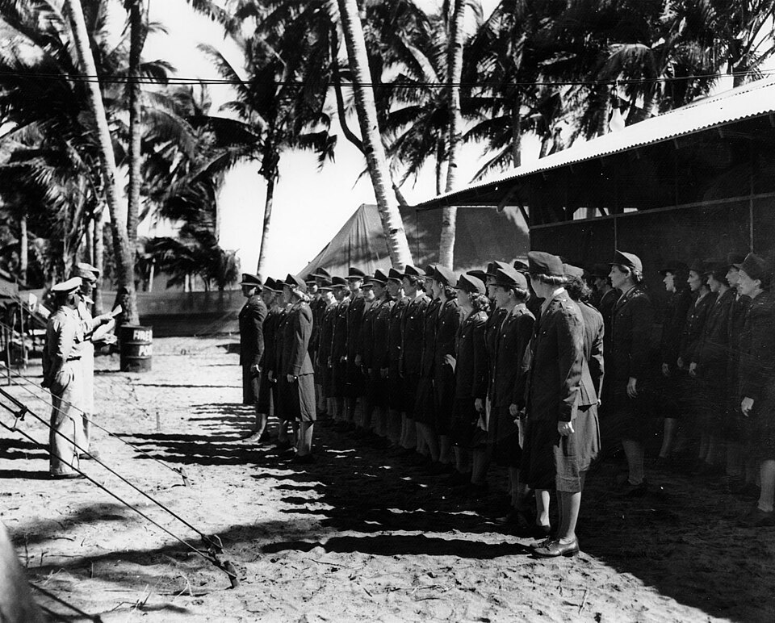

In December 1941 about a hundred American military nurses were stationed around Manila, in a posting much coveted for its short duty hours. Japanese bombers struck the Philippines on 8 December, and by Christmas the American and Filipino forces were falling back into the peninsula of Bataan and the island fortress of **[Corregidor](kloom:e/corregidor)**, at the mouth of Manila Bay. On Christmas Eve 24 Army nurses, 25 Filipino nurses and one Navy nurse, Ann Bernatitus, were sent by road to Limay, on Bataan, to open a field hospital in old barracks whose stores were wrapped in newspapers of 1918. The next day 20 more went to start a second hospital further back. The chief nurse, Captain **[Maude Davison](kloom:e/maude-c-davison)**, and her second, **[Josephine Nesbit](kloom:e/josephine-nesbit)**, led the women who came to be called the **[Angels of Bataan](kloom:e/angels-of-bataan)**.

## Hospital No. 2

General Hospital No. 1, at Limay and later at Little Baguio, took the casualties from the front; on 16 January 1942 its surgeons did 187 major operations in a day. Those who could be moved went to General Hospital No. 2, which Army engineers cut out of jungle on the south bank of the Real River near Cabcaben. It had no buildings. At its largest it ran for about 1,500 yards along the river, with some 67 medical officers, 83 nurses, 250 enlisted men and 200 civilians. Its limits were marked for enemy pilots by three red crosses, each 40 by 60 feet, laid at the corners of a triangle a mile from apex to base, and no bomb fell inside them. Its wards were cots in the open under the trees, with a shelter half or a sheet tied to the branches for a roof. "When we found a nice shady spot," one nurse said, "we made that into a ward or a place for an operating room."

The **[Battle of Bataan](kloom:e/battle-of-bataan)** was a siege, and the hospitals filled with the sick more than the wounded. From January the whole force was on half rations. By 1 March malaria was sending 500 or more men a day into hospital, and when the quinine ran out, the nurse Minnie Breese remembered in 1983, "We gave them TLC . . . about all you could do." Each hospital, built for 1,000 patients, held over 5,000 by the end of March, and No. 2's census rose to 7,000 in April, most of them sick with malaria, dysentery, malnutrition and exhaustion; many nurses worked through malarial fevers of their own. The wounded had their own danger. Wounds debrided too little, packed too tightly or closed too soon bred gas gangrene, which filled a ward of its own at No. 2 and cost many limbs and lives. On 30 March and again on 7 April bombs fell on Hospital No. 1, at Little Baguio; the Army's pamphlet of 1993 dates the first raid to 29 March. The nurses cut patients free of their traction ropes, and two of them, Rosemary Hogan and Rita Palmer, were wounded.

## The tunnel and the camp

On the night of 8 April, hours before Bataan surrendered, the nurses were ordered to Corregidor; Nesbit refused to leave without her Filipino nurses, and they came too. There they nursed in the laterals of the Malinta Tunnel, a 500-bed hospital stretched to 1,000 beds, where shifts stretched from twelve hours to sixteen and eighteen, among triple-decker bunks welded together for space, laying wet gauze over patients' mouths against the dust of each bombardment. On 29 April two Navy flying boats took out 20 nurses; one was wrecked on Lake Lanao, on Mindanao, and its ten were captured. On 3 May the submarine _Spearfish_ took out Bernatitus and ten or eleven Army nurses; the sources differ. When Corregidor surrendered on 6 May, the rest were made prisoners.

In July 1942 the Japanese moved them to the **[Santo Tomas Internment Camp](kloom:e/santo-tomas-internment-camp)**, a university campus in Manila holding several thousand civilians. Davison ran the nurses as a unit, in uniform and on duty shifts, in the camp hospital, beside the eleven Navy nurses taken when Manila fell in January. In May 1943 the Navy's eleven moved to Los Baños, and their story is told in the frame on Navy nurses as prisoners of war; they were freed in the **[Raid on Los Baños](kloom:e/raid-on-los-banos)** on 23 February 1945. Through 1943 the adult ration was about 1,700 calories a day. After the Japanese Army took the camp over in February 1944 it fell to 680 calories by January 1945; that month 32 internees starved to death, and 475 were in hospital. The nurses nursed them, hungry themselves.

## Who came home

The 1st Cavalry Division broke into Santo Tomas on 3 February 1945. Every nurse came out alive, on average 32 pounds lighter, and on 20 February, on Leyte, the Army nurses were given Bronze Stars and a step in rank before they left for home. Davison's Distinguished Service Medal came only in 2001.

The counts differ by source:

| Source                                        |        Army nurses captured | Navy nurses |
| --------------------------------------------- | --------------------------: | ----------: |
| Army Center of Military History, 1993         |                          67 |             |
| The Army's medical history, 1998              |       57, then 10 more (67) |          11 |
| Elizabeth Norman, as Wikipedia summarizes her | 66, and a nurse anesthetist |          11 |

The pamphlet counts 55 nurses left in the tunnel and ten from Mindanao, yet gives 67 in all; the medical history counts 57 and ten. Theirs was the largest group of American women ever taken prisoner by an enemy. The next frame follows the Army's nurses into the air, as flight nurses.
