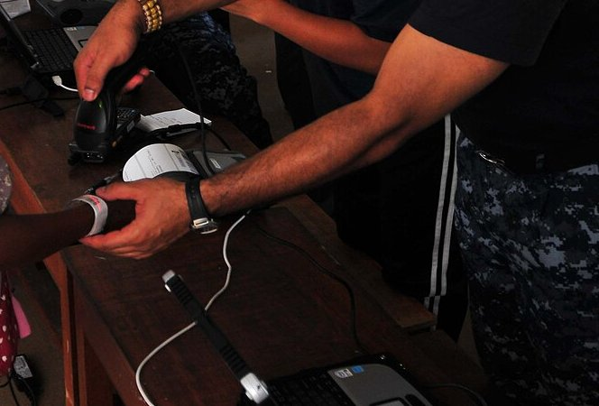

In 1992 **Sue Kinnick**, a nurse at the veterans' hospital in Topeka, Kansas, returned a rental car and watched the attendant check it in with a handheld scanner. In the telling of the **[United States Department of Veterans Affairs](kloom:e/united-states-department-of-veterans-affairs)** she was at an airport's rental-car desk; she had experience in data processing, and she saw that the same check could stand between a patient and the wrong medicine. The information staff of the Colmery-O'Neil VA Medical Center built a prototype: a computer on a wireless network with a scanner, taken to the bedside, which checked each dose against the physician's order as it was given and recorded it. It went into use at Topeka in 1995. Kinnick died of breast cancer in 1997, before the VA put her system into its medical centers nationwide, in 1999 and 2000. It is called bar-code medication administration, BCMA: a **[barcode](kloom:e/barcode)** on the patient's wristband, another on every dose, and a scanner to read the two together.

## The scan

The VA's current manual for the system sets out the medication pass step by step:

| Step | What the nurse does                              | What the software checks                                                                                         |
| ---- | ------------------------------------------------ | ---------------------------------------------------------------------------------------------------------------- |
| 1    | Signs on with her own access and verify codes    | Who is giving the medicine                                                                                       |
| 2    | Scans the bar code on the patient's wristband    | Who the patient is; opens the "virtual due list" of the doses ordered for this patient and this period           |
| 3    | Scans the bar code on each unit of each medicine | The drug is in the pharmacy's file; this patient has an active order for it; the dose is right; it is due now    |
| 4    | Gives a dose outside the hospital's set window   | Logs it as early or late, and will not go on until the nurse writes why                                          |
| 5    | Scans a dose already given, or one with no order | Refuses it with an error message                                                                                 |
| 6    | Gives the dose                                   | Marks it "G", given, in the record, with the time and the nurse                                                  |
| 7    | Cannot scan a damaged label                      | Takes the number typed from the label; failing that, and only if the hospital allows it, the nurse's attestation |

The attestation is to the "five rights" of giving medicine: the right patient, the right medication, the right dose, the right route and the right time.

## Where the errors were

In February 2004 the **[Food and Drug Administration](kloom:e/food-and-drug-administration)** required a linear bar code carrying the **[National Drug Code](kloom:e/national-drug-code)** on the label of most prescription drugs, and of over-the-counter drugs given in hospitals on an order, within two years for drugs already on the market. The rule's own arithmetic shows why. American hospitals had about 373,000 preventable adverse drug events a year, and 45.1 percent of them began when a drug was dispensed or given. The agency assumed, cautiously, that bedside scanning would catch half of those: 45.1 × 0.5 = 22.6 percent, or about 84,300 events a year at the time. The rule required machine-readable labels on blood and its components too, because about 55 percent of errors in transfusion began in patient areas, with a wrong sample drawn or the wrong patient identified.

## Did it work?

At an academic medical center, Eric Poon and his colleagues at Brigham and Women's Hospital in Boston observed 14,041 medication administrations before and after the bar code came to its units, reporting in 2010. Errors other than in timing fell from 11.5 percent of doses to 6.8, a relative fall of 41.4 percent; potential adverse drug events from 3.1 percent to 1.6; timing errors by 27.3 percent; and errors in transcribing orders, 6.1 percent before, vanished. The system reduced errors; it did not end them. The VA's own figure, an 86 percent fall in errors in dispensing drugs by 2002, measured the pharmacy's step, not the bedside's.

Nurses also found ways around it. Studying five hospitals between 2003 and 2006, Ross Koppel and his colleagues counted fifteen kinds of workaround with 31 causes: copies of patients' wristband bar codes taped to carts, doorjambs and nurses' belt rings, doses for several patients scanned and carried together, labels crinkled or missing, scanners broken, batteries dead, wristbands chewed or soaked. Each workaround took the scan out from between a nurse and the patient. At the hospitals whose logs they read, nurses overrode the system's alerts for 4.2 percent of patients charted and 10.3 percent of medications. The Navy photograph, from a medical program run from the hospital ship _Mercy_ in Cambodia in 2010, shows the wristband and the scanner at their plainest: Hospital Corpsman 2nd Class Shawn Hayes scanning a patient's identification band.

## Into the record

The VA's system ran in its hospital software, begun in 1978 and renamed **[VistA](kloom:e/vista)** in 1994, which is written in **[MUMPS](kloom:e/mumps)**, the language and database written at Massachusetts General Hospital for patient records. The rest of American medicine followed through the **[electronic health record](kloom:e/electronic-health-record)**. Under the **[Health Information Technology for Economic and Clinical Health Act](kloom:e/health-information-technology-for-economic-and-clinical-health-act)** of 2009 the government paid hospitals to adopt certified records and use them "meaningfully", and in 2012 it made electronic tracking of medication a core requirement of the program's second stage: for more than 10 percent of medication orders, every dose had to be tracked from order to administration, by bar code or radio tag. The rule cited Poon's study. A nurse's scan at the bedside, which began with a rental car in 1992, is now part of how American nursing is done, and where that nursing stands is the next frame.
