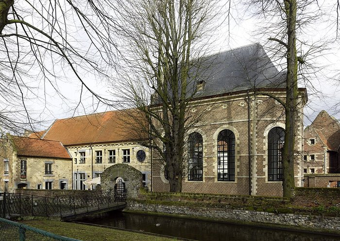

Around 1200, in the diocese of Liège and the towns of Flanders and Brabant, women began to live religious lives without entering a convent. They prayed, worked with their hands, and looked after the poor and the sick, and they took no vows that bound them for life. Their neighbors called them **[Beguines](kloom:e/beguines-and-beghards)**, a name of uncertain origin that may have begun as an insult. Their first champion was **[Jacques de Vitry](kloom:e/james-of-vitry)**, a preacher who wrote, about 1215, the life of one of them, **[Marie of Oignies](kloom:e/marie-of-oignies)**. In the old English translation, the "holy women" of the diocese earn "a poor subsistence by the work of their hands", and the widows among them "wash the feet of the poor" and are "given up to works of mercy". Marie and her husband John, having agreed to live chastely, "for some time ... tended some leprous persons in a place called Willambrock", near Nivelles. Later, Vitry says, "it was her custom to attend the sick, and to be present at the last moments of the dying and the burial of the dead", and she "not unfrequently passed sleepless nights on their account".

## Chaste, but not vowed

A beguine promised chastity and obedience only for as long as she stayed. The formula that the nursing historians Adelaide Nutting and Lavinia Dock printed in 1907 runs: "I ... promise you, my father, and the authorities present and future, obedience and chastity while I remain in the Beguinage." She could leave and marry, she kept her property, and she lived by her own work: spinning and weaving for the cloth trade of the Low Countries, teaching, sewing, and nursing. Malderus, bishop of Antwerp, explained the choice in 1630, as Nutting and Dock translate him: Flemish women "prefer to remain inviolably chaste rather than to promise to be so". Nutting and Dock thought nursing itself resisted vows, because the work went where the sick were and could not be shut behind a wall. They also gave the founding to Lambert le Bègue, a reforming priest of twelfth-century Liège; historians no longer accept that story, and the movement had no single founder.

## A town inside the town

From the 1230s the beguines of the Low Countries were gathered into walled courts, the beguinages, at **[Ghent](kloom:e/ghent)**, Bruges, **[Leuven](kloom:e/leuven)** and nearly every other town. ICOMOS, evaluating the Flemish beguinages for the World Heritage List in 1998, describes miniature towns with gates that were opened by day and closed at night. Their parts, which the plate draws as a schematic:

| Part                         | What it was for                                                                      |
| ---------------------------- | ------------------------------------------------------------------------------------ |
| The church                   | The court's own worship; at Leuven, building began in 1305                           |
| The infirmary                | The sick and old beguines, and the poorest, who lived there; it had its own superior |
| The Grande Dame's house      | The elected head of the court and her council                                        |
| The Table of the Holy Spirit | Alms for the poor outside the walls                                                  |
| Houses and "convents"        | A house for a beguine of means; a community house for those without                  |
| The farm and brewhouse       | Food and income; at Saint-Trond the infirmary and the farm stood together            |

The infirmary's superior managed its own organization and accounts, and sat on the Grande Dame's council. Nutting and Dock add that the old and feeble were kept at the community's cost, so that none became a public charge, and that a court earned money from its pay patients and from the beguines who went out to nurse in the town. A set of regulations of 1325 that they quote, without saying from which town, required that "each Beguine hospital shall have a Superioress who shall give permission to go out". No medieval beguine left a manual of how she nursed; what the sources describe is watching by the bed, feeding, washing, and laying out the dead.

## Suspected

Women who were neither nuns nor wives worried the Church. In 1310 Marguerite Porete, a beguine whose book of mysticism had been condemned, was burned in Paris, and the **[Council of Vienne](kloom:e/council-of-vienne)** of 1311–1312 turned on the whole movement. Its decree declared that beguines, "since they promise obedience to nobody, nor renounce possessions, nor profess any approved rule are not religious at all", and forbade their way of life "perpetually". A last clause let "faithful women" go on "living uprightly in their hospices", and in Flanders most beguinages survived; in 1321 Pope John XXII allowed reformed beguines to resume their life. In the Rhineland the condemnation was enforced harder.

The courts outlived the Middle Ages. Nutting and Dock record Belgian beguines nursing soldiers in an epidemic of 1809–1810 and the sick in the cholera epidemics of 1832, 1849 and 1853. The last of the traditional beguines, Marcella Pattyn, died at Kortrijk in 2013, and thirteen Flemish beguinages were inscribed as a World Heritage site in 1998. The photograph shows the infirmary of the beguinage at Tongeren, with its chapel.

Jacques de Vitry, the Beguines' first champion, was also the historian who described the Hospitallers' early brothers giving their best bread to the sick. Four centuries after him, a priest in Paris met the same problem, how to have women nurse the sick without walls around them, and answered it with the Daughters of Charity.
