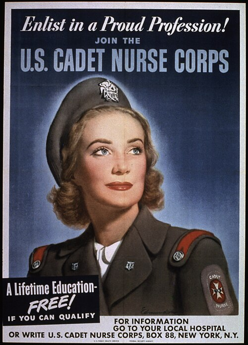

By the spring of 1943 the war had taken so many graduate nurses into the Army and Navy that the hospitals at home were running on their students, who already gave about two-thirds of the care in hospitals that had schools. On 29 March **[Frances Payne Bolton](kloom:e/frances-p-bolton)**, a Republican congresswoman from Ohio and a champion of nursing education since the First World War, introduced H.R. 2326, a bill "to provide for the training of nurses for the armed forces, governmental and civilian hospitals, health agencies, and war industries". The Senate added a clause that the training be open to all "regardless of race, color, or creed". Both houses passed it unanimously, and on 1 July 1943 the Nurse Training Act became Public Law 74, known ever since as the Bolton Act. It created the **[Cadet Nurse Corps](kloom:e/cadet-nurse-corps)**, the largest of the government's wartime nurse training programs, and gave it to the **[United States Public Health Service](kloom:e/united-states-public-health-service)** to run. The Surgeon General, **[Thomas Parran](kloom:e/thomas-parran-surgeon-general)**, made **[Lucile Petry](kloom:e/lucile-petry-leone)** director of a new Division of Nurse Education, the first woman to head a major division of the Service.

## The bargain

The Public Health Service's own history, published in 1950, put the argument plainly: after a few months of training, three student nurses could replace two graduates on many hospital tasks, and free the graduates for the services. So the government paid for a nurse's whole education, and a little pocket money, and every cadet signed a pledge:

> In consideration of the training, payments, and other benefits which are provided me as a member of the United States Cadet Nurse Corps, I agree that I will be available for military or other Federal, governmental, or essential civilian services for the duration of the present war.

The Service's lawyers later advised that the pledge was "purely honorary" and bound no one, and the Service judged that a binding contract would have scared off more recruits than it kept. The schools, in return for federal money, compressed the usual three-year course into thirty months, and the last six became paid service:

| Stage        | Months | What the government paid                    | The cadet's allowance      | Time on the wards                        |
| ------------ | ------ | ------------------------------------------- | -------------------------- | ---------------------------------------- |
| Pre-cadet    | 1–9    | Tuition, fees, and $45 a month for her keep | $15 a month                | no more than 24 hours a week, on average |
| Junior cadet | 10–30  | Tuition, fees and uniforms                  | $20 a month                | 44 to 48 hours a week, classes included  |
| Senior cadet | 31–36  | Nothing: the hospital she served paid       | at least $30, and her keep | full time, doing a graduate nurse's work |

A senior cadet could stay in her own hospital or go where she was most needed. Most stayed, 73 percent of them, but more than 6,000 served in Army hospitals, 1,025 in Navy hospitals, 7,521 in Veterans' Administration hospitals and 1,000 in the Indian Service's.

## Who was let in

The non-discrimination clause opened the federal money to schools for Black women, and 21 of them joined the Corps, along with 38 schools that took both Black and white students. How many Black cadets there were is not settled. The 1950 history quotes **Estelle Massey Riddle** of the National Association of Colored Graduate Nurses twice, once for "more than 3,000" and once, in her survey of May 1945, for "about 2,600", a number she called "dangerously low"; the Army's history of its nurses gives about 2,000. Her survey also found states that still held Black schools to lower standards, and federal hospitals that would not take Black senior cadets. Boston City Hospital became one of the first northern hospitals to take Black cadets for part of their training, twelve students from Tuskegee Institute's school.

The Corps' membership card never asked a cadet's race, so the rest is reconstructed. Thelma Robinson's study of Nisei cadets, as Wikipedia summarizes it, counts more than 400 Japanese American women, many of them released from the camps of the **[internment of Japanese Americans](kloom:e/internment-of-japanese-americans)**, though only about seventy schools would admit them. The only accredited school of nursing for Native American women, at Sage Memorial Hospital in Ganado, Arizona, in the Navajo Nation, trained about 39 cadets. The Service's 1950 history mentions neither group.

## What it did

| Admitted                                  | Cadets  |
| ----------------------------------------- | ------- |
| Already in school when the Corps began    | 36,000  |
| Fiscal year 1944 (July 1943 to June 1944) | 50,827  |
| Fiscal year 1945                          | 54,396  |
| Fiscal year 1946, until 15 October 1945   | 28,220  |
| Total                                     | 169,443 |

Of those 169,443 cadets, in 1,125 of the country's 1,300 nursing schools, 124,065 graduated: about 73 percent, by our arithmetic. (Wikipedia, from a later count, gives 179,294 enrolled; the graduates agree.) At its peak, on 15 September 1945, the Corps held 117,679 students, 84.5 percent of all the student nurses in the country, and when Japan surrendered students were giving 80 percent of the nursing in more than a thousand civilian hospitals. The program cost the government $160,326,237. The American Hospital Association credited the cadets with keeping civilian nursing from collapse in **[World War II](kloom:e/world-war-ii)**; Petry, in 1949, became the first woman to be an Assistant Surgeon General of the Service. Bolton went on to her next bill, for men.

While the Corps filled the schools, the Army's own nurse corps was short of nurses and still held to a quota on Black ones, the story of the next frame.
