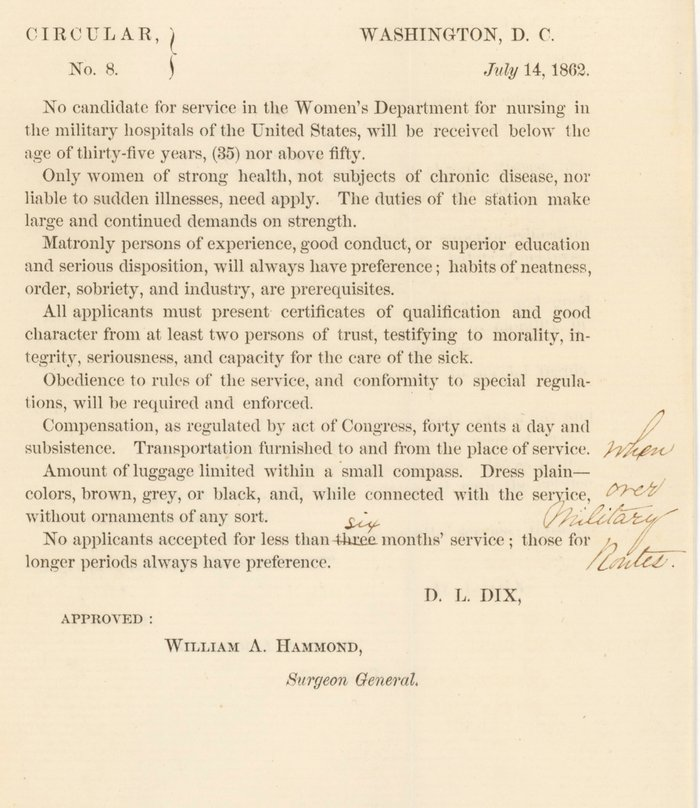

When the **[American Civil War](kloom:e/american-civil-war)** began in April 1861, the Army's hospitals were nursed by soldiers detailed from the ranks, and the Army had no women nurses at all. Thousands of women offered themselves at once. On 10 June 1861 the Secretary of War, Simon Cameron, named **[Dorothea Dix](kloom:e/dorothea-dix)**, known across the country for her campaigns for the insane, Superintendent of Women Nurses, and in August Congress let the Surgeon General employ women in the general hospitals. Dix had never nursed. Her task was to choose who would.

## The circular

Her rules were printed on 14 July 1862 as Circular No. 8, approved by the Surgeon General, William Hammond. Popular retellings give them as "over thirty" and "plain-looking"; the circular itself, in the National Archives, says:

| The circular                                                                                                               | In short                 |
| -------------------------------------------------------------------------------------------------------------------------- | ------------------------ |
| No candidate "will be received below the age of thirty-five years, (35) nor above fifty"                                   | 35 to 50                 |
| "Only women of strong health, not subjects of chronic disease"                                                             | the work was heavy       |
| "Matronly persons of experience, good conduct, or superior education and serious disposition, will always have preference" | maturity over enthusiasm |
| Certificates of character "from at least two persons of trust"                                                             | references               |
| "Compensation, as regulated by act of Congress, forty cents a day and subsistence"                                         | about $12 a month        |
| "Dress plain—colors, brown, grey, or black, and ... without ornaments of any sort"                                         | no hoops, no jewelry     |
| No one for less than six months' service (the printed "three" is struck out by hand)                                       | no short visits          |

A second circular of the same day, Hammond's own, set the numbers: the regulations allowed one nurse to every ten beds in a general hospital, and of every three nurses one was to be a woman and two men. "Sisters of Charity will be employed, as at present, under special instructions." The plate lays out a ward of thirty beds by those numbers. Dix's office appointed about 3,000 women. Counting everyone, the Army Nurse Corps' own chronology puts about 6,000 women among the nurses of the Union army, and estimates of women in nursing and relief on both sides run to about 30,000. Dix quarreled with surgeons, distrusted the Catholic sisters, and lost most of her authority in 1863, when the Army put its hospital staff under the surgeons.

## A ward nurse's day

The fullest account of the work is **[Louisa May Alcott](kloom:e/louisa-may-alcott)**'s. She was thirty, five years under the circular's minimum, when she reached a hospital in Georgetown in December 1862, and her letters home became **[_Hospital Sketches_](kloom:e/hospital-sketches)** (1863). Three days after she arrived, forty ambulances brought the wounded from Fredericksburg. "Wash, dress, feed, warm and nurse them," another nurse told her, handing her a basin, a sponge and "a block of brown soap". Her day, as she gives it:

| When            | The work                                                                                         |
| --------------- | ------------------------------------------------------------------------------------------------ |
| On arrival      | Strip and scrub each man; clean shirts; the attendants put him to bed                            |
| Then            | Trays of bread, meat, soup and coffee to all who could eat                                       |
| Surgeons' round | Help the surgeon dress the wounds: her "first lesson in the art of dressing wounds"              |
| Evening         | Medicines, "washing feverish faces; smoothing tumbled beds; wetting wounds"; letters and reading |
| From nine       | The night watch, with the gas turned down, "wetting" the dressings, which had to be kept damp    |

On nights she sorted her ward into a "duty room", a "pleasure room" and a "pathetic room", the first visited "with a dressing tray, full of rollers, plasters, and pins", the last "with teapots, lullabies, consolation, and sometimes, a shroud." After some six weeks she caught typhoid and her father took her home, with, as she put it, "a sharp tussle with typhoid, ten dollars, and a wig" to show for it. Forty-five years later the first superintendent of the Navy's nurses said the book had made her want to nurse soldiers.

## The Sanitary Commission

The **[United States Sanitary Commission](kloom:e/united-states-sanitary-commission)**, a private body that the government authorized in June 1861, was founded by people who had read Florence Nightingale and the British inquiries into the Crimean War, where the British army's mortality of January 1855, its historian wrote, "would in ten months have destroyed every man in it" had it gone on. Its method was inspection. Six paid inspectors visited the camps with a list of 180 questions, on the site and drainage, the tents, the clothing, the water, the cooking and the sick; the returns of nearly 400 inspections were tabulated by its actuary, E. B. Elliott, and a Bureau of Vital Statistics followed. It also sent supplies, ran hospital transports and soldiers' homes, and placed nurses of its own.

## Sisters, and the women the rules left out

More than 600 Catholic sisters nursed for the Union, the Sisters of Charity among them. **[Susie King Taylor](kloom:e/susie-king-taylor)**, born enslaved in Georgia in 1848, was enrolled as laundress of the 1st South Carolina Volunteers, later the 33rd United States Colored Troops, and did little laundry. In 1863 she nursed a soldier of her company through smallpox, going to him every day and last thing at night; she taught the men to read; when the wounded came back from an assault on James Island she made them custard from condensed milk and turtle eggs. She served four years and three months "without receiving a dollar", and a technicality kept her off the roll of Army nurses' pensions. In the hospital at Beaufort she met **[Clara Barton](kloom:e/clara-barton)**, nursing there. In the South, Sally Tompkins kept her Richmond hospital open by accepting a captain's commission in 1861, and Kate Cumming kept a journal of her years as a matron.

The war's nurses went home in 1865, and the Army went back to nursing with men. The next frame follows the women who came back in 1898.
