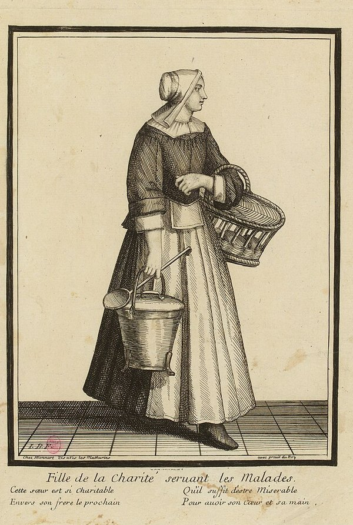

In 1617 the priest **[Vincent de Paul](kloom:e/vincent-de-paul)** was serving the parish of Châtillon-les-Dombes, north of Lyon. Asked one Sunday to speak about a family in which everyone was sick, he found afterwards that many of his hearers had gone out to them with food. "Noble but ill-regulated charity," he is reported to have said: provided with too much now, the family would soon be in want again. So he gathered the women of the parish into a Confraternity of Charity, to take turns visiting the sick poor, and wrote them a rule. When he carried the idea to [Paris](kloom:e/paris), the noblewomen of the city's Ladies of Charity joined, and often sent their servants in their place. Vincent wanted women who would do the work themselves, and found them among country girls. The first was **[Marguerite Naseau](kloom:e/marguerite-naseau)**, a country girl from Suresnes who had taught herself to read; in February 1633 she took a woman sick with plague into her own bed, and died of it. On 29 November 1633 **[Louise de Marillac](kloom:e/louise-de-marillac)**, a widow who had worked beside Vincent for years, moved with four or five such girls into a small house in Paris to train them. They became the **[Daughters of Charity](kloom:e/daughters-of-charity-of-saint-vincent-de-paul)**.

## Not nuns

Nuns of that time were enclosed, and enclosure would have kept the Daughters from the sick. Vincent refused it, and refused them a convent, a habit and a veil. They wore the gray dress of the countrywomen they were, made their promises for one year at a time, and could leave. In a conference of 24 August 1659, explaining the rules for the sisters who nursed in the parishes of Paris, he read them the article that they "do not belong to a religious Order because that state is incompatible with the duties of their vocation", having "for monastery only the houses of the sick ... for cell, a hired room; for chapel, the parish church; for cloister, the streets of the city; for enclosure, obedience ... for grille, the fear of God; for veil holy modesty". In the same conference he put it shortly: to say nun is to say cloistered, and a Daughter of Charity had to go everywhere.

## The visit

The rule Vincent wrote at Châtillon in 1617 sets out the visit, and the Daughters inherited it. In the English of his biographer Émile Bougaud:

| Step | What the rule required                                                                                       |
| ---- | ------------------------------------------------------------------------------------------------------------ |
| 1    | Take the food from the treasurer, cook it, carry it to the sick, and greet each one "cheerfully and kindly"  |
| 2    | Set a tray on the bed, spread a napkin over it, and lay on it a glass, a spoon and a bread roll              |
| 3    | Wash the sick person's hands and say grace                                                                   |
| 4    | Pour out the soup, put the meat on a plate, and invite the sick person to eat; cut the food, pour the drink  |
| 5    | Leave the rest to anyone at hand, and go on to the next                                                      |
| 6    | Begin with those who have someone to help them, and end with those who have no one, to stay longer with them |
| 7    | In the evening, return with the supper and do it all again                                                   |

Each sick person had as much bread as needed, a quarter of a pound of mutton or boiled veal at dinner and as much roast at supper, boiled chicken on Sundays and feasts, and minced pie two or three times a week. Those without fever had a pint of wine a day, half in the morning and half at night. The dying were to be prepared for death, and the dead buried at the confraternity's cost. The plate draws the round and the tray.

A print sold by the Bonnart family in Paris about 1700 shows a Daughter on her round: the soup pot and ladle in one hand, a basket on her arm. The Daughters also carried medicines. Vincent told them, in Bougaud's version, never "to prepare the medicines according to your own way of thinking", to follow the doctors exactly in "the quantity of the dose", and to learn "in what case it is necessary to bleed in the arm or in the foot; what quantity of blood you should take on each occasion; when to apply the cupping-glasses", so as to be useful in villages with no doctor.

## Louise's school

Louise did the training. The girls came from villages and farms, and Vincent wanted them able to read, write and reckon; she taught them the work of the sick room and the rule, and placed them in the parishes. In 1639 the hospital of Saint-Jean at Angers asked for Daughters to take over its nursing, the first hospital to do so, and she went with them and stayed three months. Her regulations for Angers, as the nursing historians Adelaide Nutting and Lavinia Dock summarize them, had the sisters up at four, in the wards at six to make the beds, give the medicines and serve breakfast, the patients fed at fixed hours and given drink when thirsty, settled for the night at seven, and one sister left on watch when the rest went to bed at eight. The contract, signed in February 1640, gave the sisters alone the care of the patients, and kept for Louise the right to recall them.

When Vincent and Louise died in 1660, the Daughters had more than forty houses in France and nursed the sick poor at home in twenty-six parishes of Paris. They went on to war. In October 1854 _The Times_ reported that the French army in the Crimea had "the help of the Sisters of Charity, who have accompanied the expedition in incredible numbers", and **[Florence Nightingale](kloom:e/florence-nightingale)**, who had lived with the Sisters in Paris the year before to learn their work, asked their mother house for nurses on her way to Scutari, and was refused. In America their sisters nursed in field hospitals of the Civil War. The Protestant answer to them, two centuries on, came from a pastor's parish on the Rhine, at Kaiserswerth.
