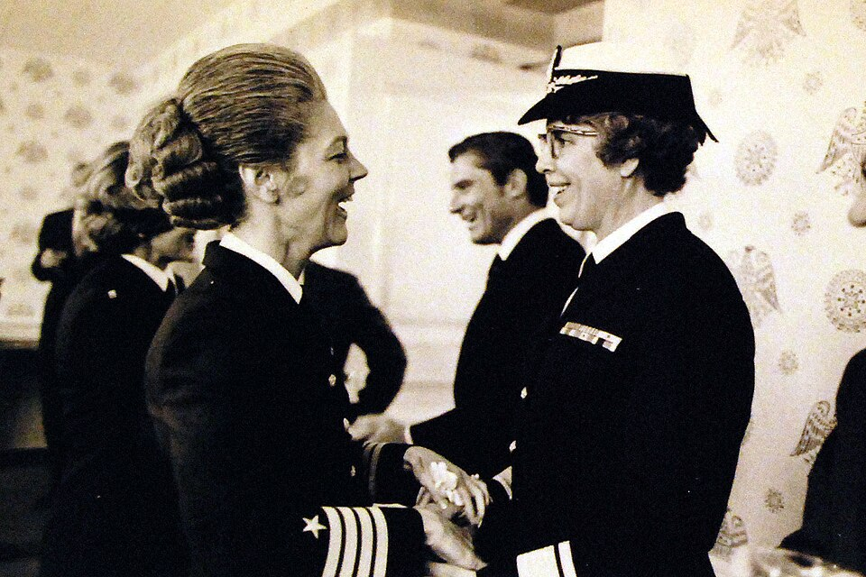

On 1 June 1972 **[Alene Duerk](kloom:e/alene-duerk)**, Director of the **[United States Navy Nurse Corps](kloom:e/united-states-navy-nurse-corps)**, became a rear admiral, the first woman in the Navy's history to reach flag rank. It took 197 years and a forward-looking Chief of Naval Operations, the director of the Naval History and Heritage Command said at her death in 2018, "but the credit goes to Duerk." She had come up through the wards, the classroom and the recruiting office, and the Corps she led was one she had joined as a reserve ensign in the middle of a war.

## Ensign to captain

Duerk was born in Defiance, Ohio, on 29 March 1920, and trained at the Toledo Hospital School of Nursing, earning her diploma in 1941. Her career, step by step, as the Navy's official biography gives it:

| When            | Where and what                                                                                     |
| --------------- | -------------------------------------------------------------------------------------------------- |
| 23 January 1943 | Appointed ensign, Nurse Corps, US Naval Reserve                                                    |
| March 1943      | Ward nurse, Naval Hospital Portsmouth, Virginia                                                    |
| January 1944    | Ward nurse, Naval Hospital Bethesda, Maryland                                                      |
| May 1945        | The hospital ship _Benevolence_ (AH-13), in the Pacific                                            |
| 1946–51         | Released from active service; a degree, a hospital post, a reserve unit in Detroit                 |
| June 1951       | Recalled: ward nurse, Portsmouth; then instructor at the Naval Hospital Corps School there         |
| 1956–58         | Interservice education coordinator, Naval Hospital Philadelphia                                    |
| 1958–61         | Nurse programs officer, Naval Recruiting Station, Chicago                                          |
| 1961–63         | Charge nurse at Subic Bay in the Philippines; assistant chief nurse at Yokosuka, Japan             |
| 1963–68         | Senior nurse at Long Beach; Corps School, San Diego; nurse recruitment and placement in Washington |
| 1968–70         | Chief of nursing service, Naval Hospital Great Lakes, Illinois                                     |
| May 1970        | Director of the Navy Nurse Corps                                                                   |

The ship was the one she never forgot. **[USS _Benevolence_](kloom:e/uss-benevolence)** lay off Eniwetok taking the sick and wounded from the Third Fleet's strikes against Japan, and was with the fleet in Tokyo Bay at the surrender. Then she anchored off Yokosuka to take in Allied prisoners of war freed from the Japanese camps, and screened 1,520 of them. Duerk told the Library of Congress's Veterans History Project, long afterwards, that taking the prisoners aboard "was the most exciting experience of my whole career."

Between the wars she took a bachelor's degree at Western Reserve University in 1948, in ward management and teaching, medical and surgical nursing, and taught and supervised medical nursing at Highland Park General Hospital in Michigan. Much of her second career was teaching hospital corpsmen and recruiting nurses, at a time when the Corps was short of them. She transferred from the reserve to the regular Navy in December 1953, and was made captain in 1967. The plate draws her career on its years, with the five years out of uniform left blank.

## What the stars took

Two things had to change before a nurse could wear an admiral's stars. Public Law 90-130, signed on 8 November 1967, was "to remove restrictions on the careers of female officers", and it rewrote the clause on the Nurse Corps's director to say that an officer serving as director "has the rank of captain unless otherwise entitled to a higher rank or grade". The frame on commissioned rank tells that law and the long road to it. The second was a sponsor. The Navy's historians credit the Chief of Naval Operations from 1970, **[Elmo Zumwalt](kloom:e/elmo-zumwalt)**, with the break with tradition, and in August 1972, weeks after her promotion, he ordered that women be offered "various paths of progression to flag rank". President **[Richard Nixon](kloom:e/richard-nixon)** approved Duerk's selection on 26 April 1972, and she was advanced on 1 June. The Navy's sources differ on the date: its history of the Nurse Corps says she was promoted on 27 April, and a photograph caption has Zumwalt "frocking" her, letting her wear the rank before it took effect, which may be why. As the story is told, she heard the news on her car radio, and the first person she told was the attendant at a toll booth.

## Director

As director she widened what Navy nurses did, into ambulatory care, anesthesia, pediatrics, obstetrics and gynecology, and she spoke for the Navy's women as well as its nurses, on pay, conditions and recruiting. The Corps she led had admitted men since 1965, under her predecessors; their story is told on the trail of who was let in. She retired in 1975 and died in Florida on 21 July 2018, aged 98.

The directors after her wore the stars too. **[Maxine Conder](kloom:e/maxine-conder)**, director from 1975 to 1979, had nursed off Korea aboard the hospital ship _Haven_. **[Frances Shea-Buckley](kloom:e/frances-shea-buckley)**, director from 1979 to 1983, had run the operating rooms of _Repose_. The first woman of the line to make rear admiral, Fran McKee, did so in 1976, and **[Grace Hopper](kloom:e/grace-hopper)**, whom Zumwalt had made a captain, followed as a commodore in 1983. The trail ends here, sixty-four years after the twenty nurses of 1908 who came in with no rank at all; the frame on the Sacred Twenty is where it began.
