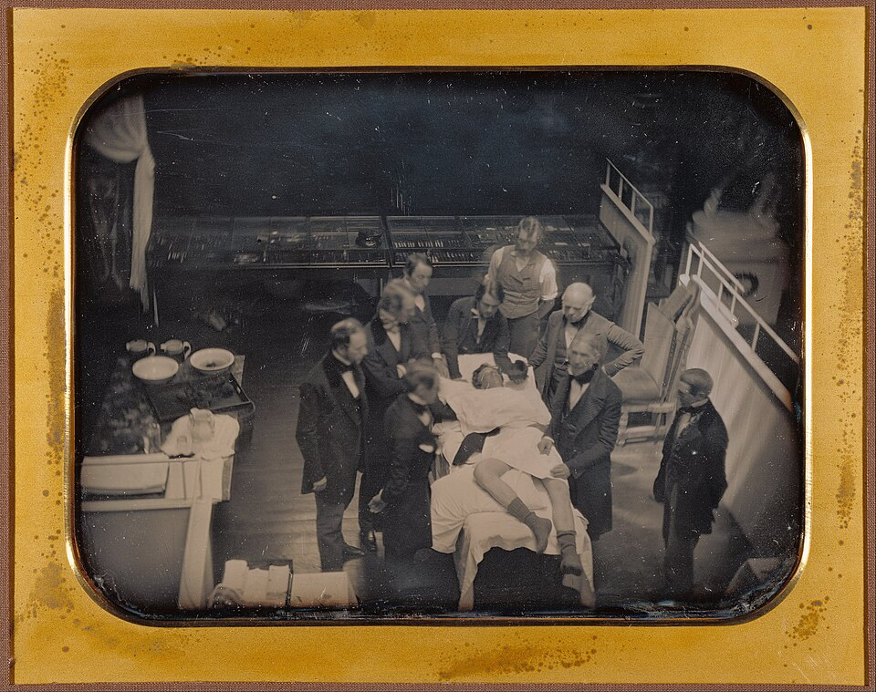

On Friday 16 October 1846 a young man of about twenty sat in the operating chair of the **[Massachusetts General Hospital](kloom:e/massachusetts-general-hospital)** in Boston, under the skylit dome at the top of the building that has been called the **[Ether Dome](kloom:e/ether-dome)** ever since. He had a tumor of tangled veins on the left side of his neck, and **[John Collins Warren](kloom:e/john-collins-warren-surgeon-born-1778)**, sixty-eight, a founder of the hospital and its first surgeon, meant to tie them off. Everything was ready, and the man who had asked for the morning was not there. **[William T. G. Morton](kloom:e/william-t-g-morton)**, a Boston dentist, arrived nearly half an hour late, still altering his apparatus, and had the patient breathe from it. After four or five minutes he said the man was ready.

## What the witnesses wrote

Warren made a cut two to three inches long and, he wrote, "to my great surprise" the patient did not start or cry out. As the veins were separated he began to move his limbs, cry out and "utter extraordinary expressions", and Warren was not satisfied until he had asked him, then and later, whether it had hurt. It had not, the patient said, though he knew of the operation and felt the knife as "a blunt instrument passed roughly across his neck". **Henry Jacob Bigelow**, a surgeon who was there and who published the first report in the _Boston Medical and Surgical Journal_ of 18 November, put it less kindly: the patient had muttered, and said afterwards that the pain was considerable though mitigated, "as though the skin had been scratched with a hoe". Neither names him. Later accounts call him **Edward Gilbert Abbott**, a printer. The next day a woman had a large fatty tumor removed from her arm and knew nothing of it, and on 7 November a girl's leg was amputated above the knee while she lay insensible: that, Bigelow wrote, was the case that decided it.

Warren's famous "Gentlemen, this is no humbug" is in none of the reports written at the time. The anesthetist Rajesh Haridas traced it to Nathan Rice's life of Morton, published in 1859, and to three witnesses who first told it fifty years after the event.

## The inhaler, and then the sponge

Morton kept his agent secret, called it "Letheon", and took out a patent in November. Bigelow could smell what it was: "sulphuric ether", **[diethyl ether](kloom:e/diethyl-ether)**. He described the apparatus as "a small two-necked glass globe" holding the vapor with sponges inside "to enlarge the evaporating surface". Air came in through one neck and was drawn out through the other into the lungs, and "the expiration is diverted by a valve in the mouth piece" so that it did not spoil the vapor in the globe. The plate draws it in section from that description, as a schematic.

Within months the Boston surgeons gave up the globe. Warren's book of 1848, _Etherization_, explains why: with the valved tube, patients had struggled for breath and turned purple, and once a plain sponge was used, letting in air with the vapor, "asphyxia ceased to occur". His directions are a procedure:

| Step     | Warren's directions, 1848                                                                                         |
| -------- | ----------------------------------------------------------------------------------------------------------------- |
| Position | Lying down rather than sitting; it works faster and the patient is calmer                                         |
| Sponge   | Hollowed to fit over the nose, damp, then saturated with the purest ether                                         |
| Dose     | "About two ounces" was usual, but judged by the effect, never by the quantity                                     |
| Time     | Two to five minutes; past ten, lift the sponge often to let in air; add fresh ether as the sponge chills          |
| Signs    | Eyelids close, questions go unanswered, muscles relax                                                             |
| Watch    | "The pulse and respiration should be carefully observed": if they fail, stop, and sponge the face with cold water |
| Danger   | Ether burns: beware of a candle                                                                                   |

Warren kept his own fingers on the patient's pulse through the whole etherization whenever someone else was operating. Who did that watching became the question of the next century. In most of the world the surgeon handed the anesthetic to whoever was free: a medical student, a junior doctor, or a nurse.

## Who was first

Morton was not the first to use ether. **[Crawford Long](kloom:e/crawford-long)**, a doctor in Jefferson, Georgia, had seen friends at ether parties bruise themselves and feel nothing, and on 30 March 1842 he gave ether on a towel to James Venable and cut a small cyst from his neck. Long did not publish until December 1849, when he wrote that he had waited to see who else would claim it. **[Horace Wells](kloom:e/horace-wells)**, a Hartford dentist and Morton's former partner, had his own tooth pulled under nitrous oxide in 1844 and showed the gas to Warren's students; the gas bag was taken away too soon, the patient said it hurt, and the demonstration was "denounced as an imposition". Wells dated it December 1844, other accounts January 1845. Morton's chemistry teacher Charles Jackson claimed the idea too. What Morton did was to show it in public, in a great hospital, before witnesses who wrote it down, and by December the news had crossed the Atlantic.

## The first death

In November 1847 James Young Simpson in Edinburgh brought in **[chloroform](kloom:e/chloroform)**, stronger and pleasanter to breathe than ether, and it spread fast. On 28 January 1848, at Winlaton near Newcastle, Hannah Greener, fifteen, was given a teaspoonful of it on a handkerchief before a toenail was removed. Within about two minutes she was dead, and nothing revived her. She had had the same operation under ether the November before without harm. The Massachusetts General went back to ether and its governors forbade chloroform, John Snow wrote in 1858, after two accidents of its own. Giving an anesthetic became a skill of its own, and in America, before the century was out, it was often a nurse's, as the frame on the nurse anesthetist tells. Anesthesia took away the pain of surgery but not its other killer, infection, which the next frame finds in a Vienna maternity hospital a year later.
