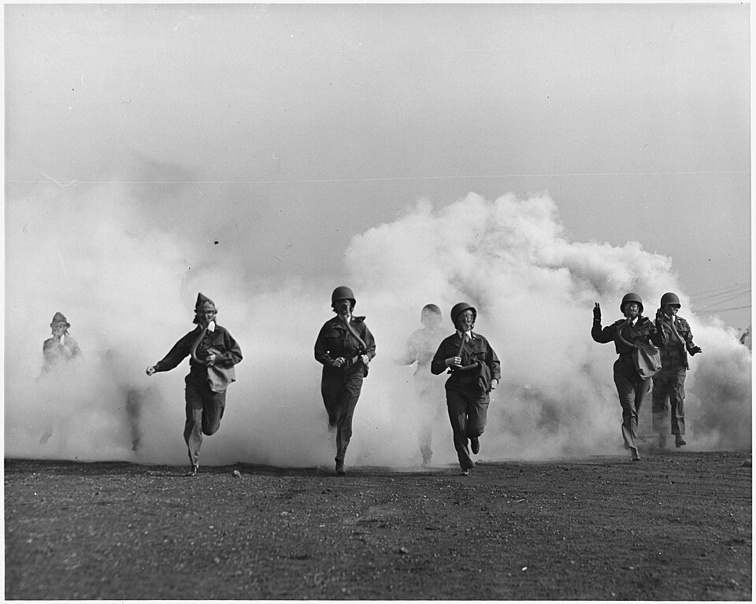

In the summer of 1940 the Army did not want nurses in airplanes. Since 1932 an aviator named **[Lauretta Schimmoler](kloom:e/lauretta-schimmoler)** had been building an Aerial Nurse Corps of America, registered nurses trained to care for patients in the air, and writing to the Air Corps about it. In June 1940 the acting superintendent of the **[Army Nurse Corps](kloom:e/united-states-army-nurse-corps)**, Captain Florence Blanchfield, answered an inquiry that "the present mobilization plan does not contemplate the extensive use of aeroplane ambulances", so a special corps of nurses for them "will not be required". Within three years the **[Second World War](kloom:e/world-war-ii)** had made them routine. Cargo planes flew supplies to the front and brought the wounded out, and someone had to care for them on the way.

## The school at Bowman Field

In late November 1942 the War Department told the 349th Air Evacuation Group at **[Bowman Field](kloom:e/bowman-field-kentucky)**, the airfield at Louisville, Kentucky, to train flight surgeons, nurses and enlisted technicians for **[air evacuation](kloom:e/aeromedical-evacuation)**. A squadron was a headquarters and four flights; each flight was a flight surgeon, six nurses and six technicians, and one nurse and one technician made a team. On 18 February 1943 the first 39 **[flight nurses](kloom:e/flight-nurse)** graduated, many of them former airline hostesses, after a course of four weeks. The Air Surgeon, Brigadier General David Grant, found that nobody had thought of an insignia for them, unpinned his own flight surgeon's wings and pinned them on the honor graduate. Until a design was approved, the nurses had a dental officer solder an "N" onto flight surgeon's wings.

The rules for entry, as the Air Force's official medical history gives them:

| Requirement  | What it was                                                           |
| ------------ | --------------------------------------------------------------------- |
| Commission   | an officer of the Army Nurse Corps                                    |
| Experience   | at least six months on the staff of an Army hospital                  |
| Body         | 62 to 72 inches tall, 105 to 135 pounds, aged 21 to 36                |
| Physical     | the class three examination for flying                                |
| Course       | four weeks at first, six from February 1943, eight from November 1943 |
| Volunteering | required: the planes carried no red cross, so they could be shot at   |

The course grew to cover aeromedical physiology, with two flights in a decompression chamber; loading litters into mock-up fuselages; ditching and survival; and two weeks on the wards of Louisville's hospitals, where each nurse taught her technician intravenous technique, catheterization and oxygen. By October 1944, 1,079 flight nurses had graduated at Bowman Field.

## A flight

The workhorse was the **[C-47](kloom:e/douglas-c-47-skytrain)**. Fitted with aluminum brackets it took 18 litters; with the webbing straps the Aero Medical Laboratory designed, 24, in tiers along both sides of an aisle. The flight surgeon chose who would fly, prepared them and briefed the nurse on those needing special care, and then usually stayed on the ground. From the door until the hospital at the far end, the patients were hers. The Pacific Wing of the Air Transport Command, flying C-54s with litters four high on each side, set out how to load them: the patients needing least attention on the top and bottom litters, those needing most in the middle tiers, where the nurse could reach them, and nervous patients toward the front.

In the air, usually at 5,000 to 10,000 feet, she took pulses and temperatures and kept the records, and she treated what went wrong: pain, hemorrhage, shock, a chest that needed oxygen. Every plane carried portable oxygen, plasma, hypodermics, splints and chemically heated pads against the cold. The cold was real: the heaters warmed the cabin only about 20 degrees above the air outside, and the litters near the floor stayed cold. On the Atlantic route the planes' built-in oxygen outlets released nothing below 10,000 feet until valves were fitted. The Army's own account of its nurses tells of one whose patient began to bleed under his plaster cast, on a plane with no cast cutter; she cut the cast away with bandage scissors and stopped the bleeding. If the plane had to come down at sea, the drill was a life vest on every patient, the litter straps tightened, and after the impact the nurses unstrapped the litters and got the wounded into the rafts.

## The numbers

In the 29 months from January 1943 to May 1945 the Army Air Forces flew 1,172,648 sick and wounded. The death rate in flight was 4 for every 100,000 patients, about 47 people by our arithmetic, falling from 6 in 1943 to 1.5 in the first five months of 1945. The Army's account of its nurses counts 1,176,048 evacuated in the whole war and 46 deaths en route. Seventeen flight nurses died. One was **[Aleda Lutz](kloom:e/aleda-e-lutz)** of the 802nd squadron, killed on 1 November 1944 when her C-47, carrying fifteen wounded men from Lyon, crashed in a storm near Saint-Chamond; she is credited with 196 missions and over 3,500 patients, and was awarded the Distinguished Flying Cross.

On 8 November 1943 a plane carrying thirteen nurses of the 807th squadron and its technicians from Sicily to Bari lost its way in a storm and came down in German-held Albania. With partisans and British officers they walked across the mountains in winter; ten nurses reached Italy on 9 January 1944, and three cut off from the party came out in March. The Air Force history names all thirteen: Gertrude Dawson, Agnes Jensen, Pauleen Kanable, Ann Kopcso, Wilma Lytle, Ava Maness, Ann Markowitz, Frances Nelson, Helen Porter, Eugenie Rutkowski, Elna Schwant, Lillian Tacina and Lois Watson. The Air Force history calls their plane only "the large transport"; the Army's account of its nurses says it was a C-54.

The flight nurse's creed told her to lift Florence Nightingale's lamp "to heights not known by her in her time". The next frame goes to Korea, where the wounded first came to a field hospital by helicopter.
