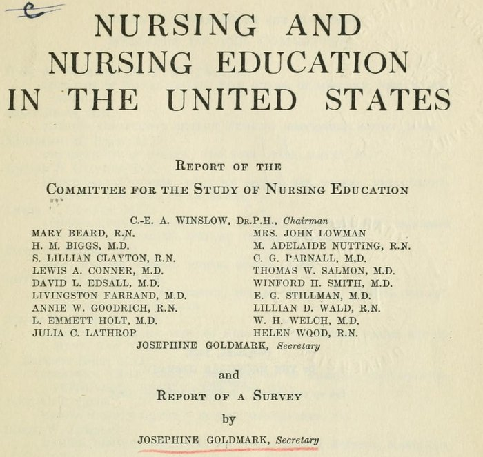

In December 1918 the **[Rockefeller Foundation](kloom:e/rockefeller-foundation)** invited about fifty people to New York to talk about public health nurses: how many the country needed, and how to train them. They agreed that three years in a hospital school did not, by itself, prepare a nurse for the work, and asked for a study. The committee the foundation appointed was chaired by **[C.-E. A. Winslow](kloom:e/charles-edward-amory-winslow)**, Yale's professor of public health, and included **[Adelaide Nutting](kloom:e/mary-adelaide-nutting)**, **[Annie Goodrich](kloom:e/annie-warburton-goodrich)** and [Lillian Wald](kloom:e/lillian-wald). In June 1919 it hired as its secretary **[Josephine Goldmark](kloom:e/josephine-clara-goldmark)**, a labor reformer who had gathered the evidence on women's working hours for the Brandeis Brief in _Muller v. Oregon_ and had written _Fatigue and Efficiency_. In 1920 the foundation asked the committee to widen its study to the whole of nursing education. Its report, _Nursing and Nursing Education in the United States_, came out in February 1923, the committee's conclusions followed by Goldmark's own long survey, and it has been known by her name ever since.

## How the survey worked

On 1 January 1921 there were about 1,800 schools of nursing in the United States, with 55,000 students, graduating some 15,000 nurses a year. The committee could not study them all, and its inquiry, it said, "was not statistical": it aimed to judge the quality of the teaching. It chose 23 schools, large and small, public and private, general and special, which it believed were "well above the median grade", and sent two investigators to each: an expert in nursing education, and an educator from outside nursing, among them a professor of physiology from Mount Holyoke. They followed the students through the wards and classrooms, and compared what each school's program promised with what its students had actually done. The committee also studied public health nursing agencies in the field, and their nurses at work.

## What it found

The findings were the committee's, but the numbers were the survey's:

| Measure                             | In the 23 schools                                                                                             |
| ----------------------------------- | ------------------------------------------------------------------------------------------------------------- |
| Hours on ward duty a day            | A median of 8 to 8.5, not counting classes                                                                    |
| Hours on duty a week                | A median of 54; in two schools, a full 60                                                                     |
| Anatomy and physiology              | 30 to 150 hours, a median of 60, against the 90 the committee proposed                                        |
| Bacteriology                        | 11 to 80 hours, a median of 24, against 45                                                                    |
| Services missing                    | 1 school had no adequate obstetrics, 5 no children's nursing, 7 no communicable disease, 18 no mental illness |
| Night duty, one class of one school | From 16 weeks for one student to 39 weeks for another                                                         |

| Weekly hours on duty | Schools |
| -------------------- | ------: |
| 51–53                |       8 |
| 54–56                |       7 |
| 57–59                |       6 |
| 60                   |       2 |

Students were assigned where the hospital needed hands, not where they would learn: one school's program gave seven and a half months to surgery, and its students had spent anywhere from 7 to 13½ months there. In one typical hospital on the eight-hour system a quarter to a fifth of the student's day went on work with nothing left to teach her: a ward maid's tasks, putting away linen, mending rubber gloves, running errands. The committee's fifth conclusion put it plainly: "the educational needs and the health and strength of students are frequently sacrificed to practical hospital exigencies." It blamed no one in particular. The fault, it said, was a system in which nursing education had "no independent financial endowments for its specific ends".

## What it asked for

The committee asked for high school before entry; a preliminary term of four months in the sciences and elementary nursing, without regular ward service; then 24 months of graded teaching and practice, two of them vacation, 28 months in all against the usual 36; a working day, wards and classes together, of no more than eight hours, and a week of no more than 48, "preferably 44". The school was to have a board of its own and money of its own, and graduate nurses and hospital workers were to take over the routine the students had done. Above all it asked for university schools of nursing to train the profession's leaders, and for a separate, shorter and licensed training for a subsidiary grade of nurse.

The foundation paid for one at once. The **[Yale School of Nursing](kloom:e/yale-school-of-nursing)** opened in 1923 with an initial grant of $150,000 and Goodrich as its dean, the first woman to be a dean at Yale. It was not the first nursing program in a university, which was Minnesota's of 1909, but it was the first school with its own dean, faculty, budget and degree, where the student's education came before the hospital's service. Its 28-month course was the committee's. Its first class graduated in 1926, at a ceremony shared with the last class of the Connecticut Training School, one of the three schools of 1873.

## Why little changed

Hospitals went on training most nurses for forty years, because the students still staffed the wards. The Surgeon General's consultant group counted 875 hospital diploma programs in 1962, against 176 baccalaureate and 84 associate degree programs; of 49,500 students admitted in 1960–61, 38,700 entered a diploma school, about 78 percent by our arithmetic. In 1962 only one employed professional nurse in ten held a college degree. The plate sets the two courses on one scale of months, and the two weeks a square to the hour. The next frame, in Copenhagen, turns from the schools to the bedside, where a new kind of nursing began.
