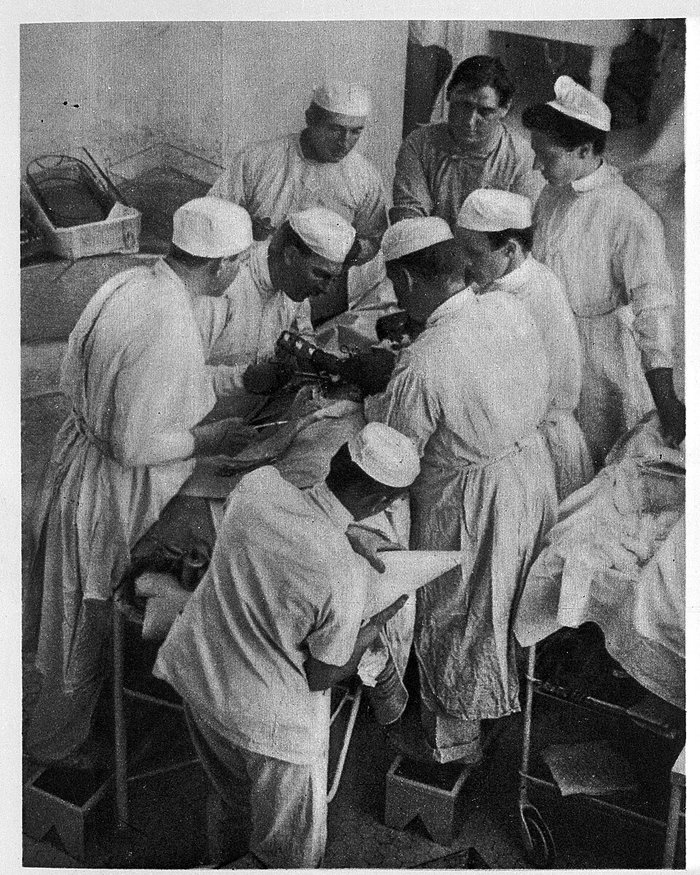

The **[Johns Hopkins Hospital](kloom:e/johns-hopkins-hospital)** in Baltimore opened in 1889, and its surgeon, **[William Stewart Halsted](kloom:e/william-stewart-halsted)**, put a nurse of twenty-seven in charge of his operating room. **[Caroline Hampton](kloom:e/caroline-hampton)** had trained in New York, at Mount Sinai and then the New York Hospital, which graduated her in 1888. She assisted at the wound, sponging it with gauze she wrung out of a mercury solution, and her hands and forearms went through the clinic's disinfection before every operation. By the winter of 1889–90 the solutions had given her a dermatitis of the hands and arms, and she was ready to leave. Halsted told what happened next in 1913, in the _Journal of the American Medical Association_:

> In the winter of 1889 and 1890—I cannot recall the month—the nurse in charge of my operating-room complained that the solutions of mercuric chlorid produced a dermatitis of her arms and hands. As she was an unusually efficient woman, I gave the matter my consideration and one day in New York requested the Goodyear Rubber Company to make as an experiment two pair of thin rubber gloves with gauntlets.

He did not name her. Nor did his resident, who called her "the nurse in charge of the operating-room".

## Hands that could not be made clean

The gloves were not first meant to protect the patient. In the hospital's first year Halsted's clinic tried again and again to disinfect a pair of hands, culturing scrapings from under the nails after precipitating the mercury that would otherwise have stopped the bacteria growing. Forty-five minutes of work on one pair of hands never once succeeded, he reported in 1891. "The nearest approach to a perfect disinfection was made by the operating room nurse": after nearly an hour on her hands, three of four tubes stayed sterile. Hunter Robb, the hospital's resident gynecologist, printed the method the clinics settled on in 1894:

| Step | What was done                                                                            |
| ---- | ---------------------------------------------------------------------------------------- |
| 1    | Hands and forearms scrubbed ten minutes by the watch, steam-sterilized brush, green soap |
| 2    | Two minutes in a warm saturated solution of potassium permanganate, rubbed in            |
| 3    | Washed in warm saturated oxalic acid until the brown stain had gone                      |
| 4    | Rinsed in sterile lime-water, then sterile water or salt solution                        |
| 5    | Two minutes in bichloride of mercury, 1 in 500; rinsed in salt solution before work      |

The water was as hot as could be borne and changed at least ten times. Halsted's surgical clinic, by 1899, soaked the hands at least five minutes in bichloride at 1 in 1,000 instead. Experiments by Dr. Mary Sherwood at the university showed that the oxalic acid, not the **[potassium permanganate](kloom:e/potassium-permanganate)**, did the disinfecting. The last basin held **[mercuric chloride](kloom:e/mercury-ii-chloride)**, "corrosive sublimate", a highly toxic and corrosive salt of mercury, and the sponges the nurse wrung out lay in it at 1 in 1,000.

## The gloves

Robb gave the routine for them too. The gloves, bought "of the Goodyear Rubber Co., New York", were boiled in a 1 per cent soda solution, kept in bichloride 1 in 1,000 until wanted and rinsed in sterile water. They were worn loose, with long wristlets to cover the forearm, and put on wet: the glove was filled with solution until its fingers stood out, the hand slid in and held up, and the solution run out. After the day's work they were washed, hung to dry and boiled again before the next. Later tellers add that Halsted had plaster casts made of her hands, which his own account does not say.

Caroline Hampton was born in 1861 near Columbia, South Carolina, the niece of the Confederate general **[Wade Hampton III](kloom:e/wade-hampton-iii)**. Her mother died when she was a baby and her father was killed at Brandy Station in 1863. Raised by three aunts behind the ruins of a plantation house that Sherman's troops had burned, she went north in 1885, against her family's wishes, to train as a nurse. She married Halsted on June 4, 1890, and left the hospital; Wikipedia says that a married woman was required to.

## From her hands to the patient's wound

In the autumn of 1890 the assistant who passed the instruments got gloves too, to protect his hands from the carbolic acid the instruments lay in. For years the operator wore them only to open a joint. **[Joseph Colt Bloodgood](kloom:e/joseph-colt-bloodgood)**, Halsted's resident, began wearing them for every clean operation in December 1896, and from February 1897 every assistant at a hernia operation wore them, and the operator with few exceptions. His report of 1899 counted the wounds that suppurated:

| Hernia wounds, 1889–1899                    | Cases | Suppurated | Per cent |
| ------------------------------------------- | ----- | ---------- | -------- |
| Closed with silk; operator ungloved         | 116   | 28         | 24.1     |
| Closed with silver wire; operator ungloved  | 104   | 10         | 9.6      |
| Silver wire; operator and assistants gloved | 226   | 4          | 1.8      |

The change of stitch mattered as well as the gloves, so the fair comparison is the last two rows, with the same wire: about one wound in ten against one in fifty-six, by our arithmetic. The often-quoted fall from 17 per cent to under 2 pools the silk cases with the wire. Halsted wondered later how they "could have been so blind" for four or five years, and by 1913 he wrote that rubber gloves "must, of course, be worn by all concerned in the operation".

The **[medical glove](kloom:e/medical-glove)** began as a nurse's protection, and only later became the patient's. The trail _At the table_ follows the scrub nurse's work from here, from the scrub to the count; on the main spine, the next frame turns to the nurse at the head of the table, giving the anesthetic.
