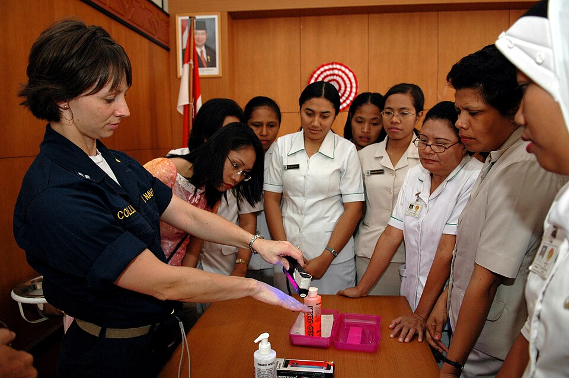

In 1994 the infection control team at **[Geneva University Hospitals](kloom:e/geneva-university-hospitals)**, led by the physician **[Didier Pittet](kloom:e/didier-pittet)**, stood in the wards and watched. Over three years they counted more than 20,000 _opportunities_, moments when a nurse's, doctor's or aide's hands should have been cleaned before the next touch. In the first survey, staff cleaned their hands at 48% of them, and the team found one reason above all for the rest: there was no time.

## The arithmetic of a shift

They were right. In 1997 Andreas Voss and Andreas Widmer worked out the cost for a model intensive care unit of twelve staff: if every opportunity were met by **[hand washing](kloom:e/hand-washing)** at a sink, it would take 16 hours of nursing time every day shift; by an alcohol rub from a bottle at the bedside, 3 hours. The **[World Health Organization](kloom:e/world-health-organization)**, the WHO, gives the parts of the sum in its guidelines of 2009. Nurses in intensive care met an average of 30 opportunities an hour of care, and nurses on children's wards 8. A wash with soap and water takes 40 to 60 seconds; a rub takes 20 to 30, and needs no sink, no towel and no walk.

| Method, time each | Minutes an hour at 30 opportunities |
| ----------------- | ----------------------------------: |
| Wash, 60 seconds  |                                  30 |
| Wash, 40 seconds  |                                  20 |
| Rub, 30 seconds   |                                  15 |
| Rub, 20 seconds   |                                  10 |

By our arithmetic, a nurse who washed at every one of those opportunities would spend between a third and a half of each hour at the sink before walking to it. Alcohol also acts in seconds against a wide range of microorganisms, and a rub with a softener such as glycerol is gentler on skin than washing over and over. So the Geneva team's answer was a system change: put **[hand sanitizer](kloom:e/hand-sanitizer)** where the hands are.

## The Geneva campaign

From 1995 the team put bottles of alcohol rub on every ward, fixed holders for them to the beds, and asked staff to carry a bottle in a pocket. Posters went up, and each survey's results went back to the wards. Pittet and his colleagues published the result in _The Lancet_ in 2000. Over seven surveys from December 1994 to December 1997, compliance rose from 48% to 66%. Hand washing at the sink stayed about the same; hand rubbing rose sharply. Nurses and nursing assistants improved most. Doctors stayed poor.

Between 1993 and 1998 the hospitals' use of rub rose from 3.5 to 15.4 litres per 1,000 patient-days. Over the same years the prevalence of hospital infection fell from 16.9% in 1994 to 9.9% in 1998, and transmission of resistant [_Staphylococcus aureus_](kloom:e/staphylococcus-aureus) from 2.16 to 0.93 episodes per 10,000 patient-days. That is a fall of 41% in infections by our arithmetic; Pittet's Wikipedia article rounds it to "almost 50%". The study compared before with after, in one hospital, with no control group, so the paper says the campaign was "coinciding" with the fall, not that it caused it.

## Five moments

The team then asked when, exactly, hands must be cleaned. Hugo Sax and colleagues answered for the Swiss national campaign, and the WHO took the answer into its guidelines of 2009. Around each patient is a _patient zone_: the patient's skin, the bed rails, bedside table, linen and infusion tubing, and the monitors and buttons staff touch while caring for them. Everything outside it is the health-care area. Hands are cleaned at the zone's edge, and inside it before anything clean:

| Moment                                 | Why                                                          |
| -------------------------------------- | ------------------------------------------------------------ |
| 1. Before touching a patient           | to keep the ward's germs off the patient                     |
| 2. Before a clean or aseptic task      | a line opened, an injection, a dressing: to protect the site |
| 3. After body fluid exposure risk      | to protect the nurse, and other sites on the same patient    |
| 4. After touching a patient            | to keep the patient's germs off the ward                     |
| 5. After touching patient surroundings | the same, when the patient was not touched                   |

Gloves change nothing: hands are cleaned before gloves go on for a clean task, and after they come off. Moving straight from one patient to the next, moments 4 and 1 fall together, and one rub covers both. The plate draws the zone, and a nurse's path through the moments.

## The rub

The WHO's poster gives the rub, which takes 20 to 30 seconds in all:

| Step | What the hands do                                                        |
| ---- | ------------------------------------------------------------------------ |
| 1    | A palmful of rub in a cupped hand, covering all surfaces                 |
| 2    | Palm to palm                                                             |
| 3    | Right palm over the back of the left, fingers interlaced, and vice versa |
| 4    | Palm to palm, fingers interlaced                                         |
| 5    | Backs of the fingers to the opposite palm, fingers interlocked           |
| 6    | Each thumb clasped in the other palm and rubbed round                    |
| 7    | The clasped fingertips of each hand rubbed round in the other palm       |
| 8    | Once dry, the hands are safe                                             |

Soap and water is kept for hands visibly dirty or soiled with blood or body fluids, after the toilet, and where spore-forming bacteria such as _Clostridium difficile_ are about, which alcohol does not kill. For hospitals that could not buy a rub, the guidelines give a recipe: 833.3 ml of 96% ethanol, 41.7 ml of 3% hydrogen peroxide and 14.5 ml of 98% glycerol, topped up to a litre with clean water.

A rub can miss places. In the photograph, from August 2006, Lt. Tara Collins of the medical treatment facility aboard the Navy hospital ship USNS _Mercy_ uses an ultraviolet lamp to show nurses of a local hospital in Kupang, Indonesia, the germs their hands carry, in a lecture on hand washing.

As of October 2026 the WHO still publishes the 2009 guidelines for health care, and in October 2025 it added separate guidelines for hand hygiene in homes, schools and public places. The idea is older than any of it: **[Ignaz Semmelweis](kloom:e/ignaz-semmelweis)** had hands scrubbed in chlorinated lime in Vienna in 1847, the story of the frame on Semmelweis. The trail goes back to where it began, to Nightingale's rose diagram, and the counting that made all of this provable.
