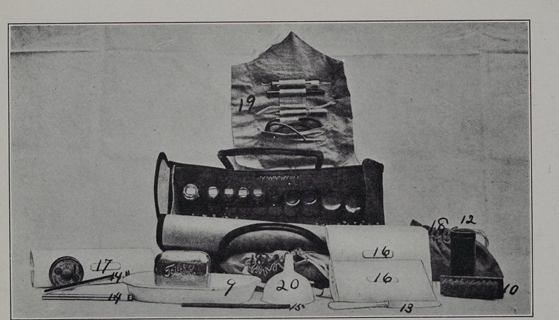

In 1893 **[Lillian Wald](kloom:e/lillian-wald)**, a graduate of the New York Hospital's training school, was teaching home nursing to immigrant mothers on the Lower East Side of **[New York City](kloom:e/new-york-city)** when a child came to fetch her to a sick woman in a rear tenement on Ludlow Street. She found a family of seven sharing two rooms with boarders, and the mother on a bed "soiled with a hemorrhage two days old". Wald wrote in 1915 that the morning was "a baptism of fire". Within days she and Mary Brewster, a friend from her training school, had agreed "to live in the neighborhood as nurses", and by September they had taken the top floor of a tenement on Jefferson Street, chosen because it had a bathtub. In 1895 the banker Jacob Schiff bought them a house at 265 Henry Street. The nurses' settlement there became the **[Henry Street Settlement](kloom:e/henry-street-settlement)**, and its nursing service, much later, the **[Visiting Nurse Service of New York](kloom:e/vns-health)**.

## A nurse on call

Wald set out the rules on which the service ran, and they were new. The nurse would answer "calls from the people themselves" as readily as calls from physicians, and would work under any physician, the "Lodge" doctor of a mutual benefit society as much as the city's specialists. Fees were charged where people could pay. Wald reckoned that ninety percent of the sick in the city were sick at home, and the nurses sent about one patient in ten on to a hospital.

Yssabella Waters, one of the settlement's nurses, described the service's working in 1909. Each nurse lived in her district and was on duty from 9 to 6, with a day off each week and no night work. She kept a daily record of her visits, bedside notes for the doctor that stayed in the patient's room, and a case card at the district's headquarters. Fees usually ran from 10 to 25 cents a visit, sometimes 50 cents or a dollar. Waters made the comparison herself: for a workingman earning $2 a day, a 25-cent visit was a larger share of his income than $25 a week for a private nurse was of a salary of $5,000.

The bag the nurses carried was leather, lined with linen that could be taken out, scrubbed, disinfected and laundered, and 14 inches long, 6 wide and 7½ high. Waters listed what was in it:

| In the bag       | What it held                                                                                                                                               |
| ---------------- | ---------------------------------------------------------------------------------------------------------------------------------------------------------- |
| Instruments      | Mouth and rectal thermometers, a glass syringe, glass and rubber catheters, a spatula, a medicine dropper, a caustic stick                                 |
| Dressings        | Gauze and muslin bandages, two yards of gauze, absorbent cotton, adhesive plaster, rubber tissue                                                           |
| Bottles and jars | 95 percent alcohol, green soap, Listerine, whiskey, carbolic acid, cascara tablets; boric acid, bichloride tablets, Vaseline, ichthyol and boric ointments |
| For the nurse    | An apron, a hand towel, a nail brush, a napkin for soiled dressings, safety pins                                                                           |
| For the record   | A pencil, a scratch pad, a package of bedside notes, envelopes                                                                                             |

## The school nurse

New York had sent doctors into its schools since 1897, but all they could do was send sick children home, and when the city ordered every pupil examined in 1902 thousands were excluded for trachoma, ringworm and lice. Most went untreated and played in the street. Wald offered to lend a nurse to show that the excluded could be treated and kept in class. **Lina Rogers**, a Canadian nurse on the settlement's staff, began on 1 October 1902 in four schools near the settlement, about ten thousand children, with a stair closet for a dispensary and a radiator for a dressing table. She treated what the doctor found by a code number, so that classmates would not learn what a child had:

| Condition      | Treatment, as Rogers wrote it down                                    |
| -------------- | --------------------------------------------------------------------- |
| Head lice      | Kerosene and sweet oil, washed out next day; hot vinegar for the nits |
| Ringworm       | Tincture of green soap, then a cover of collodion                     |
| Scabies        | Green soap, then sulfur ointment                                      |
| Conjunctivitis | Irrigation with boric acid solution                                   |

The children she could not treat at school she followed home, to show their mothers what the doctor had ordered. Within a month the Board of Health made her a school nurse, the first a city paid anywhere; she dated her appointment 7 November 1902, and Wald remembered the first nurse on the payroll in October. By February 1903 there were 27. The nursing writer Mary Sewall Gardner gave the result in 1916: 10,567 children excluded from New York's schools in September 1902, and 1,101 in September 1903.

## The wider work

Wald gave the work its name, **[public health nursing](kloom:e/public-health-nursing)**, and in 1912 became the first president of the National Organization for Public Health Nursing. In 1909 she persuaded the **[Metropolitan Life Insurance Company](kloom:e/metlife)** to pay visiting nurses to care for its industrial policyholders, which spread home nursing, as she put it, "on the only basis that makes it possible for persons of small means to receive nursing without charity". With Florence Kelley and Edward Devine she proposed a federal office for children, and in April 1912 President Taft signed the act that created the **[Children's Bureau](kloom:e/united-states-childrens-bureau)**. The plate draws the bag in oblique projection, with the bottles and jars of its lining. Wald sat, too, on the committee behind the Goldmark Report, two frames on. The next frame turns to the law, and the registered nurse.
