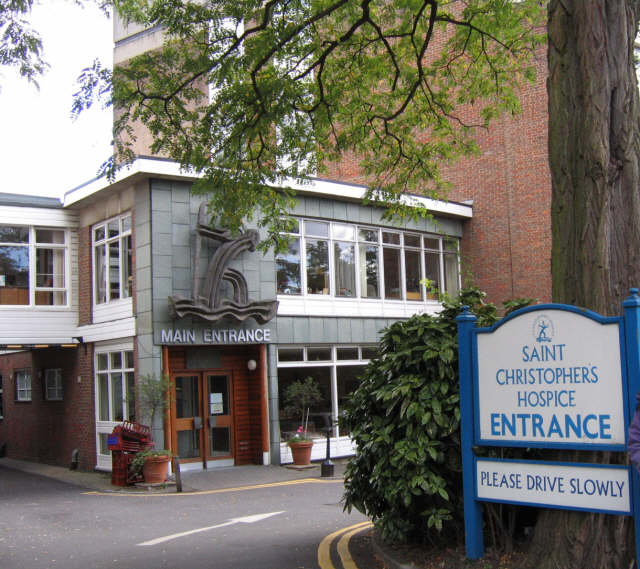

On 13 July 1967 the first patient, a Mrs Medhurst, was admitted to **[St Christopher's Hospice](kloom:e/st-christophers-hospice)** in Sydenham, south London, and on 24 July it was formally opened. It had been built for people dying of cancer, by a woman who had been their nurse, their social worker and their doctor in turn. **[Cicely Saunders](kloom:e/cicely-saunders)** trained as a nurse at the Nightingale School of **[St Thomas' Hospital](kloom:e/st-thomas-hospital)** from 1940 to 1944, until a bad back stopped her; qualified as a medical social worker, an almoner, in 1947; and, after working with the dying at St Luke's Home for the Dying Poor, went to St Thomas's medical school in 1951 and qualified as a doctor in 1957. "Having worked in all three roles", she wrote for surgeons in 1967, she knew that the care of a dying patient's family was the doctor's work too.

## The method

She worked it out first at St Joseph's Hospice in Hackney, run by the Irish Sisters of Charity, where from the late 1950s she cared for patients admitted with three months or less to live, and kept detailed records of those who died: 900 by 1963, 1,100 by 1967. More than 70 percent of them had pain severe enough to need narcotics. In a paper of 1963 she set out what she called "so simple" that she would have been diffident about it had it not worked. The usual order for a dying patient's opiate was every four hours "p.r.n.", as needed; so the patient had to ask, and the pain had come back before the dose. Her rules, in her own words where they are quoted:

| Rule                                                                      | Why                                                                                      |
| ------------------------------------------------------------------------- | ---------------------------------------------------------------------------------------- |
| Assess every symptom first: nausea, breathlessness, a sore mouth          | Much pain can be eased without analgesics, or the need for them reduced                  |
| "Constant pain calls for constant control": give the drug by the clock    | "Analgesics should be given to prevent pain from occurring, not to control it"           |
| Fit the dose so that pain is only just returning when the next dose comes | The patient "should not have to ask", and is less dependent on the staff and on the drug |
| Give by mouth where possible, in small doses                              | 3 to 5 mg of diamorphine was often enough; the standard dose was 5 or 10 mg              |
| Leave a mild analgesic at the bedside at night                            | Patients often slept seven or eight hours through the routine dose                       |
| Add a phenothiazine, and alcohol, rather than ever more opiate            | Larger doses added little relief and many side effects                                   |

Her drug was **[heroin](kloom:e/heroin)**, diamorphine, given by mouth in the **[Brompton cocktail](kloom:e/brompton-cocktail)**, a mixture of the opiate with cocaine and gin, or by injection. Of one series of 200 patients, 49 stayed more than three months, two-thirds of all doses were given by mouth, and only nine ever needed more than the standard 10 mg. Tolerance and addiction, she wrote, were "not problems to us". The plate draws the idea on its axes: the same drug given by the clock and given on demand, with invented numbers.

## Total pain

One patient told her, "All of me is wrong." Saunders came to call it _total pain_: physical, but also mental, social and spiritual, the fear and the isolation and the worry for the family, each needing its own treatment, the last of them often by listening. At St Christopher's the method became research. Robert Twycross's trials there found no clinical difference between **[morphine](kloom:e/morphine)** and diamorphine, Saunders questioned the Brompton mixture, and by 1981 she was advising morphine in most cases, and that mixtures with cocaine and alcohol be given up. Of 3,362 patients at St Christopher's from 1972 to 1977, by her count as the historian David Clark reports it, more than three-quarters came in with pain and 1 percent had pain that was still a problem. A nurse, Barbara McNulty, and a doctor, Mary Baines, began its home care in 1969, the first such care given at home. In the years after AIDS appeared, Saunders was reluctant to admit people dying of it to St Christopher's wards, telling a parliamentary committee that families would be afraid to visit.

## To America

In 1963 Saunders lectured at Yale, and the dean of its Yale School of Nursing, **[Florence Wald](kloom:e/florence-wald)**, said later that "until then I had thought nurses were the only people troubled by how a terminal illness was treated". Wald left the deanship in 1966, worked at St Christopher's for a month in 1969, studied with a team of doctors, nurses and clergy how dying patients fared at home and in hospital, and with two pediatricians and a chaplain founded what became the Connecticut Hospice, in Branford, which began caring for patients in their homes in 1974 and calls itself the first **[hospice](kloom:e/hospice)** in the United States; its 44-bed building opened in 1980. Congress made hospice a Medicare benefit in 1982. As of 2026, the latest count by Congress's Medicare advisers is for 2024: 6,706 hospices cared for more than 1.8 million Medicare patients, more than half of all Medicare beneficiaries who died, and 5,497 of the hospices were run for profit.

| Year | Hospices | For profit |
| ---- | -------- | ---------- |
| 2019 | 4,840    | 3,435      |
| 2020 | 5,058    | 3,694      |
| 2021 | 5,358    | 4,024      |
| 2022 | 5,899    | 4,581      |
| 2023 | 6,535    | 5,243      |
| 2024 | 6,706    | 5,497      |

The next frame comes to another ward for the dying, in San Francisco, for patients with AIDS: Ward 5B.
