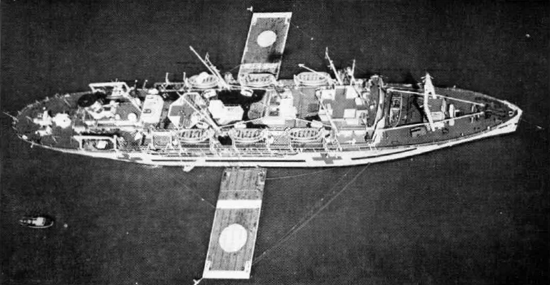

Navy nurses first went to sea for a few months in 1913, aboard the presidential yacht _Mayflower_ and the _Dolphin_; a few served on hospital ships in the First World War, and on the transports that brought the troops home after it. Their first permanent posts afloat came with **[USS _Relief_ (AH-1)](kloom:e/uss-relief-ah-1)**, the first ship of the United States Navy designed and built from the keel up as a **[hospital ship](kloom:e/hospital-ship)**. She was laid down at the Philadelphia Navy Yard in 1917 and commissioned on 28 December 1920; the history of the **[Navy Nurse Corps](kloom:e/united-states-navy-nurse-corps)** published by the Naval History and Heritage Command dates the nurses' arrival aboard to August 1920, before the commissioning. Her first chief nurse was J. Beatrice Bowman, one of the Corps' first twenty, with ten staff nurses, and their charge was to direct the 184 hospital corpsmen assigned to the ship.

## A hospital that sailed

The nurses wrote about the ship for their own journals, and in 1992 Lieutenant Commander Christine Curto, a Navy nurse, gathered what they said. _Relief_ had six operating rooms, outpatient departments, forced ventilation that could be heated, and a contagion ward aft, kept apart from the main wards by a very narrow bridge. Alberta Carriere, aboard in 1933–34, listed the wards:

| Ward                       | Beds |
| -------------------------- | ---: |
| Officers                   |   10 |
| Medical                    |   40 |
| General surgical           |   60 |
| Orthopedic surgical        |   60 |
| Eye, ear, nose and throat  |   28 |
| Urology                    |   40 |
| Isolation                  |   50 |
| Convalescent (eight small) |   64 |

That is 352 beds in her list, by our arithmetic, against the 500 to 550 the ship was built for. In the year to August 1934 the ship gave 1,343 anesthetics, only 51 of them by inhalation, 189 spinal and 1,103 local, and the operating-room nurse, a graduate anesthetist as well, worked at both ends of the table. A medical officer recorded 2,140 patients in 1934, a daily average of 114.

## Receiving casualties

In 1944 bunks were bolted to _Relief_'s bulkheads to take more than 700 patients, and she anchored off invasion beaches to load casualties brought out by boat, sometimes within 30 minutes of their wounding. Once, hurried by a typhoon, she took 691 patients aboard in an hour and a quarter, up the gangways and by derrick. Curto, drawing on the nurses' own accounts, sets out what followed:

| Step        | What was done                                                                          |
| ----------- | -------------------------------------------------------------------------------------- |
| At the side | Physicians triage: a ward or the operating room, and a bunk in a tier                  |
| On the ward | Clothes off; a fresh look for bleeding, shock and anything missed                      |
| Shock       | Plasma and dextrose by vein                                                            |
| Wounds      | Debrided, dusted with sulfanilamide crystals, covered with petrolatum gauze            |
| Fractures   | Plaster casts                                                                          |
| Every hour  | A patient, the ward's "water boy", took round water and wrote down what each man drank |
| The record  | Temperature, pulse and respiration sheet on a clipboard at the bunk                    |

The nurses supervised the corpsmen on the wards and answered to the doctors, and the walking wounded were each given a helpless shipmate to feed. Okinawa brought burns: dehydrated men in shock who needed plasma, a high-protein diet and rest. **[Ann Bernatitus](kloom:e/ann-a-bernatitus)**, an operating-room nurse who had escaped from Corregidor in 1942, was aboard then, and in her telling, read from her notes in a 1994 interview, the ship sailed for Saipan on 10 April 1945 with 556 casualties and for Tinian on 27 April with 613. By the end of the war _Relief_ had carried nearly 10,000 patients out of the Pacific's battles. The newer hospital ship **[USS _Solace_ (AH-5)](kloom:e/uss-solace-ah-5)** was at Pearl Harbor on 7 December 1941; the frame on Pearl Harbor tells that day.

## White hull, red crosses

What protected these ships was paint and a promise. Hague Convention X of 1907 said a military hospital ship, its name notified to the enemy before use, "shall be respected, and cannot be captured", if painted white with a green band about a meter and a half wide and flying the red cross flag beside her national colors; she could be put to no military purpose, could be stopped and searched, and lost protection if used to injure the enemy. The **[Second Geneva Convention](kloom:e/second-geneva-convention)** of 1949 kept the bargain and sharpened it: names notified ten days before use, every outside surface white, "one or more dark red crosses, as large as possible" on the hull and decks, no secret wireless code, and protection withdrawn only after a warning.

The promise held only so far. Off Okinawa _Relief_ lay off the beach by day and steamed out by night lit "like a Christmas tree". On 2 April 1945 a bomb fell a few yards wide of her, and from 9 April the hospital ships stayed in the anchorage at night, lights out, under smoke screens. At the end of April a suicide plane crashed into the surgery of the hospital ship _Comfort_, killing 28, six of them nurses.

## The helicopter deck

In the Korean War three hospital ships, _Haven_, _Repose_ and **[USS _Consolation_ (AH-15)](kloom:e/uss-consolation)**, each took 800 patients, with 25 medical officers, three dentists, 200 corpsmen and 30 nurses. On 18 September 1950, off Inchon, the Inspector General of the Navy's Medical Department, **[Joel T. Boone](kloom:e/joel-thompson-boone)**, found _Consolation_ anchored six miles down the bay, an hour and more by boat from the beach. He borrowed the fleet commander's helicopter, was lowered to her fantail on a cable, and on his return proposed landing platforms on hospital ships. _Consolation_ got hers, aft, in a refit in California in the summer of 1951, and on 18 December 1951, by the Navy's ship history, began taking casualties flown straight from the battlefield. (_Navy Medicine_'s editors dated the first landing 18 December 1950, which her refit makes impossible.) _Haven_ moored floating pads alongside, as the photograph shows, until she too got a deck. By one count _Consolation_ treated some 15,000 patients in twenty months off Korea.

Not every Navy nurse of the Second World War was at sea or within reach of rescue: the next frame follows the ones the Japanese took prisoner.
