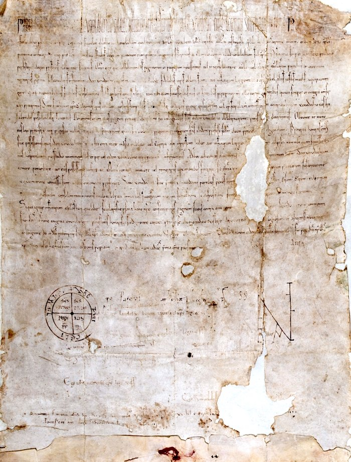

Christian pilgrims who reached **[Jerusalem](kloom:e/jerusalem)** were often sick, poor or injured by the time they arrived. In the eleventh century merchants from **[Amalfi](kloom:e/amalfi)** were allowed by the city's Fatimid rulers to build a Benedictine abbey near the Church of the Holy Sepulchre, and in the late 1060s its monks opened two hospitals for pilgrims, one for men and one for women. The men's house, dedicated to Saint John, outgrew the abbey that founded it. Around 1080 the abbot put a lay brother named **[Gerard](kloom:e/gerard-sasso)** in charge of it, and he stayed through the siege of 1099, when the **[First Crusade](kloom:e/first-crusade)** took the city. On 15 February 1113 **[Pope Paschal II](kloom:e/pope-paschal-ii)**'s bull **[_Pie postulatio voluntatis_](kloom:e/pie-postulatio-voluntatis)** took "the Hospital which thou hast founded in the city of Jerusalem" under the protection of the Holy See, let its professed brothers elect their own master, and placed under it a chain of hospices on the pilgrims' road and at the ports where they took ship: Saint-Gilles, Asti, Pisa, Bari, Otranto, Taranto and Messina. A hospital had become a religious order, the **[Knights Hospitaller](kloom:e/knights-hospitaller)**.

## Our lords the sick

The order's first written rule, from Gerard's successor **[Raymond du Puy](kloom:e/raymond-du-puy)** and confirmed by the pope between 1145 and 1153, binds the brothers to poverty, chastity and obedience, to "claim nothing for themselves save bread, water and raiment", and to dress poorly, "because Our Lord's poor, whose servants we confess ourselves to be, go naked." One chapter is headed "How our lords the sick should be received and served", and it sets out the admission:

| When       | What the rule requires                                                                   |
| ---------- | ---------------------------------------------------------------------------------------- |
| On arrival | The sick man confesses his sins to a priest and receives the sacrament                   |
| Then       | He is carried to bed                                                                     |
| Every day  | "As if he were a Lord", he is fed before the brothers themselves eat                     |
| Visits     | A priest in white brings the sacrament, with a lantern and holy water carried before him |
| Sundays    | The Epistle and Gospel are chanted in the ward, and it is sprinkled with holy water      |

The phrase "our lords the sick" is the heart of it, and it may go back to Gerard. A century later the historian **[Jacques de Vitry](kloom:e/james-of-vitry)**, bishop of Acre, wrote that the early brothers were "kind and open-handed to the poor and sick, whom they used to call their masters", and that "they used to lavish pure wheaten bread on the sick, and keep what was left, with the bran, for their own use." He also tells of a sisterhood that cared for women pilgrims, and of its abbess, a Roman noblewoman named Agnes, who joined Gerard's work under the same rule and habit.

## How many

Visitors who saw the hospital at its height disagree about its size. **[John of Würzburg](kloom:e/john-of-wurzburg)**, a German priest in Jerusalem in the 1160s, was told that the sick "amounted to two thousand, of whom sometimes in the course of one day and night more than fifty are carried out dead, while many other fresh ones keep continually arriving." Theoderich, another German pilgrim, a few years later, walked through the "palace" and could not find out how many patients there were, "but we saw that the beds numbered more than one thousand." The historian Benjamin Kedar, who published a twelfth-century description of the hospital, takes about a thousand as its regular size, and thinks that in emergencies the brothers gave up their own dormitories and slept on the floor. Descriptions from the later twelfth century divide the men's hospital into eleven wards. After the battle of **[Montgisard](kloom:e/battle-of-montgisard)** in November 1177 the Hospital brought 750 badly wounded men back to Jerusalem for treatment. It admitted the sick whatever their nation or religion, Muslims and Jews among them. Its vaulted halls, about 14,000 square metres of them, were excavated by the Israel Antiquities Authority between 2000 and 2013.

## From the ward to the field

Pilgrims needed protecting on the roads as well as nursing in the city, and over the twelfth century the order took in knights, became one of the two great military orders of the crusader states with the Templars, and fought from castles across the kingdom. Its care of the sick went with it, after Jerusalem and then Acre fell, to Cyprus, Rhodes and Malta, where its _Sacra Infermeria_ could take 500 patients. A British order founded in its name in the nineteenth century runs **[St John Ambulance](kloom:e/st-john-ambulance)**. The plate draws the order's eight-pointed cross on its construction lines, beside a ward laid out as a schematic.

The Hospitallers were men under vows. The next frame turns to women who nursed in the towns of northern Europe without taking any, the Beguines.
