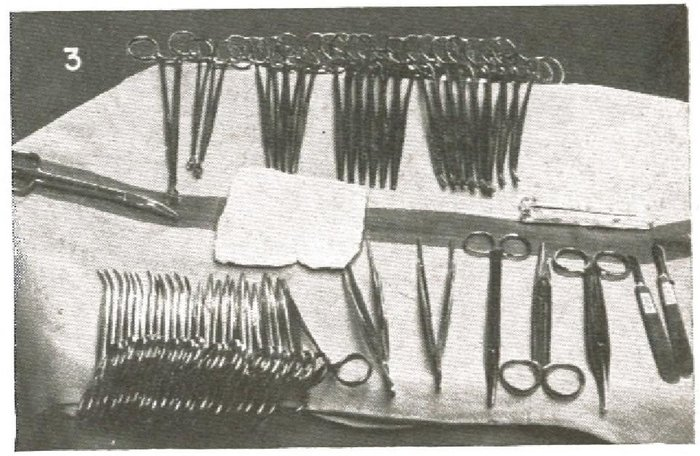

In 1943 the C. V. Mosby Company of St. Louis published _Operating Room Technique_, by **Edythe Louise Alexander**, R.N. The preface to that first edition, reprinted in the third, sets out the book's premise: an operation can be spoiled by small failures of many people, some of whom never enter the operating room, from a blood grouping not done to a nurse who has not sterilized a routine instrument, and "teamwork is essential in safeguarding the patient". The second edition followed in 1949 and the third, retitled _The Care of the Patient in Surgery, Including Techniques_, in 1958; the account below is from the third, the earliest we could read. In it the scrubbed nurse, the "instrument nurse", drapes the furniture with sterile sheets, arranges every sterile piece on the tables to the department's plan, and hands it to the surgeon, knowing the anatomy and the steps of the operation well enough to have the next thing ready.

## The setup as a plan

The plate draws the field as the Navy's _Handbook of the Hospital Corps_ photographed it in 1959, for an **[appendectomy](kloom:e/appendectomy)**, and as the Army's later course for operating-room specialists describes it. The operating table stands in the middle with the patient draped. The **Mayo stand**, a tray on a stand raised over the patient's legs, carries only the instruments for the opening. The large back table and the ring stand, with its basins, stand at right angles to the operating table, and with it they close what the Army calls the sterile circle. The surgeon stands at the incision with the assistant across from him. In the Navy's photograph the scrub, a **[hospital corpsman](kloom:e/hospital-corpsman)**, stands beside the surgeon, the anesthetist sits at the head, and the circulating nurse, a Navy nurse, works outside the circle.

The Navy's Mayo stand, in its own caption, held in front twelve small curved **[hemostats](kloom:e/hemostat)** and twelve straight, two rat-tooth and two plain forceps, Metzenbaum, straight and curved **[Mayo scissors](kloom:e/mayo-scissors)** and two scalpels; in the middle suture scissors, a pack of gauze and two tubes of ties; and at the back a large and two small Babcock clamps, four Allis, six Kocher and eight large Kelly hemostats. The Navy's general instrument tray, from which it was laid, listed 89 instruments and a needle book, by our count. Alexander's setup for the same kind of opening asks for twenty-four straight hemostats, twelve curved and sixteen towel forceps, and her procedure book kept a five-by-eight-inch card for each setup, with typed instructions and pictures of the arrangement, so that with standard setups a well-oriented team could prepare the sterile tables in about five minutes. The Army's back table keeps the ringed instruments on a rolled towel, small ones in front.

The instruments come up in the order of the operation. Alexander's steps for opening the abdomen through a McBurney incision, the appendix approach, pair what the surgeon does with what the scrub hands:

| Step | The surgeon                              | The scrub nurse hands                                                        |
| ---- | ---------------------------------------- | ---------------------------------------------------------------------------- |
| 1    | Covers the skin on each side with gauze  | Gauze compresses; a basin set on the field; suction tested                   |
| 2    | Cuts through the skin down to the fascia | The skin scalpel, then a second scalpel; sponges; Kelly or Crile hemostats   |
| 3    | Ties the bleeding vessels                | Ties of gut or silk; a needle holder threaded                                |
| 4    | Fastens towels to the skin edges         | Skin towels folded in half; towel forceps                                    |
| 5    | Nicks the fascia and lifts its edges     | A scalpel, two toothed tissue forceps, hemostats                             |
| 6    | Opens the peritoneum and explores        | Retractors, hemostats, sponges on holders, wet pads; every loose sponge away |

The skin scalpel is laid in a basin and kept off the field after the first cut, because the skin cannot be made sterile: the point of the frame on the surgical scrub.

## Passing

The Army's course gives the rule for the hand-off: each instrument is handed in the position the surgeon will use it, so that it can be grasped at once, without the two pairs of gloves touching. A needle holder goes with its needle set to sew, the scrub holding the long end of the suture so that it does not trail across the wound, and a needle comes back whole, or the surgeon is told. Signals were already the rule at Breslau in 1897, where **[Jan Mikulicz](kloom:e/jan-mikulicz-radecki)**'s team did "the necessary communication" by hand, as the frame on the mask tells. Neither the Navy's handbook nor Alexander's index sets the signs themselves down, and we give none here.

## The sterile field's rules

Alexander's rules for aseptic standards fit on a page: gowned members keep a wide margin from anything unsterile and face what is sterile; two of them pass back to back or front to front; anything that falls below the waist is contaminated; the circulating nurse never reaches across a sterile surface; and when an article's sterility is uncertain, it is unsterile. The Army adds that only the top of a draped table is sterile, and the gown only from table level to a few inches below the neck. A pricked glove is changed at once and the needle that pricked it goes off the field. Whoever sees a break in technique says so at once, "even if there is doubt", and the doubtful drape, gown or instrument is replaced.

## The author

Alexander's title page of 1958 tells her career: supervisor at Mountainside Hospital in Montclair, New Jersey, and of the private-pavilion operating rooms at the New York Hospital; supervisor of operating rooms and associate director of nursing at the Roosevelt Hospital; then director of nursing service and principal of the school of nursing at the Lutheran Medical Center in Brooklyn. In 1972 she published a textbook of nursing administration. Her surgical book went on under editors as _Alexander's Care of the Patient in Surgery_, and the **[United States Navy](kloom:e/united-states-navy)**'s handbook of 1959 sent its corpsmen to it for further reading. What she arranged on these tables was also counted, item by item, before the wound was closed: the next frame.
