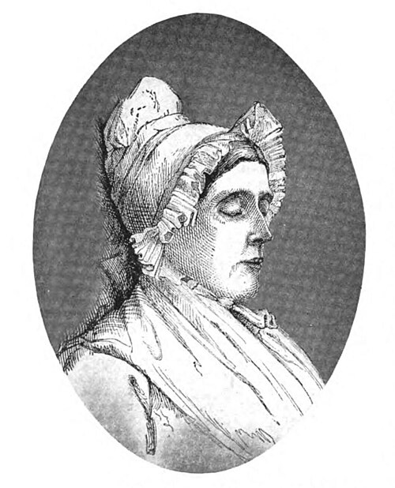

On 13 October 1836 the Protestant pastor of **[Kaiserswerth](kloom:e/kaiserswerth)**, a small Catholic town on the Rhine below Düsseldorf, opened a hospital in the largest house in the place, which he had bought that April for 2,300 thalers he did not have. It began, as **[Florence Nightingale](kloom:e/florence-nightingale)** described it fourteen years later, "with one patient, one nurse, and a cook". The pastor was **[Theodor Fliedner](kloom:e/theodor-fliedner)**, and the hospital was not mainly a hospital: "established chiefly as a school for training the Deaconesses", it took in every kind of sick person, so that the women who nursed there would learn to nurse anything. It is usually called the first school to train women as nurses in a hospital.

## Friederike's house

The house was run by his wife. **[Friederike Fliedner](kloom:e/friederike-fliedner)**, born Münster in 1800, a teacher who had worked with neglected children, had already pressed her husband to open a refuge for women leaving prison in 1833, and she persuaded him to buy the house three days after giving birth. The first nurse, Gertrud Reichardt, a woman in her late forties, was skilled at the bedside but, in Theodor's words as Adelaide Nutting and Lavinia Dock translate them, lacked "the rarer but most essential talents of ruling and of administration", and in 1837 Friederike took over as superintendent. She chose the probationers, trained them, placed them and wrote down her rules for doing so in a notebook that was never published; Nutting and Dock print its motto, "Niemand gebe die Seele preis um der Kunst willen", in our translation "let no one sacrifice the soul for the sake of skill". She held that the deaconesses should be nurses of the body only, and lost that argument with her husband. She died in April 1842, at forty-two, after a stillbirth. The histories long gave the institution to Theodor; the nurse historian Dagmar Bork calls Friederike's contribution "particularly comprehensive", and crucial to the founding of professional nursing.

## The training

In the first year the nurses grew to seven, all but Reichardt on six months' probation. They nursed sixty patients in the house and twenty-eight in their homes, and changed duties in rotation: kitchen and housekeeping, laundry and linen, the women's ward, the men's ward with an orderly, the children's ward, and the garden in summer. A physician, Dr Thönissen, taught them from Johann Friedrich Dieffenbach's _Anleitung zur Krankenwartung_ (1832), a manual of nursing, and they studied pharmacy and sat the state examination in it.

By the time of Nightingale's first visit, in 1850, the hospital had more than a hundred beds in four departments, for men, women, boys and small children, with no more than four beds to a women's ward. Men nurses, trained there, served the men's wards. No doctor lived in. The head sister of each ward went round with the physician, and the sister who kept the pharmacy wrote down every prescription and copied it into a book. Each week the pastor questioned the nurses on what they had read to their patients and how they would meet hard cases, "never in the shape of a formal lecture, but of question and answer". Probation lasted one to three years, and a deaconess was consecrated with a blessing, "without vows of any kind". There were then 116 deaconesses, 94 consecrated and 22 on probation, 67 of them working away from Kaiserswerth.

Nightingale set out the day, and how the night was watched:

| Time         | What happened                                                                       |
| ------------ | ----------------------------------------------------------------------------------- |
| 5:00         | Sisters rise; breakfast at a quarter to six, a drink of ground rye and bread        |
| 11:00, 12:00 | Patients dine; at twelve the sisters, on broth and vegetables                       |
| 2:00–3:00    | Rye drink and bread                                                                 |
| 7:00         | Supper, broth                                                                       |
| 10:00        | Sisters to bed; one sleeps in every ward; the house's night watcher begins          |
| 1:30         | A second watcher takes over until five                                              |
| Every hour   | The watcher goes round every ward but the men's, and returns to the children's room |

The plate sets the day and the watches on a twenty-four-hour dial. Each watch was three and a half hours, and none came to a sister more than once a week; in severe illness and after operations the ward sister sat up as well. The day is from a letter Nightingale wrote to her mother in 1851; the night from her pamphlet, written in 1850, _The Institution of Kaiserswerth on the Rhine_.

## What Nightingale thought

She first came for a fortnight, from 31 July to 13 August 1850, and wrote the pamphlet before she reached home; it was printed anonymously in 1851 by the inmates of a London ragged school. It praised the place and ended by asking Englishwomen, "Shall the Roman Catholic Church do all the work?" She came back early in July 1851 and lived in the institution until 8 October, sleeping in the orphan asylum, eating with the deaconesses, and watching an amputation. Pastor Fliedner said afterwards that no one had passed so distinguished an examination. Forty-five years later she was blunt: "The nursing there was _nil_. The hygiene horrible. The hospital was certainly the worst part of Kaiserswerth." A year later she added: "never have I met with a higher tone, a purer devotion, than there."

The model spread as the "motherhouse": a central house that trained deaconesses, sent them to hospitals and parishes elsewhere, could recall them, and kept them when old or sick. In 1849 Fliedner brought four deaconesses to Pittsburgh, at the request of the Lutheran pastor **[William Passavant](kloom:e/william-passavant)**, for his new infirmary there. By Fliedner's death in 1864 there were 30 motherhouses and some 1,600 deaconesses. Three years after her stay, Nightingale took her own nurses to the Crimean War, at Scutari.
