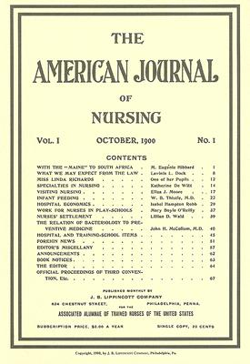

By the 1890s anyone in America could call herself a trained nurse. The schools were multiplying with no common standard, and graduates competed for private cases with untrained women and the graduates of short courses and correspondence schools. The nurses' answer was to organize, and then to go to the state legislatures. In 1893 the superintendents of the training schools formed a society of their own, with **[Lavinia Dock](kloom:e/lavinia-dock)**, then assistant superintendent at the **[Johns Hopkins Hospital](kloom:e/johns-hopkins-hospital)**, as its secretary. In September 1896 delegates of the schools' alumnae societies met at Manhattan Beach, near New York, to form a national association, the **[Nurses' Associated Alumnae](kloom:e/american-nurses-association)** of the United States and Canada, and in February 1897 at Baltimore they elected **[Isabel Hampton Robb](kloom:e/isabel-hampton-robb)**, who had built the Hopkins school, its first president. It became the American Nurses Association in 1911.

## A journal and a law

The association needed a voice. Its members formed a joint stock company with shares at $100, and in October 1900 the first number of the **[_American Journal of Nursing_](kloom:e/american-journal-of-nursing)** came out, edited by **[Sophia Palmer](kloom:e/sophia-french-palmer)**, superintendent of the city hospital in Rochester, and published for the association by J. B. Lippincott at $2 a year. The first issue carried Dock on "what we may expect from the law".

Palmer had already set out the aim, in a paper to New York's women's clubs in November 1899: "The greatest need in the nursing profession to-day is a law that shall place training schools for nurses under the supervision of the University of the State of New York." Nurses were to be examined by nurses, as doctors were by doctors. New York's bill was fought for two years, mostly over who would sit on the examining board, and in the end the nurses kept it: five nurses nominated by their state society and appointed by the Regents. Its applicants had to be over twenty-one and hold the diploma of a school that gave at least two years' training and that the Regents had registered as meeting their standards, which gave the state a hand in the schools as well as the nurses.

## North Carolina first

North Carolina passed first, in March 1903, led by its state nurses' association and Mary Wyche. New Jersey's governor signed its act on 7 April; New York's bill passed its last vote, in the Assembly, on 20 April; Virginia's was signed in May. The _Journal_ printed the North Carolina act whole. It worked like this:

| The act's rule  | What it said                                                                                                                                 |
| --------------- | -------------------------------------------------------------------------------------------------------------------------------------------- |
| Until 1904      | A nurse with two years in a hospital training school, or a certificate from three physicians, registered without examination                 |
| The board       | Five members: two physicians chosen by the state medical society, three registered nurses chosen by the nurses' association                  |
| The examination | Once a year at least, in anatomy and physiology, medical, surgical, obstetrical and practical nursing, invalid cookery and household hygiene |
| Fees            | $5 for the license; 50 cents to the clerk of the Superior Court, who entered the nurse in the county's register                              |
| The title       | "Registered Nurse", and the letters R.N.; using them without a license, a fine of up to $50 or 30 days in jail                               |
| Everyone else   | "Nothing in this act shall … abridge the right … of any person to pursue the vocation of a nurse, whether trained or untrained"              |

So the first laws protected a title, not the work. They made the **[registered nurse](kloom:e/registered-nurse)**: a nurse who had finished a recognized course, passed a board and been entered on a register. Anyone else could still nurse for pay. The bargain had a price in New Jersey, where the nurses lost their examining board altogether and licenses were issued by county clerks on a diploma.

## The examination

From 1904 the board examined every applicant. The _Journal_ printed the questions North Carolina set in May 1906: the nurse members wrote the papers on nursing and cookery, the physicians those on anatomy, physiology and surgery.

| Paper               | Some of the questions                                                                                                                                    |
| ------------------- | -------------------------------------------------------------------------------------------------------------------------------------------------------- |
| Practical nursing   | "How do you give a cold sponge bath to reduce temperature?" "How do you prepare normal salt solution?"                                                   |
| Practical nursing   | "How would you prepare your patient for anesthesia? Name half a dozen things that the nurse must always have ready for an operation in a private house." |
| Invalid cookery     | "What is the source of starch?" "Tell how you would cook oatmeal, grits, and cornmeal gruel."                                                            |
| Medical nursing     | "Give some of the toxic symptoms of strychnia. Of arsenic." "Give the table of apothecary's measures."                                                   |
| Obstetrical nursing | "In case of post-partum hemorrhage, the doctor being absent, what is the essential thing for the nurse to do?"                                           |
| Surgical nursing    | "Describe the preparation of catgut by the cumol method."                                                                                                |

## Title or practice

Sources disagree about when a license first became compulsory. Dock's continuation of their _History of Nursing_, in 1912, calls Virginia's act "the first example of a mandatory act", because after a year's grace it made it unlawful to practice professional nursing without a license, though not for women who did not claim to be trained. The nursing historian Bonnie Bullough dates the change to 1938, when New York passed the first law requiring a license of everyone who nursed for hire, and created two levels of nurse, registered and practical. By 1923, she writes, every state then in the Union had a registration act, and none of them defined what nursing was. The plate draws North Carolina's act as a mechanism, from the two societies to the register. The next frame asks what the schools behind the diploma were teaching.
