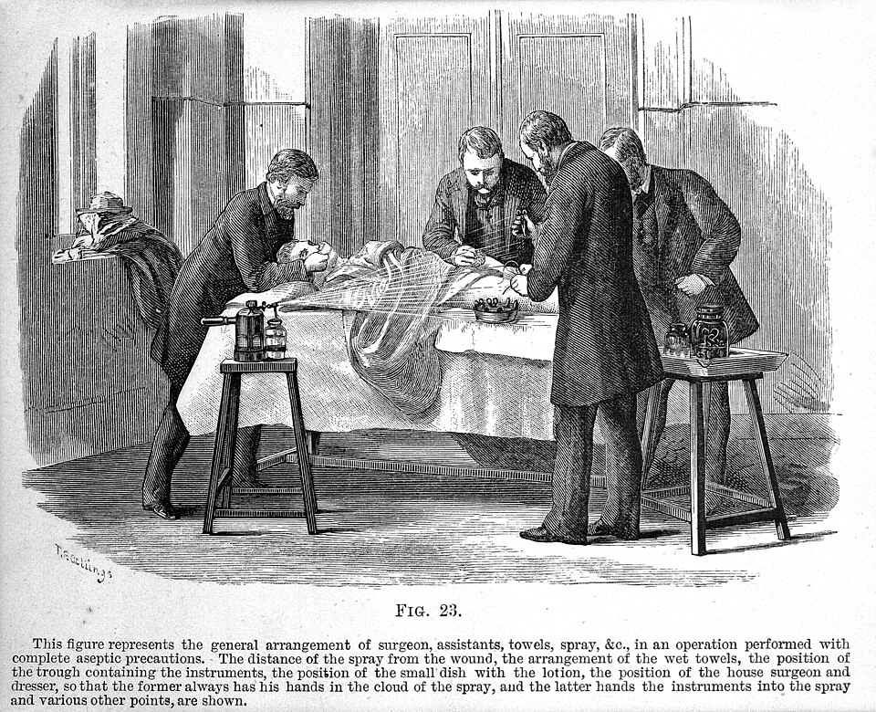

A simple fracture, where the skin stayed whole, nearly always healed. A compound fracture, where the broken bone opened the skin, too often festered, and then the choice was amputation or death, and after amputation the wound could fester too. **[Joseph Lister](kloom:e/joseph-lister)**, professor of surgery at Glasgow and a surgeon of the **[Glasgow Royal Infirmary](kloom:e/glasgow-royal-infirmary)**, began his paper of 1867 with that contrast, and with an explanation borrowed from a chemist. **[Louis Pasteur](kloom:e/louis-pasteur)** had shown that putrefaction was not caused by the oxygen of the air but by living germs carried in it. If the germs could be killed in the wound and kept out afterwards, a compound fracture might heal like a simple one.

He needed something to kill them that would not kill the patient. In 1864 he read that **[carbolic acid](kloom:e/phenol)** had stopped the stench of the sewage spread on the fields at Carlisle. The chemistry professor Thomas Anderson, who had pointed him to Pasteur's papers, found him a sample of the crude kind sold as "German creosote". Both came from **[coal tar](kloom:e/coal-tar)**: the chemist Friedlieb Runge had drawn the acid from it in 1834, and named it _Karbolsäure_, coal-oil acid.

## The method

His first attempt, in March 1865, failed, from "improper management", he wrote. The first success was a boy of eleven admitted on 12 August 1865 with a leg broken under the wheel of an empty cart. Lister's house surgeon, Dr Macfee, laid a piece of lint dipped in liquid carbolic acid on the wound and splinted the leg. The acid and the blood set into a crust. When the dressing was lifted after four days there was no pus, and six weeks later the bones were firmly joined. The next cases taught him to cover the crust with thin sheet metal, because the acid escaped through oiled silk. By August 1867, when he read "On the Antiseptic Principle in the Practice of Surgery" to the British Medical Association in Dublin, a compound fracture was dressed like this:

| Layer         | What Lister gave, 1867                                                                                                                  |
| ------------- | --------------------------------------------------------------------------------------------------------------------------------------- |
| On the skin   | A rag dipped in carbolic acid dissolved in oil, left in place throughout, so no germ could reach the wound at a change                  |
| The paste     | Whiting worked up with one part of carbolic acid in four of boiled linseed oil into "a firm putty", too dilute to burn the skin         |
| Its thickness | About a quarter of an inch, rolled between two pieces of thin calico so it could be wrapped round the limb                              |
| Over it       | A sheet of block tin, or tinfoil strengthened with adhesive plaster, or the sheet lead that lines tea chests, to stop the acid escaping |
| Changed       | The paste daily, as long as any discharge continued; the rag never                                                                      |

For cuts made at operation, he said in Dublin, "a solution of carbolic acid in twenty parts of water", 5 per cent, would kill any germs that fell on the wound. For his abscess dressing, a putty spread on tin, a fresh supply was made daily, he wrote, "by some convalescent in a hospital, or in private practice by the nurse or a friend of the patient". The plate draws the dressing in section over a broken tibia.

## The numbers

In nine months, he told the British Medical Association in 1867, his two large wards, once among the unhealthiest in the infirmary, had had not one case of pyaemia, hospital gangrene or erysipelas. In January 1870 he gave his amputations:

| Period                   | Amputations | Deaths | Per 100, by our arithmetic |
| ------------------------ | ----------: | -----: | -------------------------: |
| 1864 and 1866, before    |          35 |     16 |                         46 |
| 1867 to 1869, antiseptic |          40 |      6 |                         15 |

The hospital's records for 1865 were incomplete, and Lister himself called the numbers "too small for a satisfactory statistical comparison". In the same paper he blamed the infirmary's building: beside the ground-floor accident wards, a few inches below the surface and only a four-foot basement area away, lay coffins from the cholera of 1849. The infirmary's managers answered in _The Lancet_ that his remarks were unfair and his patients stayed long, and claimed some of the improvement for themselves. A Glasgow physiologist had mocked the "carbolic acid mania" in 1869, and Lister resolved to answer with statistics.

## Spray, gauze and the nurse

By December 1870 an assistant was playing a cloud of 1 in 40 carbolic lotion over the wound from an atomizer, Richardson's apparatus, while Lister operated, and the spray, later driven by steam, became part of the routine. In 1890, in Berlin, he gave it up: "I feel ashamed that I should have ever recommended it", since a spray could not kill the germs drawn into it. Germs from the air, he had come to think, mattered far less than he had once believed.

In Lister's wards the dressing was done by his house surgeons and the students who served as dressers. Everything around it was the nurse's work, and when he moved to London in 1877 he found how much depended on her: the nurses at King's College Hospital were hostile, and his system needed a loyal staff to prepare it. **Clara Weeks**, a graduate of the New York Hospital's training school, set the Lister dressing out for nurses in her _Text-Book of Nursing_ of 1885. The instruments and the operators' hands were dipped in carbolic, 1 in 40; sutures and drainage tubes were kept in carbolic until the moment of use; the wound was washed, covered with "green protective", then eight or ten layers of carbolized gauze reaching eight inches past it, a layer of mackintosh between the last two, and a carbolized gauze bandage, left three or four days. She gave the nurse the gauze recipe: for thirty yards, 13⅓ ounces of resin, 3⅓ of carbolic crystals and 2⅔ of castor oil, dissolved in two quarts of alcohol. The next frame turns from killing germs in the wound to keeping them out altogether: asepsis.
