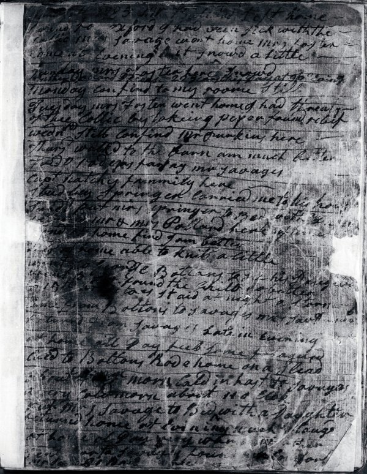

On Sunday 9 January 1785, at [Hallowell](kloom:e/hallowell-maine) on the **[Kennebec River](kloom:e/kennebec-river)**, in the District of Maine, still part of Massachusetts, a woman of forty-nine wrote in her diary: "I put mrs springer to Bed with [a daughter]." Eleven days later: "Cald in hast to Savages. a very Cold morn. about 11 o clok put mrs Savage to Bed with a Daughter. Returnd home at Evn very much fatagued." She was **[Martha Ballard](kloom:e/martha-ballard)**, a midwife and healer, and she wrote in the book nearly every day until May 1812, almost ten thousand entries. It is one of the fullest records we have of how women cared for the sick in early America: in houses, long before any woman there was trained as a nurse. The plate draws that first page as the transcription gives it, each day an entry as long as she made it; the longest is the morning she was called in haste.

## A delivery

The diary records a birth in a few lines, and almost always in the same order. On 8 June 1787: "mrs Springer grew very ill about 1 O Clok ys morn. Calld her women and was Safe Deliverd at 11 of a fine Son. I left her Comfortable & returnd at 3 pm." The midwife was fetched, by horse, on foot or across the river by canoe or boat; the mother's women, her neighbors and kin, were called to the house; the hour of birth was noted; the midwife stayed until mother and child were settled, and came back to see them. Payment came later, often in goods: on 24 August 1787, after two deliveries in a night, "receivd 6/8" from each father, six shillings and eightpence. Her historian, **[Laurel Thatcher Ulrich](kloom:e/laurel-thatcher-ulrich)**, found that for 768 of the 814 deliveries entered in the diary Ballard gave no medical detail at all, and hinted at complications in only 46, or 5.6 percent.

## Watching

Births were only part of her work. Much of the rest was sickness, and its center was the watch: sitting up through the night with someone very ill, often taking turns with other women. "Watcht" is the diary's own word, and "Sett up" another. In the [scarlet fever](kloom:e/scarlet-fever) epidemic that the diary calls the "Canker Rash", in the summer of 1787, she nursed one child of the Howards' through June:

| Date (1787) | The diary                                                                     |
| ----------- | ----------------------------------------------------------------------------- |
| 20 June     | Called to see Ibbee Howard, "Siesd with a relaps of the rash"                 |
| 21 June     | "I went to mrs Howards, watcht with her Child. Shee is very Sick indeed."     |
| 22 June     | "took Care of lbbee all day"; that night Mrs Savage and she "watcht with her" |
| 23 June     | Ibbee died "at 4 oClok morn"; the three women "Laid out her Corps"            |

Her remedies were mostly her own garden's. Ulrich's appendix lists every plant the diary names: syrups of mullein, a poultice of basswood for a swollen foot, catnip tea for a man laid on "a bed by the fire", onions bound to the feet, and for Polly Kenyday, "very ill with the Canker" on 7 August, cold water root dug from the field, given by mouth, and her throat gargled, "which gave her great Ease". She gave clysters, lanced breasts, made salves and pills, and laid out the dead. On 20 August a mother she had delivered died, and she helped lay her out, "her infant Laid in her arms", and wrote: "ye first woman that died in Child bed which I Deliverd."

## Reading the diary

Earlier historians had the diary and set it aside. James North, in 1870, found most entries "not of general interest"; Charles Nash, who printed an abridgment, called much of it "trivial and unimportant". Ulrich read all of it, with the town's tax lists, court records and physicians' papers, and in _A Midwife's Tale_ (1990), which won the Pulitzer Prize for History, argued the opposite: "it is in the very dailiness, the exhaustive, repetitious dailiness, that the real power of Martha Ballard's book lies."

Her counts give two totals. Her introduction speaks of "the 816 deliveries she performed between 1785 and 1812"; her tables count 814 delivery entries. On those 814, the diary records 14 stillbirths and 5 mothers who died within two weeks of giving birth, none at the delivery itself: one maternal death in every 198 live births. Ulrich set these beside the case books of a New Hampshire physician, James Farrington:

| 1785–1812 and 1824–1859  | Ballard | Farrington |
| ------------------------ | ------: | ---------: |
| Deliveries recorded      |     814 |      1,233 |
| "Difficult" births       |    5.6% |        20% |
| Stillbirths per 100 live |     1.8 |        3.0 |
| Mothers who died         |       5 |          5 |

Ulrich warns that the difference is partly one of perception: a physician looked for anomalies, and by Farrington's time doctors used forceps, ergot and opiates in births Ballard would have called ordinary. The town's leading physician, Daniel Cony, presented a paper to the Massachusetts Medical Society on a delivery he performed in August 1787. It mentions no midwife; the diary shows that the mother was his own wife. In the year he presented it, by Ulrich's count, Ballard attended 60 percent of the births in Hallowell.

| Maternal deaths per 1,000 births | Deaths per 1,000 |
| -------------------------------- | ---------------: |
| Martha Ballard, 1785–1812        |              6.1 |
| London hospital "A", 1767–1772   |             27.5 |
| London hospital "B", 1749–1770   |             21.5 |
| Dublin hospital "B", 1757–1775   |             14.1 |
| United States, 1930              |              6.7 |
| United States, 1945              |              2.1 |

The chart is Ulrich's table, from figures she gathered from the eighteenth-century physician Charles White and a 1973 public-health text. A rural midwife's mothers fared better than those in the great city lying-in hospitals of her day, and about as well as American mothers of 1930. The next frame is the first school that set out to train women to nurse, at Kaiserswerth on the Rhine.
