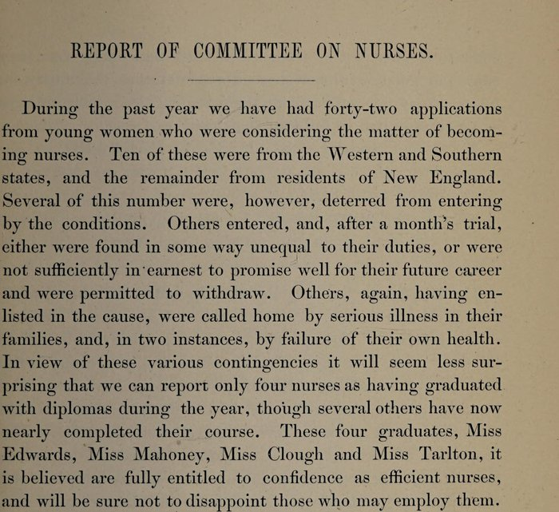

In the year that ended on 30 September 1879, the committee on nurses of the **[New England Hospital for Women and Children](kloom:e/new-england-hospital-for-women-and-children)**, in Roxbury, outside Boston, reported that it had received forty-two applications from young women thinking of becoming nurses, and that it could report "only four nurses as having graduated with diplomas during the year." It named them: Miss Edwards, Miss Mahoney, Miss Clough and Miss Tarlton. Miss Mahoney was **[Mary Eliza Mahoney](kloom:e/mary-eliza-mahoney)**, born in Dorchester in 1845 to free Black parents, and she was the first African American woman to finish a course of training as a nurse in the United States. She was thirty-three when she began it. By the usual account she had worked at the hospital for years before that, as a cook, a maid and a washerwoman.

## The course she finished

The hospital had been founded in 1862 by women physicians, led by Marie Zakrzewska, to give women doctors a place to practise and to train, and it trained nurses from its first years. Its resident physician Susan Dimock reorganized the nurses' school in the early 1870s, and the hospital's report for 1875 sets out the course as it stood when Mahoney entered it:

| Stage           | What the 1875 report requires                                                                             |
| --------------- | --------------------------------------------------------------------------------------------------------- |
| Admission       | "Well and strong", preferably aged 21 to 31, with a good reference for character and disposition          |
| Probation       | Two weeks before the term began; terms began in February, June and October                                |
| First 12 months | Training divided between medical, surgical, children's, confinement and night nursing                     |
| Last 4 months   | Time "to prove their competency in all these branches", and, if deserving, a diploma                      |
| On the ward     | "Each nurse has charge of a Ward with six beds"                                                           |
| Allowance       | $1 a week for six months, $2 for the next six, $3 for the last four, for calico dresses and felt slippers |

The hospital insisted that the allowance was not a wage: "Neither do we consider that payment for services is made." By our arithmetic, counting about 26, 26 and 17 weeks, it came to some $129 over the course, about $8 a month. The physicians lectured too, a course of twelve lectures a winter given free by the hospital's women doctors, and taught at the bedside. The plate lays out the course to scale, with the ward of six beds each pupil kept.

## Who finished

The 1879 report explains why so few graduated. Some applicants "were deterred from entering by the conditions"; others entered and "after a month's trial" were found unequal to the work or not earnest enough and "permitted to withdraw"; others were called home by illness in their families, and two left because their own health failed. The hospital's retrospective of 1882 put numbers to it: in six years two hundred women had applied, a hundred had been admitted, and thirty-seven had taken their diplomas. By our arithmetic, a little over a third of those who began finished.

Accounts of Mahoney's own class differ. Wikipedia's article, following later biographers, says forty began with her and three finished, Mahoney and two white women. The figure of forty-two is the report's count of applications for the whole year, not of a class, and the report names four graduates. We follow the report.

The rule that let her in is less certain still. The University of Pennsylvania's nursing history center writes that the hospital's charter "provided for the admission of one African American student and one Jewish student per year", when both were regularly excluded from most training schools. We have not found that rule in the hospital's reports for 1875 to 1884. The 1879 report says instead that the work was done with "all sects and nationalities meeting with equal favor", and that "both in the professional and nursing departments we have had colored students, who have proved equally able and equally acceptable with any in the Hospital." The report of 1884 says that two of its pupil nurses were "colored", and among "the very best of our corps."

## A career in private duty

Most of the school's graduates went into private duty, nursing in families' homes, which paid better than hospital work, and Mahoney did the same for most of her career, much of it with new mothers and their babies. She joined the Nurses' Associated Alumnae of the United States and Canada, which became the **[American Nurses Association](kloom:e/american-nurses-association)**, and when Black nurses were shut out of its state associations she took part in the **[National Association of Colored Graduate Nurses](kloom:e/national-association-of-colored-graduate-nurses)**, founded in 1908, which made her a life member and its chaplain. From 1911 to 1912 she directed the Howard Colored Orphan Asylum in Brooklyn. In 1920 she was among the first women in Boston to register to vote. She died at the hospital where she had trained, on 4 January 1926.

In 1936 the association of Black nurses created the Mary Mahoney Award for those who opened nursing to others; the ANA has given it since 1951. She entered the ANA's Hall of Fame in 1976. The next frame turns to the men whom almost every school of her time turned away.
