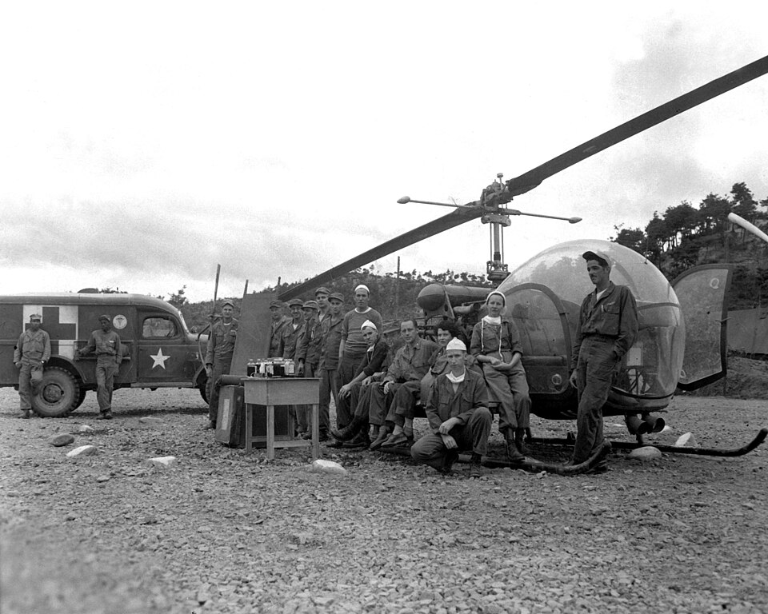

In 1948 the Surgeon General issued a table of organization for a new kind of unit: a sixty-bed hospital in tents, light enough to move with an army and close enough behind the line to operate on men who would not survive a longer journey. Its complement was fourteen medical officers, two Medical Service Corps officers, a warrant officer, ninety-seven enlisted men and twelve nurses. When the **[Korean War](kloom:e/korean-war)** began on 25 June 1950, the **[Mobile Army Surgical Hospital](kloom:e/mobile-army-surgical-hospital)**, the MASH, went to war for the first time. On 8 July twelve Army nurses moved forward with the 8055th MASH to Taejon, led by Captain Phyllis LaConte, and set up in a primary school. The 8076th, which landed at Pusan on 25 July, brought twelve nurses under its chief nurse, Captain Elizabeth Johnson.

## How a MASH worked

The 1948 table divided the hospital into sections, and a wounded man passed through them in order. From Albert Cowdrey's _The Medics' War_, the Army's official medical history of the Korean War:

| Section                | What was done there                                                                                    |
| ---------------------- | ------------------------------------------------------------------------------------------------------ |
| Preoperative and shock | casualties were treated for shock and prepared for surgery; in slack times it also ran a clinic        |
| Operating              | "meatball surgery", as one MASH surgeon called it: whatever got the patient out alive                  |
| Postoperative          | the operated recovered until they could travel                                                         |
| Holding ward           | patients waited for the train, or the plane to Japan; by helicopter went only head and some eye wounds |
| Pharmacy and X-ray     | served every section                                                                                   |

The nurses ran the wards on both sides of the operating tent and worked in it. One of them, Captain Oree Gregory, wrote in her diary near Masan in August 1950 of patients "begging for water. But they're mostly due for surgery, so fluids are limited." A man going to surgery was kept fasting, and the nurses explained why. The 8076th's commander, Major Kryder Van Buskirk, said most of its nurses worked twelve to sixteen hours a day without rest "and some until they collapsed". Short of supplies, the hospital washed and rewashed its sponges and bandages, and the nurses would "give the doctors hell if they so much as wasted a suture". Whole blood came to the MASHs by air, at first in light liaison planes, and the 8076th, the Army's history says, never lacked for it. Van Buskirk refused to send his nurses back when the front came close: if it was too dangerous for the nurses, he argued, it was too dangerous for the MASH.

## Sorting

The numbers came in waves. At Miryang, between August and October 1950, the 8076th admitted 5,674 patients and once performed 244 operations in twenty-four hours. In late November, at Kunu-ri, as the Chinese offensive broke, in temperatures of 23 to 30 degrees below zero, it took 1,836 admissions in six days, 661 in one. Ambulances left the wounded lying in the snow because there was no room in the tents, and some froze to death before they could be carried in. The unit's history records the decision that **[triage](kloom:e/triage)** comes to when the wounded outnumber what a hospital can do: some of the most gravely injured "were given sufficient medication to prevent suffering and then they were put aside to die", while the staff worked on the ones who could be saved. On the 28th the hospital was ordered out, and left about forty patients, a doctor and some corpsmen behind; all were brought out later.

## The helicopter

The helicopter changed where a MASH could take its wounded from. Three Army helicopter detachments of four pilots and four mechanics each reached Korea in 1951, each attached to a MASH. Their **[Bell H-13](kloom:e/bell-h-13-sioux)** carried two patients in litter pods outside the cabin, where in theory nobody could treat them; a pilot of the 8191st, Lieutenant Joseph Bowler, worked out with Lieutenant Colonel James Brown of the 8063d MASH how to run plasma into both pods in flight, and Captain Hubert Gaddis later adapted it for whole blood. In 1951 the IX Corps moved 1,500 critical cases by helicopter, and carried some 5,000 pints of whole blood forward on the same machines. They were expensive: a Bell carrying two cost more than ten times as much as a ground ambulance carrying five. In practice the MASHs grew to 200 beds, with medical as well as surgical work, and became less mobile than the table intended.

## The numbers

By the **[Army Nurse Corps](kloom:e/united-states-army-nurse-corps)**' own chronology, about 540 Army nurses served in Korea, in twenty-five hospitals, the MASHs among them; it does not say whether at once or in all. No Army nurse was killed by enemy action there. Major Genevieve Smith, a veteran of the [Second World War](kloom:e/world-war-ii), died when the plane carrying her to Korea to be chief nurse crashed. Of the wounded who reached an Army hospital in Korea, 2.5 percent died, compared with 4.5 percent in the Second World War, by the figures of the Army's history of the Vietnam War; a count made partway through the war gave 2.4 percent. Off the coast, thirty Navy nurses served aboard each of the hospital ships _Haven_, _Consolation_ and _Repose_, the subject of the frame on Navy nurses at sea.

In Vietnam the helicopter became the usual way to reach a hospital, as the next frame tells.
